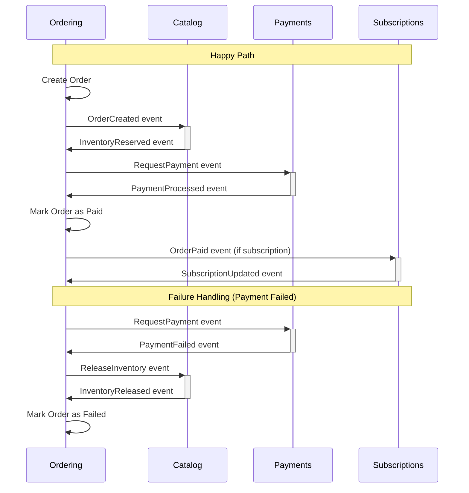

## ADR-005: Distributed Transaction Strategy

## Context

In a domain-driven design architecture with multiple bounded contexts, ensuring data consistency across contexts while maintaining their autonomy is a key challenge. When operations span multiple bounded contexts in Elias Food Imports (EFI), traditional ACID transactions are not feasible because:

1. Bounded contexts may have different persistence mechanisms
2. Transactions would create tight coupling between contexts
3. Long-running transactions decrease system availability

For example, processing an order involves multiple bounded contexts:

- **Ordering**: Creates and manages the order
- **Catalog**: Updates inventory
- **Payments**: Processes payment
- **Subscriptions**: Updates subscription status (if applicable)

Each of these contexts has its own consistency requirements while needing to coordinate with other contexts to complete the business process.

## Decision

We will implement the **Saga Pattern** for coordinating distributed transactions rather than Two-Phase Commit (2PC) to maintain bounded context independence while ensuring eventual consistency.

### Implementation Approach

We will specifically implement **Choreography-based Sagas** using domain events:

1. **Domain Events**: Each bounded context publishes events when significant state changes occur
2. **Event Handlers**: Each context subscribes to relevant events from other contexts
3. **Compensating Actions**: For each action, define a corresponding compensating action to roll back if necessary

### Key Components

#### 1. Domain Event Infrastructure

Enhance the existing `DomainEvents` class to include:

- Event publishing across bounded contexts
- Retry mechanisms for failed event handling
- Monitoring and observability

```typescript
class DomainEventBus {
  private eventHandlers: Map<string, Function[]> = new Map();
  
  registerHandler(eventType: string, handler: Function): void {
    // Register event handler logic
    const handlers = this.eventHandlers.get(eventType) || [];
    handlers.push(handler);
    this.eventHandlers.set(eventType, handlers);
  }
  
  publishEvent(event: DomainEvent): void {
    const handlers = this.eventHandlers.get(event.type) || [];
    
    for (const handler of handlers) {
      try {
        handler(event);
      } catch (error) {
        // Implement retry logic
        this.logFailedEvent(event, error);
        this.scheduleRetry(event, handler);
      }
    }
  }
  
  private logFailedEvent(event: DomainEvent, error: Error): void {
    // Log failed event processing
  }
  
  private scheduleRetry(event: DomainEvent, handler: Function): void {
    // Schedule retry with exponential backoff
  }
}
```

#### 2. Saga Coordinator (Optional)

For complex sagas, implement a coordinator service that:

- Tracks saga state
- Implements timeouts
- Handles compensating actions

#### 3. Event Persistence

Store domain events in an event store to:

- Provide an audit trail
- Support replay capabilities
- Enable event sourcing if needed

### Example Saga: Order Processing

The following sequence diagram illustrates the saga pattern for order processing:



### Consistency Boundaries

We define the following consistency boundaries:

| Context | Local Consistency Requirements |
|---------|--------------------------------|
| Ordering | Orders must have valid items and customer information |
| Catalog | Inventory must not go below zero |
| Payments | Payment amount must match order total |
| Subscriptions | Subscription must reference valid customer and items |

## Consequences

### Positive

1. **Loose Coupling**: Maintains bounded context independence and autonomy
2. **Scalability**: Each context can scale independently without coordination overhead
3. **Resilience**: System can continue functioning even if some components fail temporarily
4. **Eventual Consistency**: Provides a practical consistency model for distributed systems
5. **Audit Trail**: Event-based approach creates natural audit records of all system activities

### Negative

1. **Complexity**: Implementing compensating transactions adds complexity
2. **Eventual Consistency**: Business stakeholders need to understand and accept that consistency happens over time, not immediately
3. **Debugging Challenges**: Distributed flows can be harder to trace and debug
4. **Error Handling**: Requires careful consideration of all failure scenarios
5. **Development Discipline**: Requires teams to diligently implement compensating actions

## Implementation Examples

### Event Handler with Compensating Actions

```typescript
@Injectable()
export class OrderEventHandler {
  constructor(
    private readonly inventoryRepository: InventoryRepository,
    private readonly eventBus: DomainEventBus
  ) {}
  
  @EventHandler(OrderCreatedEvent)
  async handleOrderCreated(event: OrderCreatedEvent): Promise<void> {
    try {
      // Attempt to reserve inventory
      const inventory = await this.inventoryRepository.findByProductId(event.productId);
      
      if (inventory.available >= event.quantity) {
        await inventory.reserve(event.orderId, event.quantity);
        await this.inventoryRepository.save(inventory);
        
        // Publish success event
        this.eventBus.publishEvent(new InventoryReservedEvent(
          event.orderId,
          event.productId,
          event.quantity
        ));
      } else {
        // Handle insufficient inventory
        this.eventBus.publishEvent(new InventoryNotAvailableEvent(
          event.orderId,
          event.productId,
          inventory.available,
          event.quantity
        ));
      }
    } catch (error) {
      // Publish failure event
      this.eventBus.publishEvent(new InventoryReservationFailedEvent(
        event.orderId,
        event.productId,
        error.message
      ));
    }
  }
  
  @EventHandler(PaymentFailedEvent)
  async handlePaymentFailed(event: PaymentFailedEvent): Promise<void> {
    // Compensating action to release inventory when payment fails
    const inventory = await this.inventoryRepository.findByProductId(event.productId);
    await inventory.release(event.orderId, event.quantity);
    await this.inventoryRepository.save(inventory);
    
    this.eventBus.publishEvent(new InventoryReleasedEvent(
      event.orderId,
      event.productId,
      event.quantity
    ));
  }
}
```

## Testing Strategy

1. **Unit Tests**: Test each step in isolation

   ```typescript
   it('should reserve inventory when processing OrderCreatedEvent', async () => {
     // Arrange
     const handler = new OrderEventHandler(mockInventoryRepository, mockEventBus);
     const event = new OrderCreatedEvent('order-1', 'product-1', 5);
     
     // Act
     await handler.handleOrderCreated(event);
     
     // Assert
     expect(mockInventoryRepository.save).toHaveBeenCalled();
     expect(mockEventBus.publishEvent).toHaveBeenCalledWith(
       expect.any(InventoryReservedEvent)
     );
   });
   ```

2. **Integration Tests**: Test interactions between two contexts
3. **Saga Tests**: Test complete saga flows including failure scenarios
4. **Chaos Tests**: Inject failures to verify compensating actions

## Monitoring and Observability

Implement the following to monitor saga execution:

- Distributed tracing with correlation IDs
- Event completion metrics
- Failed transaction alerts
- Saga execution timeline visualization

## Implementation Plan

1. **Phase 1: Event Infrastructure (1 month)**
   - Enhance domain event infrastructure
   - Implement event persistence
   - Set up monitoring infrastructure

2. **Phase 2: Core Sagas (2 months)**
   - Order processing saga
   - Subscription management saga
   - Payment processing saga

3. **Phase 3: Advanced Features (1 month)**
   - Timeout handling
   - Long-running saga support
   - Operational dashboards

## References

- Evans, Eric. "Domain-Driven Design: Tackling Complexity in the Heart of Software"
- Garcia-Molina, H. and Salem, K. "Sagas"
- Richardson, Chris. "Microservices Patterns"
- [Domain Event Catalog](../domain-knowledge/integrations/events.md)

---

*This ADR establishes our strategy for handling distributed transactions across bounded contexts. It provides a consistent pattern for ensuring data consistency while maintaining bounded context autonomy.*
