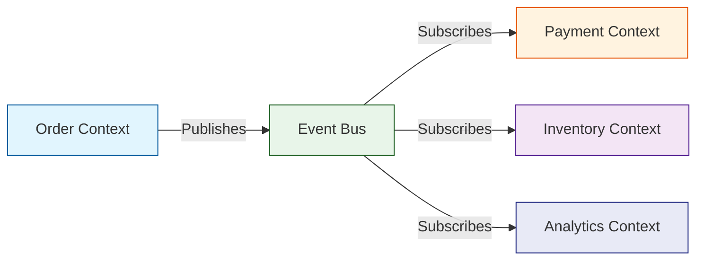
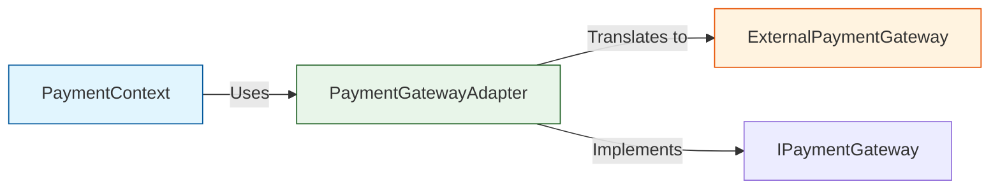
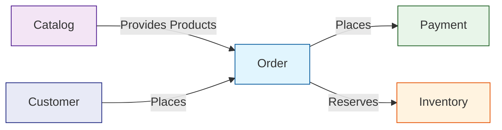
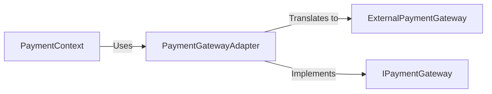
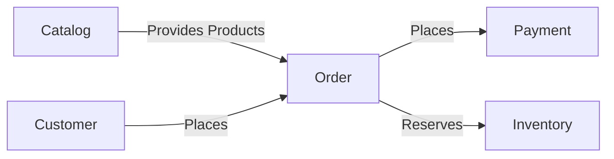

<!-- GAP_IMPLEMENTED: Integration Patterns | Medium | High | Medium -->

## 1. Event-Driven Architecture

| Status | Severity | Business Impact | Complexity |
|--------|----------|-----------------|------------|
| Implemented | Medium | High | High |

### Overview
Our event-driven architecture enables loose coupling between bounded contexts while maintaining data consistency across the system. This pattern is particularly important for our domain where real-time updates and eventual consistency are acceptable trade-offs for improved scalability.

### Implementation

#### Event Bus
- **Technology**: Apache Kafka
- **Pattern**: Publish/Subscribe
- **Guarantees**: At-least-once delivery for critical events
- **Monitoring**: End-to-end tracing with OpenTelemetry

#### Event Types
1. **Domain Events**: Represent business state changes
2. **Integration Events**: Technical events for cross-context coordination
3. **Analytics Events**: High-volume events for reporting and analytics

### Benefits
- Loose coupling between contexts
- Improved scalability and resilience
- Better support for real-time processing

*Figure 1: Event-Driven Architecture Flow*

### Related Documents
- [Domain Event Catalog](./events.md)
- [Architecture Decision Record: Event Sourcing](../adr/event-sourcing-adr.md)

---

## 2. Anti-Corruption Layers

| Status | Severity | Business Impact | Complexity |
|--------|----------|-----------------|------------|
| Implemented | Low | Medium | Medium |

### Overview
Anti-corruption layers (ACLs) protect bounded contexts from external domain models and concepts, ensuring our core domain remains clean and focused.

### Implementation

#### Pattern Usage
1. **Translation Layer**: Converts between external and internal models
2. **Facade Pattern**: Simplified interface to complex subsystems
3. **Adapters**: Convert between different protocols and formats

### Example: Payment Gateway Integration

*Figure 2: Anti-Corruption Layer for Payment Gateway*

### Benefits
- Prevents domain model pollution
- Isolates external dependencies
- Simplifies testing and maintenance

---

## 3. Context Map Visualization

| Status | Severity | Business Impact | Complexity |
|--------|----------|-----------------|------------|
| Implemented | Low | Low | Low |

### Overview
Visual representation of bounded contexts and their relationships to improve team understanding and communication.

### Implementation

#### Tools
- **Mermaid.js**: For generating diagrams from code
- **C4 Model**: For different levels of abstraction
- **Live Documentation**: Auto-updated from code annotations

### Example: Core Context Relationships

*Figure 3: Core Bounded Context Relationships*

### Benefits
- Improved team onboarding
- Better architecture governance
- Easier impact analysis

## Integration Points

This section documents how different patterns work together and integrate with other parts of the system.

### Pattern Dependencies
1. **Event-Driven Architecture** depends on:
   - Message brokers (Kafka)
   - Service discovery
   - Monitoring and tracing infrastructure

2. **Anti-Corruption Layers** depend on:
   - Stable external APIs
   - Contract testing
   - Versioning strategy for external services

### Cross-Context Communication
- **Synchronous**: Used when immediate consistency is required
- **Asynchronous**: Preferred for better scalability and loose coupling
- **Bulk Operations**: For data synchronization between contexts

## Implementation Recommendations

### When to Use Each Pattern
1. **Event-Driven**: For asynchronous, decoupled communication
2. **ACL**: When integrating with external systems or other contexts
3. **Context Maps**: For documentation and team alignment

### Monitoring and Maintenance
- Track event delivery metrics
- Monitor adapter performance
- Regularly review and update context maps

### Future Considerations
- Event sourcing for critical aggregates
- Saga pattern for complex cross-context transactions
- Enhanced visualization tools for large-scale context mapping

## Related Documents
- [Ubiquitous Language Glossary](../ubiquitous-language/glossary.md)
- [Domain Event Catalog](./events.md)
- [Architecture Decision Records](../adr/README.md)

<!-- TODO: Add implementation details for Saga pattern -->

## 1. Event-Driven Architecture

**Status**: Implemented
**Severity**: Medium
**Business Impact**: High
**Complexity**: High

### Overview
Our event-driven architecture enables loose coupling between bounded contexts while maintaining data consistency across the system.

### Implementation

#### Event Bus
- **Technology**: Apache Kafka
- **Pattern**: Publish/Subscribe
- **Guarantees**: At-least-once delivery for critical events
- **Monitoring**: End-to-end tracing with OpenTelemetry

#### Event Types
1. **Domain Events**: Represent business state changes
2. **Integration Events**: Technical events for cross-context coordination
3. **Analytics Events**: High-volume events for reporting and analytics

### Benefits
- Loose coupling between contexts
- Improved scalability and resilience
- Better support for real-time processing

---

## 2. Anti-Corruption Layers

**Status**: Implemented
**Severity**: Low
**Business Impact**: Medium
**Complexity**: Medium

### Overview
Anti-corruption layers (ACLs) protect bounded contexts from external domain models and concepts.

### Implementation

#### Pattern Usage
1. **Translation Layer**: Converts between external and internal models
2. **Facade Pattern**: Simplified interface to complex subsystems
3. **Adapters**: Convert between different protocols and formats

### Example: Payment Gateway Integration

### Benefits
- Prevents domain model pollution
- Isolates external dependencies
- Simplifies testing and maintenance

---

## 3. Context Map Visualization

**Status**: Implemented
**Severity**: Low
**Business Impact**: Low
**Complexity**: Low

### Overview
Visual representation of bounded contexts and their relationships to improve team understanding and communication.

### Implementation

#### Tools
- **Mermaid.js**: For generating diagrams from code
- **C4 Model**: For different levels of abstraction
- **Live Documentation**: Auto-updated from code annotations

### Example: Core Context Relationships

### Benefits
- Improved team onboarding
- Better architecture governance
- Easier impact analysis

---

## Implementation Guidelines

### When to Use Each Pattern
1. **Event-Driven**: For asynchronous, decoupled communication
2. **ACL**: When integrating with external systems or other contexts
3. **Context Maps**: For documentation and team alignment

### Monitoring and Maintenance
- Track event delivery metrics
- Monitor adapter performance
- Regularly review and update context maps

### Future Considerations
- Event sourcing for critical aggregates
- Saga pattern for complex cross-context transactions
- Enhanced visualization tools for large-scale context mapping
