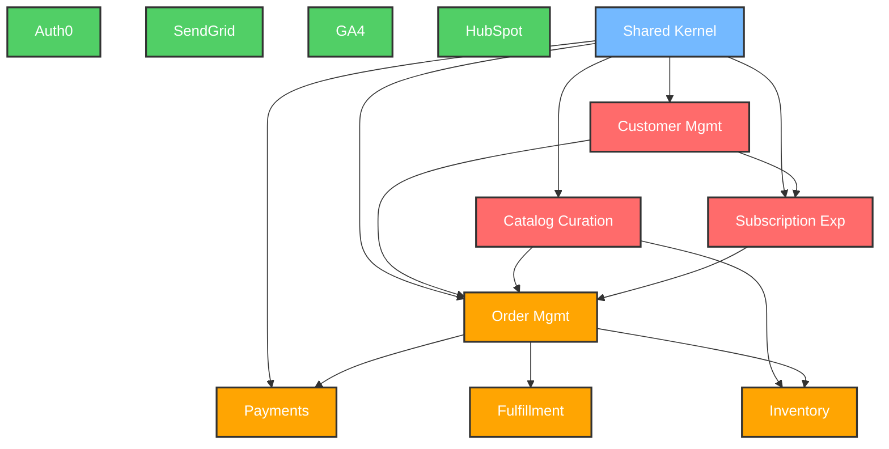

# Subdomain Classification Matrix

## Core Domains (Differentiating)

| Subdomain | Purpose | Key Metrics | Ownership | Bounded Context |
|-----------|---------|-------------|-----------|----------------|
| **Customer Management** | Customer segmentation, personalization, and relationship management | NPS, Retention Rate, CLV | Product Team | Customers |
| **Catalog Curation** | Product curation, sourcing, and information management | Product Quality Score, Engagement | Culinary Team | Catalog |
| **Subscription Experience** | Recurring order management and personalization | Renewal Rate, Subscriber Growth | Product Team | Subscriptions |

## Supporting Domains (Essential but Non-Differentiating)

| Subdomain | Purpose | Integration Style | SLA | Bounded Context |
|-----------|---------|-------------------|-----|----------------|
| **Order Management** | End-to-end order processing | Synchronous API | 99.9% uptime | Ordering |
| **Payment Processing** | Secure payment handling | Asynchronous Events | PCI-DSS compliant | Payments |
| **Inventory Management** | Real-time stock tracking | Event Sourcing | <100ms latency | Catalog |
| **Fulfillment** | Pick, pack, and ship operations | REST API | 95% OTD | Ordering |

## Generic Domains (Commoditized)

| Subdomain | Solution | Rationale | Integration |
|-----------|----------|------------|-------------|
| **Authentication** | Auth0 | Industry standard, not core | Shared Kernel |
| **Email Service** | SendGrid | Reliable delivery, rich templates | Infrastructure Layer |
| **Analytics** | Google Analytics 4 | Standard tracking needs | Infrastructure Layer |
| **CRM** | HubSpot | Standard CRM capabilities | Application Layer |

## Heat Map

## Strategic Classification Rationale

### Core Domains
- **Customer Management**: Key differentiator through customer segmentation and personalized experiences
- **Catalog Curation**: Competitive advantage through unique product selection and information
- **Subscription Experience**: Core to recurring revenue model and customer retention strategy

### Supporting Domains
- **Order Management**: Complex but not unique - requires custom development but follows established patterns
- **Payment Processing**: Complex compliance requirements but not a differentiator
- **Inventory Management**: Critical for operations but can leverage existing patterns
- **Fulfillment**: Operational necessity but not a strategic advantage

### Generic Domains
- Standard solutions provide required capabilities without differentiation
- Low risk of vendor lock-in
- Minimal customization needed

## DDD Implementation Strategy

### Bounded Contexts & Strategic Domains
| Bounded Context | Strategic Classification | Current Status |
|-----------------|--------------------------|----------------|
| **Customers** | Core Domain | Implemented |
| **Catalog** | Core Domain | Partially Implemented |
| **Ordering** | Supporting Domain | Implemented |
| **Subscriptions** | Core Domain | Planned |
| **Payments** | Supporting Domain | Planned |
| **Shared Kernel** | Technical Foundation | Implemented |

### Evolution Path
1. **Phase 1 (Current)**: Established bounded contexts, shared kernel, and core domain models
2. **Phase 2 (Next)**: Complete supporting domains, implement application services
3. **Phase 3 (Future)**: Enhance integration patterns, optimize performance, expand domain models

---
*Last updated: 2025-05-29*
