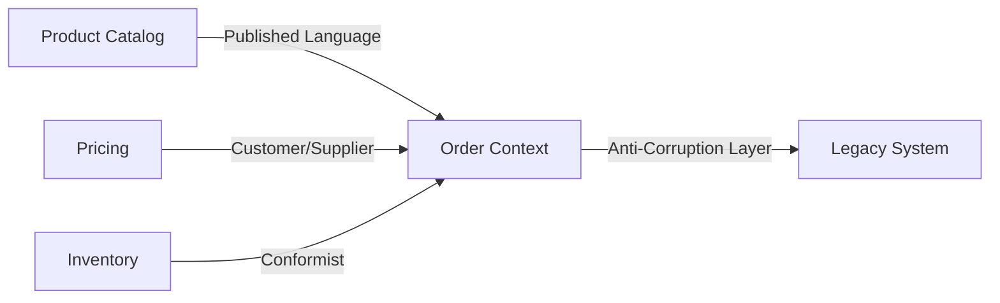
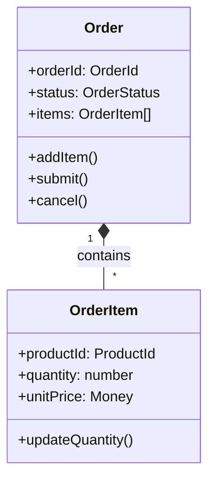
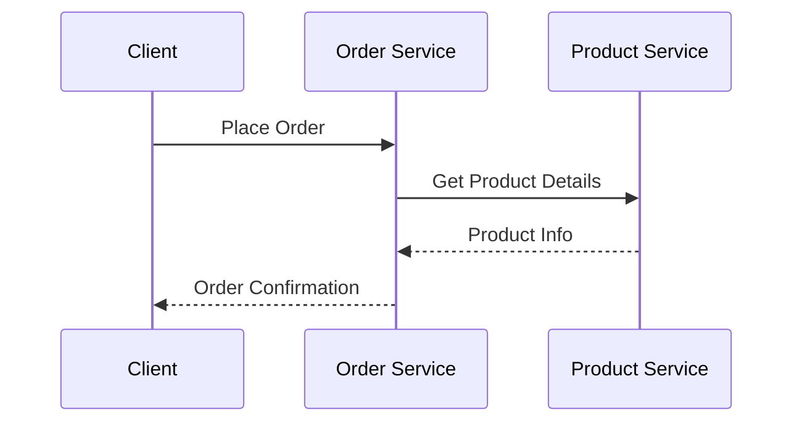
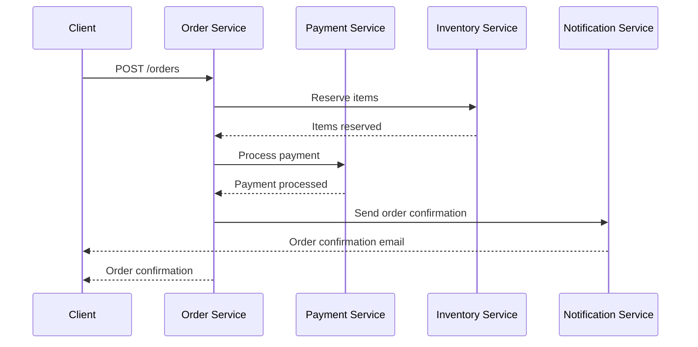

## Domain Overview

E-commerce is a broad domain encompassing online product discovery, ordering, payment, and fulfillment operations. This reference model applies Domain-Driven Design (DDD) principles to structure an eCommerce platform into cohesive bounded contexts.

### Key Characteristics

- **B2C (Business-to-Consumer)**: Consumer-facing processes including browsing, checkout, and immediate payment
- **B2B (Business-to-Business)**: Additional requirements like company accounts, negotiated pricing, and bulk ordering
- **Modular Architecture**: Independent, loosely coupled services with well-defined integration points
- **Event-Driven**: Communication through domain events for better decoupling

### Core Subdomains

1. **Product Catalog Management**
2. **Pricing & Promotions**
3. **Customer Management**
4. **Order Processing**
5. **Inventory & Warehouse Operations**
6. **Payment Processing**
7. **Fulfillment & Shipping**

### Benefits of Contextual Boundaries

- **Clear Ownership**: Each context has a well-defined responsibility
- **Independent Evolution**: Teams can develop and scale contexts independently
- **Reduced Complexity**: Avoids the pitfalls of a monolithic model
- **Ubiquitous Language**: Each context maintains its own consistent terminology
- **Explicit Integration**: Well-defined APIs and domain events for context communication

## Strategic Importance

### Context-Oriented Design

Establishing clear bounded contexts in an eCommerce architecture is strategically important for managing complexity and enabling scalability. A **context-oriented design** ensures that each team can focus on a specific part of the domain with a unified language and model, without being burdened by unrelated concerns.

> "Vigorously separating distinct areas of the whole business domain will help us succeed." - Eric Evans, Domain-Driven Design

**Key Benefits:**
- **Focused Teams**: Each team works within a clear boundary
- **Independent Deployment**: Contexts can be updated separately
- **Reduced Coupling**: Changes in one context don't ripple through the system
- **Clear Ownership**: Clear lines of responsibility for each domain

### Domain Classification

Aligned with DDD principles, organizations should categorize their domains strategically:

| Domain Type | Description | Example | Implementation Priority |
|-------------|-------------|---------|------------------------|
| **Core Domain** | The unique value proposition of the business | Product Catalog, Order Processing | Highest - Deep modeling |
| **Supporting Subdomain** | Important but not differentiating | Inventory Management, Fulfillment | Medium - Balance of effort |
| **Generic Subdomain** | Common problems with standard solutions | Identity Management, Payment Processing | Low - Buy over build |

### Context Mapping

A **Context Map** clarifies how bounded contexts interact:



**Common Integration Patterns:**
- **Open Host Service (OHS)**: Well-defined API for other contexts
- **Published Language (PL)**: Standardized data format for communication
- **Anti-Corruption Layer (ACL)**: Translates between different domain models
## Core Concepts

Before defining each bounded context, it's essential to understand the key DDD concepts and patterns used throughout this reference model.

### 1. Bounded Context

A **Bounded Context** is a logical boundary that encapsulates a specific domain model and its ubiquitous language. 

> "When we employ DDD we strive for each Bounded Context to mark off where the meaning of every term used by the domain model is well understood… It's chiefly a linguistic boundary." - Eric Evans

**Key Characteristics:**
- Defines explicit boundaries around a domain model
- Maintains its own ubiquitous language
- Encapsulates related business capabilities
- Has well-defined integration points with other contexts

### 2. Building Blocks

#### Entities

Objects defined by their identity rather than their attributes.

```typescript
class Order {
  constructor(
    public readonly id: OrderId,
    private status: OrderStatus,
    private items: OrderItem[]
  ) {}
  
  addItem(item: OrderItem): void {
    // Business rules for adding items
    this.items.push(item);
  }
}
```

**Characteristics:**
- Have a unique identity
- Can change over time while maintaining identity
- Often serve as aggregate roots

#### Value Objects

Immutable objects that describe characteristics of things in the domain.

```typescript
class Money {
  constructor(
    public readonly amount: number,
    public readonly currency: string
  ) {}
  
  add(other: Money): Money {
    if (this.currency !== other.currency) {
      throw new Error('Cannot add different currencies');
    }
    return new Money(this.amount + other.amount, this.currency);
  }
}
```

**Characteristics:**
- Defined by their attributes
- Immutable
- No conceptual identity
- Self-validating

#### Aggregates

A cluster of domain objects that can be treated as a single unit.



**Key Rules:**
- One aggregate root per aggregate
- External references must go through the root
- Transactional consistency within aggregate boundaries
- Eventual consistency between aggregates

### 3. Domain Events

Domain events represent something important that happened in the domain.

**Naming Convention:**
- Past tense, business-meaningful names
- Reflect business events, not technical operations
- Include all relevant context

**Example Event:**
```typescript
interface OrderPlaced {
  eventType: 'OrderPlaced';
  orderId: string;
  customerId: string;
  items: Array<{
    productId: string;
    quantity: number;
    unitPrice: number;
    currency: string;
  }>;
  timestamp: string;
}
```

### 4. Integration Patterns

#### Synchronous Integration



**Patterns:**
- **Open Host Service (OHS)**: Well-defined API for other contexts
- **Published Language (PL)**: Standardized data format
- **Anti-Corruption Layer (ACL)**: Translates between domain models

#### Asynchronous Integration

```mermaid
sequenceDiagram
    participant O as Order Service
    participant B as Message Broker
    participant I as Inventory Service
    
    O->>B: OrderPlaced
    B->>I: OrderPlaced
    I-->>B: InventoryReserved
    B->>O: InventoryReserved

These concepts guide the design of each bounded context in the eCommerce reference model. Each context will have its own entities and aggregates, emit domain events for significant changes, and integrate with others via services or messaging – adhering to the *linguistic boundary* of its ubiquitous language and using patterns like OHS/PL and ACL to avoid melding models.

### Product Catalog Context

**Core Purpose:**  
Manages all product information that the system offers to buyers, including product definitions, descriptions, categories, pricing attributes, and media. This is often a **Core Domain** for retail, as rich and accurate product data directly drives customer engagement and sales.

#### Domain Model

**Aggregates & Entities:**
- **Product** (Aggregate Root)
  - Attributes: name, description, SKU
  - Value Objects: `ProductDescription`, `Dimension`, `NutritionalInfo`
  - May contain `Variant` value objects for product variations

- **Category**
  - Organizes products hierarchically
  - May be an aggregate of its subcategories

**Value Objects:**
- `ProductDescription`: Rich text and media
- `Dimension`: Physical measurements
- `NutritionalInfo`: For food products
- `Variant`: Size/color options

#### Domain Events

| Event | Description |
|-------|-------------|
| `ProductCreated` | A new product was added to the catalog |
| `ProductUpdated` | Product information was modified |
| `PriceChanged` | Product price was updated |
| `ProductDiscontinued` | Product was marked as discontinued |

#### Integration

**Upstream Role:**
- Provides product data to other contexts
- Implements Open Host Service pattern

**Communication Patterns:**
- **Synchronous:** RESTful API for product queries
- **Asynchronous:** Domain events via message broker

**Example API Endpoint:**
```http
GET /api/products/{productId}
```

**Example Event Payload:**
```json
{
  "eventType": "ProductUpdated",
  "productId": "prod_123",
  "changes": {
    "price": 99.99,
    "stockStatus": "IN_STOCK"
  },
  "timestamp": "2025-06-09T21:57:24-03:00"
}
```

#### Implementation Notes

* **Performance:** In-memory caching of active promotions
* **Consistency:** Event-driven cache invalidation
* **Testing:** Focus on business rule validation
* **Classification:** Support Subdomain

### Customer Management Context

**Core Purpose:**  
Manages user accounts, customer profiles, and in B2B scenarios, organization accounts and roles. Handles registration, authentication, customer preferences, and account status.

#### Domain Model

**Aggregates & Entities:**

- **Customer** (Aggregate Root for B2C)
  - Personal information
  - Contact details
  - Authentication credentials
  - Value Objects: `Address`, `PaymentMethod`

- **Company** (Aggregate Root for B2B)
  - Organization details
  - Credit terms and limits
  - Collection of `CompanyUser` entities

- **CompanyUser**
  - Reference to Customer
  - Role within company (e.g., Admin, Buyer)
  - Permissions and access levels

**Value Objects:**
- `Address`: Shipping/billing information
- `PaymentMethod`: Stored payment details
- `CreditLimit`: B2B credit terms
- `UserRole`: Defined permissions and access

#### Domain Events

| Event | Description |
|-------|-------------|
| `CustomerRegistered` | New customer account created |
| `CustomerDetailsUpdated` | Profile information modified |
| `CompanyCreated` | New B2B organization registered |
| `UserInvitedToCompany` | New user added to organization |
| `UserRoleUpdated` | Permissions changed for company user |

#### Integration

**Upstream Role:**
- Primary source of customer data
- Authentication and authorization services

**Communication Patterns:**
- **Synchronous:** REST API for profile management
- **Asynchronous:** Event publishing for customer changes

**Example API Endpoint:**
```http
GET /api/customers/{customerId}
Authorization: Bearer {token}
```

**Example Event Payload:**
```json
{
  "eventType": "CustomerRegistered",
  "customerId": "cust_789",
  "email": "alice@example.com",
  "name": "Alice Johnson",
  "accountType": "B2B",
  "companyId": "comp_456",
  "timestamp": "2025-06-09T10:15:30-03:00"
}
```

#### Implementation Notes

- **Security:** Password hashing, JWT for authentication
- **Compliance:** GDPR and data protection measures

### Shopping Cart Context

**Core Purpose:**  
Manages the customer's shopping session, allowing them to collect items before purchase. Handles adding/removing items, applying promotions, and preparing for checkout.

#### Domain Model

**Aggregates & Entities:**

- **Cart** (Aggregate Root)
  - Collection of `CartItem` value objects
  - References to Customer/Session
  - Applied promotions/discounts
  - Value Objects: `CartItem`, `AppliedPromotion`

- **AbandonedCart** (Optional)
  - Tracks unconverted carts
  - Used for recovery campaigns

**Value Objects:**
- `CartItem`: Product ID, quantity, selected options
- `AppliedPromotion`: Reference to promotion and discount details
- `CartStatus`: Active, Converted, Abandoned

#### Domain Events

| Event | Description |
|-------|-------------|
| `CartCreated` | New shopping cart initialized |
| `ItemAddedToCart` | Product added to cart |
| `ItemRemovedFromCart` | Product removed from cart |
| `CartEmptied` | All items removed |
| `CartConvertedToOrder` | Checkout completed successfully |
| `CartExpired` | Cart abandoned and expired |

#### Integration

**Downstream Dependencies:**
- Product Catalog (for product details)
- Pricing (for current prices and promotions)

**Communication Patterns:**
- **Synchronous:** Real-time price/availability checks
- **Asynchronous:** Event publishing for cart changes

**Example API Endpoint:**
```http
POST /api/carts/{cartId}/items
Content-Type: application/json

{
  "productId": "prod_123",
  "quantity": 2,
  "options": {"color": "blue", "size": "M"}
}
```

**Example Event Payload:**
```json
{
  "eventType": "ItemAddedToCart",
  "cartId": "cart_abc123",
  "customerId": "cust_789",
  "item": {
    "productId": "prod_123",
    "quantity": 2,
    "unitPrice": 49.99,
    "addedAt": "2025-06-09T11:30:45-03:00"
  },
  "cartTotal": 99.98
}
```

**Example Event Payload:**
```json
{
  "eventType": "OrderPlaced",
  "orderId": "ord_abc123",
  "customerId": "cust_789",
  "amount": 99.99,
  "currency": "USD",
  "items": [
    {
      "productId": "prod_123",
      "quantity": 1,
      "unitPrice": 99.99
    }
  ],
  "timestamp": "2025-06-09T12:15:30-03:00"
}
```

#### Implementation Notes

- **Persistence:** MongoDB with appropriate indexes
- **Consistency:** Event sourcing for audit trail
- **Performance:** Caching for high-volume SKUs
- **Scalability:** Sharding by warehouse or product category
- **Classification:** Supporting Subdomain

### Inventory & Fulfillment Context

**Core Purpose:**  
Manages stock levels, warehouse operations, and order fulfillment processes to ensure accurate inventory tracking and efficient order processing.

#### Domain Model

**Aggregates & Entities:**

- **InventoryItem** (Aggregate Root)
  - Product and location details
  - Current stock levels
  - Reserved quantities
  - Value Objects: `StockLevel`, `Reservation`

- **Warehouse** (Entity)
  - Location information
  - Storage capacity
  - Operating hours

- **Shipment** (Aggregate Root)
  - Order references
  - Shipping details
  - Carrier information
  - Tracking status

**Value Objects:**
- `StockLevel`: Available, reserved, on-order quantities
- `Reservation`: Order reference and reserved quantity
- `Location`: Warehouse or storage location
- `Batch`: For tracking perishable goods with expiration
- `TrackingInfo`: Carrier and tracking number

#### Domain Events

| Event | Description |
|-------|-------------|
| `InventoryReserved` | Stock allocated to an order |
| `InventoryReleased` | Reservation cancelled/expired |
| `StockLevelAdjusted` | Physical count adjustment |
| `InventoryRestocked` | New stock received |
| `BatchExpired` | Perishable goods expired |
| `ShipmentPacked` | Order items packed for shipping |
| `ShipmentShipped` | Order dispatched to carrier |
| `ShipmentDelivered` | Order received by customer |

#### Integration

**Dependencies:**
- Order (for fulfillment)
- Product Catalog (item details)
- Shipping Carriers (for tracking)
- Suppliers (for restocking)

**Communication Patterns:**
- **Synchronous:** Stock availability checks
- **Asynchronous:** Event-based inventory updates
- **Batch Processing:** Stock reconciliation

**Example API Endpoint:**
```http
POST /api/inventory/reserve
Content-Type: application/json

{
  "orderId": "ord_abc123",
  "items": [
    {
      "productId": "prod_123",
      "quantity": 1,
      "warehouseId": "wh_1"
    }
  ]
}
```

**Example Event Payload:**
```json
{
  "eventType": "InventoryReserved",
  "reservationId": "res_xyz456",
  "orderId": "ord_abc123",
  "items": [
    {
      "productId": "prod_123",
      "quantity": 1,
      "warehouseId": "wh_1"
    }
  ],
  "expiresAt": "2025-06-16T12:15:30-03:00"
}
```

#### Implementation Notes

- **Persistence:** MongoDB with TTL indexes for reservations
- **Consistency:** Event sourcing for audit trail
- **Performance:** Caching for high-volume SKUs
- **Scalability:** Sharding by warehouse or product category
- **Classification:** Supporting Subdomain

### Payment & Billing Context

**Core Purpose:**  
Manages all financial transactions, including payment processing, invoicing, and financial reporting.

#### Domain Model

**Aggregates & Entities:**

- **Payment** (Aggregate Root)
  - Transaction details
  - Payment method
  - Status history
  - Value Objects: `Amount`, `PaymentMethod`

- **Invoice** (Aggregate Root for B2B)
  - Billing details
  - Line items
  - Payment terms
  - Value Objects: `BillingAddress`, `PaymentTerms`

**Value Objects:**
- `Amount`: Currency and value
- `PaymentMethod`: Credit card, bank transfer, etc.
- `BillingAddress`: Billing contact information
- `PaymentTerms`: Net 30, due on receipt, etc.

#### Domain Events

| Event | Description |
|-------|-------------|
| `PaymentAuthorized` | Funds authorized but not captured |
| `PaymentCaptured` | Funds successfully transferred |
| `PaymentFailed` | Transaction declined or failed |
| `PaymentRefunded` | Full or partial refund issued |
| `InvoiceGenerated` | New invoice created |
| `InvoicePaid` | Invoice payment received |
| `InvoiceOverdue` | Payment deadline passed |

#### Integration

**Dependencies:**
- Order (for payment processing)
- Customer (for payment methods)
- External Payment Processors (Stripe, PayPal, etc.)
- Accounting Systems (for financial reporting)

**Communication Patterns:**
- **Synchronous:** Payment processing
- **Asynchronous:** Event-based notifications
- **Scheduled:** Invoice generation and reminders

**Example API Endpoint:**
```http
POST /api/payments/process
Content-Type: application/json

{
  "orderId": "ord_abc123",
  "amount": 99.99,
  "currency": "USD",
  "paymentMethod": {
    "type": "credit_card",
    "token": "tok_visa"
  },
  "billingAddress": {
    "name": "John Doe",
    "line1": "123 Main St",
    "city": "Anytown",
    "postalCode": "12345",
    "country": "US"
  }
}
```

**Example Event Payload:**
```json
{
  "eventType": "PaymentCaptured",
  "paymentId": "pay_xyz789",
  "orderId": "ord_abc123",
  "amount": 99.99,
  "currency": "USD",
  "paymentMethod": {
    "type": "credit_card",
    "last4": "4242",
    "brand": "visa"
  },
  "timestamp": "2025-06-09T12:30:45-03:00"
#### Implementation Notes

- **Security:** PCI-DSS compliance for card data, tokenization of sensitive information
- **Resilience:** Idempotent operations, retry mechanisms, and circuit breakers
- **Audit:** Full transaction history with timestamps and user actions
- **Scalability:** Sharding by customer or date range, read replicas for reporting
- **Compliance:** Support for SCA (Strong Customer Authentication)
- **Classification:** Supporting Subdomain

**MERN Implementation:**
- **Node.js Service:**
  - Payment processing with third-party SDKs (Stripe, PayPal, etc.)
  - Webhook handlers for payment gateway callbacks
  - Idempotency keys for all payment operations
  - Transaction management with retry logic

- **MongoDB Collections:**
  ```javascript
  // payments collection
  {
    _id: ObjectId(),
    orderId: 'ord_abc123',
    amount: 9999, // in cents
    currency: 'USD',
    status: 'captured', // authorized, captured, refunded, failed
    method: 'credit_card',
    methodDetails: {
      // Tokenized/non-sensitive data only
      type: 'visa',
      last4: '4242',
      expMonth: 12,
      expYear: 2025
    },
    gateway: 'stripe',
    gatewayId: 'ch_xyz789',
    metadata: {},
    createdAt: ISODate(),
    updatedAt: ISODate()
  }
  
  // invoices collection (for B2B)
  {
    _id: ObjectId(),
    invoiceNumber: 'INV-2025-001',
    orderId: 'ord_abc123',
    customerId: 'cust_123',
    status: 'paid', // draft, sent, paid, overdue, cancelled
    dueDate: ISODate('2025-07-09'),
    items: [
      {
        description: 'Product Name',
        quantity: 1,
        unitPrice: 9999,
        amount: 9999
      }
    ],
    subtotal: 9999,
    tax: 0,
    total: 9999,
    payments: [
      {
        paymentId: ObjectId(),
        amount: 9999,
        date: ISODate(),
        method: 'credit_card'
      }
    ],
    createdAt: ISODate(),
    updatedAt: ISODate()
  }
  ```

- **React Frontend:**
  - Checkout flow integration
  - Payment method management
  - Invoice and receipt display
  - Admin dashboard for financial reporting

- **Security Considerations:**
  - Never store raw payment card details
  - Use payment gateway tokens for recurring billing
  - Implement rate limiting and fraud detection
  - Regular security audits and penetration testing

### Shipping & Fulfillment Context

**Core Purpose:**  
Manages the end-to-end shipping process from order fulfillment to final delivery, including carrier integration and shipment tracking.

#### Domain Model

**Aggregates & Entities:**

- **Shipment** (Aggregate Root)
  - Shipment details and status
  - Carrier and service level
  - Tracking information
  - Child entities: `ShipmentItem`, `Package`
  - Value Objects: `TrackingNumber`, `CarrierInfo`, `TemperatureRange`

- **Warehouse** (Entity)
  - Location details
  - Operating hours
  - Storage capabilities

**Value Objects:**
- `Address`: Shipping destination details
- `TrackingNumber`: Carrier-specific identifier
- `CarrierInfo`: Carrier name and service level
- `TemperatureRange`: For perishable items
- `PackageDimensions`: Weight and dimensions
- `ServiceLevel`: Standard, expedited, refrigerated, etc.

#### Domain Events

| Event | Description |
|-------|-------------|
| `ShipmentCreated` | New shipment record created |
| `OrderShipped` | Items packed and handed to carrier |
| `ShipmentInTransit` | Carrier has picked up the package |
| `ShipmentDelivered` | Package delivered to customer |
| `ShipmentDelayed` | Delivery delayed by carrier |
| `ShipmentException` | Problem during transit |
| `ColdChainBreach` | Temperature threshold violated |
| `DeliveryAttemptFailed` | Failed delivery attempt |

#### Integration

**Dependencies:**
- Order (for fulfillment details)
- Inventory (for stock updates)
- External Carriers (UPS, FedEx, etc.)
- Customer (for delivery preferences)

**Communication Patterns:**
- **Synchronous:** Label generation, rate calculation
- **Asynchronous:** Tracking updates, delivery notifications
- **Batch Processing:** Bulk label printing, manifest generation

**Example API Endpoint:**
```http
POST /api/shipments
Content-Type: application/json

{
  "orderId": "ord_abc123",
  "shippingMethod": "standard",
  "packages": [
    {
      "items": [
        {
          "productId": "prod_123",
          "quantity": 1
        }
      ],
      "dimensions": {
        "weight": 1.5,
        "length": 10,
        "width": 15,
        "height": 5
      },
      "specialHandling": ["fragile"]
    }
  ],
  "shipFrom": {
    "warehouseId": "wh_1"
  },
  "shipTo": {
    "name": "John Doe",
    "line1": "123 Main St",
    "city": "Anytown",
    "postalCode": "12345",
    "country": "US"
  }
}
```

**Example Event Payload:**
```json
{
  "eventType": "OrderShipped",
  "shipmentId": "ship_xyz789",
  "orderId": "ord_abc123",
  "trackingNumber": "1Z999AA1234567890",
  "carrier": "UPS",
  "serviceLevel": "Ground",
  "shippedAt": "2025-06-10T10:30:00-03:00",
  "estimatedDelivery": "2025-06-15T17:00:00-03:00",
  "packages": [
    {
      "packageId": "pkg_123",
      "trackingUrl": "https://www.ups.com/track?tracknum=1Z999AA1234567890"
    }
  ]
}
```

#### Implementation Notes

- **Carrier Integration:**
  - Use official carrier SDKs or REST APIs
  - Implement retry logic for transient failures
  - Support multiple carriers with a common interface

- **MongoDB Schema:**
  ```javascript
  // shipments collection
  {
    _id: ObjectId(),
    orderId: 'ord_abc123',
    status: 'shipped', // created, packed, shipped, in_transit, delivered, exception
    carrier: 'UPS',
    service: 'Ground',
    trackingNumber: '1Z999AA1234567890',
    trackingUrl: 'https://www.ups.com/track?tracknum=1Z999AA1234567890',
    packages: [
      {
        packageId: 'pkg_123',
        items: [
          {
            productId: 'prod_123',
            quantity: 1
          }
        ],
        dimensions: {
          weight: 1.5,
          length: 10,
          width: 15,
          height: 5,
          unit: 'in',
          weightUnit: 'lb'
        },
        specialHandling: ['fragile']
      }
    ],
    shipFrom: {
      warehouseId: 'wh_1',
      contact: { name: 'Warehouse Staff', phone: '...' }
    },
    shipTo: {
      name: 'John Doe',
      company: '',
      line1: '123 Main St',
      line2: '',
      city: 'Anytown',
      state: 'NY',
      postalCode: '12345',
      country: 'US',
      phone: '...',
      email: 'customer@example.com'
    },
    shippingCost: 12.99,
    insurance: 0,
    taxes: 1.04,
    totalCost: 14.03,
    labelUrl: 'https://api.shipping.com/labels/label_xyz.pdf',
    commercialInvoiceUrl: '...',
    events: [
      {
        type: 'shipment_created',
        timestamp: ISODate('2025-06-10T09:15:00-03:00'),
        location: 'WH1',
        status: 'created',
        message: 'Shipment created and awaiting processing'
      },
      {
        type: 'label_created',
        timestamp: ISODate('2025-06-10T09:20:00-03:00'),
        status: 'label_created',
        details: {
          carrier: 'UPS',
          service: 'Ground',
          trackingNumber: '1Z999AA1234567890'
        }
      },
      {
        type: 'shipped',
        timestamp: ISODate('2025-06-10T10:30:00-03:00'),
        status: 'shipped',
        location: 'WH1',
        message: 'Picked up by carrier',
        estimatedDelivery: ISODate('2025-06-15T17:00:00-03:00')
      }
    ],
    createdAt: ISODate('2025-06-10T09:15:00-03:00'),
    updatedAt: ISODate('2025-06-10T10:30:00-03:00')
  }
  ```

- **React Frontend:**
  - Admin dashboard for shipment management
  - Warehouse packing interface
  - Customer tracking page
  - Carrier performance analytics

- **Performance & Scalability:**
  - Caching for product and pricing data
  - Background processing for document generation
  - Rate limiting for API endpoints
  - Data archiving strategy for old quotes

- **Classification:** Supporting Subdomain

### Sales & Quoting Context

**Core Purpose:**  
Manages the quote generation, negotiation, and conversion process for B2B customers and high-value transactions, supporting custom pricing and approval workflows.

#### Domain Model

**Aggregates & Entities:**

- **Quote** (Aggregate Root)
  - Quote details and status
  - Line items with custom pricing
  - Approval workflow state
  - Child entities: `QuoteLine`, `QuoteRevision`
  - Value Objects: `QuoteStatus`, `PricingTerms`, `ValidityPeriod`

- **Customer** (Entity)
  - Company details
  - Contact information
  - Credit terms

**Value Objects:**
- `QuoteStatus`: Draft, Submitted, Approved, Rejected, Expired, etc.
- `PricingTerms`: Custom pricing, discounts, payment terms
- `ValidityPeriod`: Quote expiration date
- `Approval`: Approval details and sign-offs
- `QuoteReference`: Internal and external reference numbers

#### Domain Events

| Event | Description |
|-------|-------------|
| `QuoteCreated` | New quote initiated |
| `QuoteSubmitted` | Quote submitted for review |
| `QuoteApproved` | Internal approval completed |
| `QuoteRejected` | Internal approval denied |
| `QuoteOffered` | Quote sent to customer |
| `QuoteAccepted` | Customer accepted the quote |
| `QuoteDeclined` | Customer declined the quote |
| `QuoteExpired` | Quote validity period ended |
| `QuoteConvertedToOrder` | Quote successfully converted to order |

#### Integration

**Dependencies:**
- Product Catalog (for product information)
- Pricing (for base prices and discounting)
- Order (for quote conversion)
- Customer (for company and contact details)
- Notification (for quote communications)

**Communication Patterns:**
- **Synchronous:** Quote creation, price calculation
- **Asynchronous:** Approval workflows, notifications
- **Batch Processing:** Quote expiration, reporting

**Example API Endpoint:**
```http
POST /api/quotes
Content-Type: application/json

{
  "customerId": "cust_123",
  "validUntil": "2025-06-30T23:59:59Z",
  "items": [
    {
      "productId": "prod_123",
      "quantity": 100,
      "unitPrice": 9.99,
      "discountPercent": 15,
      "notes": "Bulk order discount"
    }
  ],
  "shippingAddress": {
    "name": "Acme Corp",
    "line1": "456 Business Ave",
    "city": "Metropolis",
    "state": "NY",
    "postalCode": "10001",
    "country": "US"
  },
  "billingAddress": {
    "useShippingAddress": false,
    "name": "Acme Corp Finance",
    "line1": "789 Accounting Blvd",
    "city": "Metropolis",
    "state": "NY",
    "postalCode": "10001",
    "country": "US"
  },
  "terms": {
    "paymentTerms": "Net 30",
    "shippingTerms": "FOB Origin",
    "notes": "Approval required for orders over $5,000"
  }
}
```

**Example Event Payload:**
```json
{
  "eventType": "QuoteAccepted",
  "quoteId": "quot_xyz789",
  "customerId": "cust_123",
  "acceptedAt": "2025-06-15T14:30:00-03:00",
  "acceptedBy": "john.doe@acmecorp.com",
  "orderId": "ord_abc456",
  "totalAmount": 849.15,
  "currency": "USD",
  "items": [
    {
      "productId": "prod_123",
      "quantity": 100,
      "unitPrice": 9.99,
      "discountPercent": 15,
      "lineTotal": 849.15
    }
  ]
}
```

#### Implementation Notes

- **MongoDB Schema:**
  ```javascript
  // quotes collection
  {
    _id: ObjectId(),
    quoteNumber: 'QT-2025-00123',
    status: 'accepted', // draft, submitted, approved, rejected, offered, accepted, declined, expired
    customerId: 'cust_123',
    companyId: 'comp_456',
    createdBy: 'user_789',
    assignedTo: 'sales_rep_123',
    validUntil: ISODate('2025-06-30T23:59:59Z'),
    currency: 'USD',
    subtotal: 999.00,
    discountTotal: 149.85,
    taxTotal: 0,
    total: 849.15,
    items: [
      {
        productId: 'prod_123',
        sku: 'SKU12345',
        name: 'Premium Widget',
        description: 'High-quality widget with advanced features',
        quantity: 100,
        unitPrice: 9.99,
        discountPercent: 15,
        discountAmount: 1.50,
        lineTotal: 849.15
      }
    ],
    shippingAddress: {
      name: 'Acme Corp',
      line1: '456 Business Ave',
      line2: 'Suite 100',
      city: 'Metropolis',
      state: 'NY',
      postalCode: '10001',
      country: 'US',
      contactName: 'John Doe',
      contactEmail: 'john.doe@acmecorp.com',
      contactPhone: '+1-555-123-4567'
    },
    billingAddress: {
      name: 'Acme Corp Finance',
      line1: '789 Accounting Blvd',
      city: 'Metropolis',
      state: 'NY',
      postalCode: '10001',
      country: 'US',
      contactName: 'Jane Smith',
      contactEmail: 'ap@acmecorp.com',
      contactPhone: '+1-555-987-6543'
    },
    terms: {
      paymentTerms: 'Net 30',
      shippingTerms: 'FOB Origin',
      notes: 'Approval required for orders over $5,000'
    },
    approval: {
      required: true,
      status: 'approved', // pending, approved, rejected
      approvers: [
        {
          userId: 'manager_123',
          name: 'Sarah Johnson',
          role: 'Sales Manager',
          status: 'approved',
          comments: 'Discount approved for strategic account',
          approvedAt: ISODate('2025-06-10T11:30:00-03:00')
        }
      ],
      requiredApprovals: 1,
      receivedApprovals: 1
    },
    history: [
      {
        timestamp: ISODate('2025-06-05T10:15:00-03:00'),
        event: 'created',
        userId: 'user_789',
        userName: 'Alex Wilson',
        changes: {
          status: ['draft', 'submitted']
        },
        metadata: {}
      },
      {
        timestamp: ISODate('2025-06-10T11:30:00-03:00'),
        event: 'approved',
        userId: 'manager_123',
        userName: 'Sarah Johnson',
        comments: 'Discount approved for strategic account'
      },
      {
        timestamp: ISODate('2025-06-15T14:30:00-03:00'),
        event: 'accepted',
        userId: 'customer_123',
        userName: 'John Doe',
        metadata: {
          orderId: 'ord_abc456'
        }
      }
    ],
    notes: 'Strategic account - willing to negotiate on larger orders',
    metadata: {
      campaign: 'Q2-2025-B2B-Promo',
      source: 'website',
      salesRep: 'Alex Wilson',
      opportunityId: 'opp_789'
    },
    createdAt: ISODate('2025-06-05T10:15:00-03:00'),
    updatedAt: ISODate('2025-06-15T14:30:00-03:00'),
    expiresAt: ISODate('2025-06-30T23:59:59Z')
  }
  ```

- **React Frontend:**
  - Quote creation and management interface
  - Approval workflow dashboard
  - Customer quote portal
  - Reporting and analytics

- **Workflow & State Management:**
  - State machine for quote lifecycle
  - Role-based access control
  - Document generation (PDF quotes)
  - Email notifications and reminders

- **Integration Points:**
  - CRM synchronization
  - ERP system connectivity
  - E-signature support
  - Document storage

- **Performance & Scalability:**
  - Caching for product and pricing data
  - Background processing for document generation
  - Rate limiting for API endpoints
  - Data archiving strategy for old quotes

- **Classification:** Supporting Subdomain

## Food/Perishable Goods Considerations

**Core Purpose:**  
Extends the standard eCommerce model to handle the unique requirements of perishable goods, including shelf-life management, cold chain logistics, and regulatory compliance.

### Domain Model Extensions

**Aggregates & Entities:**

- **InventoryItem** (Extended)
  - Batch/lot tracking
  - Expiration dates
  - Temperature requirements
  - Quality control status
  - Child entities: `InventoryBatch`, `QualityInspection`

- **Shipment** (Extended)
  - Temperature monitoring data
  - Cold chain compliance status
  - Special handling requirements
  - Child entities: `TemperatureReading`, `ConditionAlert`

**Value Objects:**
- `ExpirationDate`: Manufacturing and expiry dates
- `TemperatureRange`: Min/max temperature requirements
- `QualityStatus`: Passed, Failed, Quarantined
- `BatchInfo`: Lot number, harvest date, origin
- `ComplianceStatus`: Regulatory compliance indicators

### Domain Events

| Event | Description |
|-------|-------------|
| `InventoryLotExpiringSoon` | Batch approaching expiration |
| `InventoryLotExpired` | Batch has expired |
| `ColdChainBroken` | Temperature excursion detected |
| `QualityInspectionFailed` | Item failed quality check |
| `ProductRecalled` | Batch recalled from market |
| `InventoryDonated` | Expired/soon-to-expire items donated |
| `ComplianceCheckCompleted` | Regulatory compliance verified |

### Implementation Notes

- **MongoDB Schema Extensions:**
  ```javascript
  // inventory_items collection
  {
    _id: ObjectId(),
    productId: 'prod_123',
    sku: 'FRESH-001',
    batches: [
      {
        batchNumber: 'BATCH-2025-001',
        quantity: 100,
        manufacturingDate: ISODate('2025-05-01'),
        expirationDate: ISODate('2025-06-30'),
        origin: {
          farmId: 'farm_789',
          location: 'California, USA',
          harvestDate: ISODate('2025-04-28')
        },
        storageRequirements: {
          minTemp: 2, // °C
          maxTemp: 8,
          humidityRange: { min: 30, max: 60 } // %
        },
        qualityChecks: [
          {
            checkType: 'initial',
            status: 'passed',
            performedBy: 'qc_team_1',
            performedAt: ISODate('2025-05-02T10:00:00Z'),
            notes: 'Batch meets all quality standards'
          }
        ],
        status: 'in_stock', // in_stock, reserved, shipped, expired, quarantined
        location: {
          warehouse: 'WH-1',
          aisle: 'A',
          shelf: '3',
          bin: 'B5'
        },
        metadata: {
          organicCertified: true,
          allergens: ['dairy', 'nuts'],
          certifications: ['USDA Organic', 'Non-GMO']
        }
      }
    ],
    totalQuantity: 100,
    allocatedQuantity: 0,
    availableQuantity: 100
  }
  ```

- **React Frontend Components:**
  - Freshness indicators on product listings
  - Delivery date selector with freshness-based validation
  - Batch/lot information in order history
  - Temperature monitoring dashboard

- **Integration Points:**
  - Temperature monitoring systems (IoT devices)
  - Regulatory compliance databases
  - Quality control systems
  - Waste management services
  - Donation partner APIs

- **Performance & Scalability:**
  - Time-based indexes for expiration tracking
  - Background jobs for batch status updates
  - Caching for frequently accessed compliance data
  - Efficient querying for batch/lot lookups

- **Special Considerations:**
  - Real-time temperature monitoring alerts
  - Regulatory reporting requirements
  - Donation workflows for near-expiry items
  - Recall management system

### Cross-Context Impact

1. **Inventory Context:**
   - Tracks batch/lot information
   - Manages FEFO (First-Expired, First-Out) picking
   - Handles quality control status
   - Manages quarantine processes

2. **Order & Cart Contexts:**
   - Validates order dates against product shelf life
   - Shows freshness information to customers
   - Handles special packaging requirements

3. **Shipping Context:**
   - Manages cold chain logistics
   - Tracks temperature conditions in transit
   - Handles special carrier requirements

4. **Product Catalog:**
   - Displays shelf life information
   - Shows storage requirements
   - Indicates special handling needs

5. **Analytics Context:**
   - Tracks waste metrics
   - Monitors quality trends
   - Reports on compliance metrics

### Implementation Guidelines

1. **Event-Driven Architecture:**
   - Use domain events to trigger time-sensitive actions
   - Implement sagas for complex workflows (e.g., recall management)
   - Ensure idempotency for event processing

2. **Data Consistency:**
   - Use eventual consistency where appropriate
   - Implement compensating transactions for failures
   - Maintain audit trails for compliance

3. **Performance Optimization:**
   - Use materialized views for common queries
   - Implement caching for reference data
   - Optimize indexes for common access patterns

4. **Monitoring & Alerts:**
   - Set up proactive alerts for temperature excursions
   - Monitor batch expiration dates
   - Track compliance deadlines

By extending the core eCommerce model with these perishable goods considerations, the system can effectively handle the unique requirements of food and other time/temperature-sensitive products while maintaining the flexibility and scalability of the overall architecture.

## Implementation Recommendations

Designing the above bounded contexts in a MERN stack requires careful attention to module boundaries, data ownership, and communication patterns. Here are key recommendations and best practices for implementation:

### Architecture & Module Organization

- **One Context, One Module/Service:**
  - Align implementation with bounded contexts by separating the codebase for each context
  - Implement as distinct Node.js microservices or clearly partitioned modules
  - Each context should have its own data persistence (MongoDB collections or separate database)
  - Enforce the principle that no other context directly reads/writes another context's data
  - Example: Run distinct Express servers for Order, Inventory, etc., each with its own Mongo connection
  - Benefits: Maintains decoupling, enables independent scaling and deployment

### Domain Layer Implementation

- **Domain Models and Repositories:**
  - Implement a domain layer with classes/functions representing Aggregates and Entities
  - Example: `Order` class with methods to add order lines, `InventoryItem` with stock reservation logic
  - Use repository patterns for data access
  - Map MongoDB documents to domain objects in repositories
  - Keep business logic within domain objects, not in controllers

- **Schema Design and Transactions:**
  - Design MongoDB schemas to encapsulate aggregate data
  - Prefer single-document operations for atomic updates
  - Use MongoDB's atomic operators (`$inc`, `$set` with conditions)
  - Implement optimistic concurrency control for high-concurrency scenarios
  - Example: Use `findOneAndUpdate` with `$inc` and conditions for inventory updates

### API & Integration

- **REST APIs and Open Host Services:**
  - Implement clear RESTful or GraphQL APIs for each context
  - Document interfaces thoroughly (they become the published language)
  - Keep APIs coarse-grained
  - Use middleware for cross-cutting concerns (auth, logging)
  - Example endpoints:
    - `GET /products/:id` (Catalog)
    - `POST /orders` (Order)
    - `PUT /inventory/:id/reserve` (Inventory)

- **Asynchronous Messaging:**
  - Implement Domain Event Dispatcher for internal events
  - Use message brokers (RabbitMQ, Kafka) for cross-context events
  - Standardize on an event schema (e.g., CloudEvents)
  - Ensure idempotent event handling
  - Example event flow:
    - Order service publishes `OrderPlaced`
    - Inventory service subscribes to reserve stock
    - Payment service subscribes to process payment

### Integration Patterns

- **Saga Pattern Implementation:**
  - Use a mix of orchestration and choreography
  - For critical paths (e.g., payment), use synchronous calls with circuit breakers
  - For non-critical paths, use events for eventual consistency
  - Implement compensating transactions for rollback scenarios

- **Anti-Corruption Layer:**
  - Translate between different bounded context models
  - Validate all inputs at context boundaries
  - Example: Shipping service adapter that transforms Order data to Shipment commands

### Performance & Scalability

- **MongoDB Optimizations:**
  - Design schemas to match access patterns
  - Create appropriate indexes (e.g., `orderId`, `productId`)
  - Use aggregation pipeline for complex queries
  - Consider read replicas for read-heavy contexts

- **Node.js Specifics:**
  - Offload CPU-intensive tasks to worker processes
  - Use clustering to utilize multiple CPU cores
  - Implement caching for frequently accessed data
  - Consider connection pooling for database connections

### Frontend Integration

- **API Gateway / BFF Pattern:**
  - Implement Backends for Frontends (BFF) to aggregate data from multiple contexts
  - Consider GraphQL for flexible data querying
  - Use API gateways for routing, rate limiting, and request/response transformation
  - Example: A BFF for the web app that combines catalog, pricing, and inventory data

### Testing Strategy

- **Unit Testing:**
  - Test domain logic in isolation
  - Mock external dependencies
  - Focus on business rules and invariants

- **Integration Testing:**
  - Test context boundaries
  - Use test containers for MongoDB instances
  - Test event publishing/subscribing

- **Contract Testing:**
  - Verify API contracts between services
  - Ensure backward compatibility
  - Use tools like Pact or Postman

### Deployment & Operations

- **Containerization:**
  - Package each context as a Docker container
  - Use Docker Compose for local development
  - Consider Kubernetes for production orchestration

- **Monitoring & Observability:**
  - Implement distributed tracing (e.g., OpenTelemetry)
  - Use correlation IDs to track requests across services
  - Set up alerts for error rates and performance degradation
  - Log structured data for easier analysis

- **Scaling:**
  - Scale contexts independently based on load
  - Use horizontal scaling for stateless services
  - Consider read replicas for read-heavy contexts

### Security Considerations

- **Authentication & Authorization:**
  - Implement OAuth2/OpenID Connect for authentication
  - Use JWT for service-to-service authentication
  - Implement role-based access control (RBAC)
  - Validate all inputs at service boundaries

- **Network Security:**
  - Use service mesh (e.g., Istio, Linkerd) for secure service communication
  - Encrypt data in transit (TLS)
  - Implement network policies to restrict traffic between services

### Example: Order Processing Flow



### Example Event Payload

```json
{
  "eventType": "OrderPlaced",
  "eventId": "evt_123456789",
  "timestamp": "2025-06-09T19:52:14Z",
  "data": {
    "orderId": "ORD-20250609-XYZ123",
    "customerId": "CUST-1001",
    "items": [
      { 
        "productId": "PROD-ABC", 
        "quantity": 2, 
        "unitPrice": 19.99 
      }
    ],
    "orderTotal": 39.98,
    "billingAddress": { /* ... */ },
    "shippingAddress": { /* ... */ }
  },
  "metadata": {
    "source": "order-service",
    "correlationId": "corr_987654321"
  }
}
```

### Maintaining Ubiquitous Language

- Keep terminology consistent within each context
- Document domain terms and their meanings
- Use context maps to show relationships between bounded contexts
- Regularly review and refine the ubiquitous language with domain experts

### Future Extensibility

- Design for adding new bounded contexts
- Use event-driven architecture for loose coupling
- Maintain backward compatibility in APIs and events
- Document extension points and integration patterns
