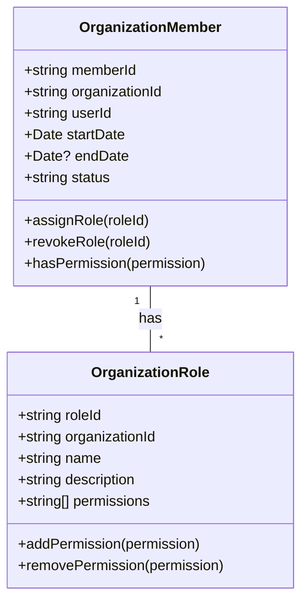

# Customer Domain

<!-- GAP_IMPLEMENTED: B2B Organization Management | Medium | High | High -->
<!-- TODO: stub for "B2B Organization Management" gap in the customer context -->

<!-- GAP_IMPLEMENTED: Customer Preference Management | High | High | Medium -->
<!-- TODO: stub for "Customer Preference Management" gap in the customer context -->

## 1. Domain Overview

The Customer Domain manages all aspects related to customers in the Elias Food Imports (EFI) system. It handles different types of customers, their contact information, preferences, relationships with the business, and segmentation strategies that drive marketing and sales efforts.

## 2. Strategic Importance

The Customer Domain is a core domain for Elias Food Imports as it:

1. **Enables Personalization**: Allows tailoring of product offerings and communications based on customer segments and preferences
2. **Drives Sales Strategy**: Provides insights on customer behaviors and preferences to inform sales approaches
3. **Supports Relationship Building**: Facilitates ongoing engagement with different customer segments
4. **Enables Loyalty Programs**: Serves as the foundation for customer retention initiatives
5. **Informs Product Development**: Customer feedback and preferences guide new product introduction

## 3. Core Concepts

### 1. Customer Segmentation

The practice of dividing customers into groups based on common characteristics, behaviors, or needs to better serve each segment with targeted products and services.

### 2. Customer Profile

A collection of attributes and preferences that define each customer, including contact information, purchase history, communication preferences, and demographic data.

### 3. Customer Lifecycle

The stages a customer goes through in their relationship with EFI, from acquisition to growth, retention, and potentially win-back if they churn.

### 4. Customer Journey

The complete sequence of interactions and touchpoints a customer has with EFI across all channels and contexts.

### 5. Customer Relationship

The ongoing connection between EFI and a customer, including communication history, support interactions, and loyalty status.

### 6. Customer Value

The total worth of a customer to the business over their lifetime, considering purchase frequency, average order value, and relationship duration.

## 4. Business Rules

### Customer Creation and Management

1. Every customer must have a unique identifier, name, segment type, and at least one valid contact method
2. Customer contact information must include a valid email address and/or phone number
3. Customer addresses must be validated against address validation service before being stored
4. Customer data must adhere to relevant data protection regulations (GDPR, CCPA) based on customer location
5. Customers may opt-out of marketing communications while maintaining their account

### Customer Segmentation

1. Each customer must be assigned to exactly one primary segment
2. Customer segment assignment must be recalculated when qualifying behaviors or attributes change
3. Segment reassignment must trigger appropriate notifications to sales and marketing teams
4. Historical segment data must be maintained for trend analysis

### B2C Customer Rules

1. Diaspora customers must specify their cultural connection and origin region
2. Expat customers must specify their country of origin and current residency status
3. Expat customers with subscriptions must provide delivery preferences and frequency
4. Tourist customers must specify where they first encountered EFI products
5. Indigenous foodie customers must specify at least one culinary interest
6. Family size for indigenous foodie customers must be greater than zero

### B2B Customer Rules

1. B2B customers must provide business identification numbers and tax information
2. Food truck customers must provide license/permit information and operating locations
3. Restaurant customers (limited/full service) must specify cuisine type and seating capacity
4. Hotel restaurant customers must provide property star rating and number of dining venues
5. Private chef customers must specify service area and client capacity
6. Specialty market customers must provide retail square footage and customer volume

### Customer Account Management

1. Customer accounts inactive for over 24 months must be flagged for review
2. Account deletion requests must be processed within 30 days
3. Changes to primary contact information require verification
4. Loyalty tier assignments must be recalculated monthly based on spending patterns

## 5. Domain Events

### Events Published by Customer Domain

| Event Name | Description | Payload | Consumers |
|-----------|-------------|---------|------------|
| `CustomerCreated` | Fired when a new customer account is created | `{ customerId: string, customerType: string, name: string, contactInfo: object, createdAt: Date }` | Marketing, Analytics, Notification |
| `CustomerUpdated` | Fired when customer information is modified | `{ customerId: string, modifiedFields: string[], previousValues: object, newValues: object }` | Marketing, Analytics, Notification |
| `CustomerSegmentChanged` | Fired when a customer is moved to a new segment | Customer ID, Previous Segment, New Segment, Reason Code | Marketing, Analytics, Sales |
| `CustomerAddressAdded` | Fired when a customer adds a new address | Customer ID, Address Type, Address Data | Order, Shipping |
| `CustomerAddressUpdated` | Fired when a customer modifies an existing address | Customer ID, Address ID, Previous Data, Updated Data | Order, Shipping |
| `CustomerPreferencesUpdated` | Fired when customer preferences change | Customer ID, Preference Category, Previous Settings, New Settings | Marketing, Catalog, Notification |
| `CustomerAccountDeactivated` | Fired when a customer account is deactivated | Customer ID, Reason Code, Deactivation Date | Marketing, Order, Subscription, Analytics |
| `CustomerAccountReactivated` | Fired when a deactivated customer returns | Customer ID, Reactivation Date, Previous Deactivation Period | Marketing, Analytics |
| `CustomerMerged` | Fired when duplicate customer records are combined | Primary Customer ID, Secondary Customer ID(s), Merged Data Summary | All domains with customer references |

### Events Consumed by Customer Domain

| Event Name | Producer Context | Purpose | Response |
|-----------|----------------|--------|----------|
| `OrderPlaced` | Order | Update customer order history and spending metrics | Update customer record |
| `SubscriptionCreated` | Subscription | Link subscription to customer and update status | Update customer preferences |
| `SubscriptionCancelled` | Subscription | Update customer subscription status | Flag for retention follow-up |
| `PaymentMethodAdded` | Payment | Associate payment method with customer | Update customer payment options |
| `ProductReviewed` | Review | Link review to customer and update preferences | Update customer interests |
| `CustomerSupportTicketCreated` | Support | Track support interactions in customer record | Update customer interaction history |
| `MarketingCampaignEngagement` | Marketing | Track customer response to marketing initiatives | Update engagement metrics |
| `ProductAuthenticationScanned` | Catalog Authentication | Record product authentication by customer | Update authentication history |

## 6. Aggregates, Entities, and Value Objects

### Customer Aggregate

**Description**: Core aggregate representing a customer in the system and their relationship with Elias Food Imports.

**Entities**:
- Customer (Root)
- CustomerAddress
- CustomerPreference
- LoyaltyAccount
- InteractionHistory

**Value Objects**:
- CustomerId
- CustomerType
- ContactInfo
- CustomerStatus
- LoyaltyTier
- CustomerSegment

**Business Rules**:
1. Customer names must not be empty
2. Contact information must include at least one valid contact method
3. A customer must have at least one verified address before placing orders
4. Loyalty tier calculations must follow defined thresholds and rules
5. Segment changes must be validated against segment qualification rules

### B2C Customer Aggregates

**DiasporaCustomer Aggregate**:

**Description**: Extension of Customer aggregate for diaspora community members with cultural ties to Caribbean food.

**Additional Entities**:
- CulturalPreferences

**Additional Value Objects**:
- CulturalConnection
- OriginRegion

**Business Rules**:
1. Must specify country or region of cultural connection
2. Cultural preferences must include at least one Caribbean cuisine type

**ExpatCustomer Aggregate**:

**Description**: Extension of Customer aggregate for Caribbean nationals living abroad.

**Additional Entities**:
- ResidencyInformation

**Additional Value Objects**:
- CountryOfOrigin
- ResidencyStatus
- DeliveryPreference

**Business Rules**:
1. Must specify country of origin
2. Must specify current residency status
3. Expats with subscriptions must provide delivery preferences

### B2B Customer Aggregates

**BusinessCustomer Aggregate**:

**Description**: Base aggregate for all business customers with shared B2B properties.

**Additional Entities**:
- BusinessContact
- OrderingAuthority
- PaymentTerms

**Additional Value Objects**:
- BusinessIdentification
- TaxInformation
- PurchaseVolumeTier

**Business Rules**:
1. Must provide valid business identification numbers
2. Must have at least one designated ordering authority
3. Payment terms must be approved by finance

**RestaurantCustomer Aggregate**:

**Description**: Extension of BusinessCustomer for restaurant clients (both limited and full service).

**Additional Entities**:
- MenuProfile
- SeasonalPurchasePattern

**Additional Value Objects**:
- CuisineType
- SeatingCapacity
- ServiceType

**Business Rules**:
1. Must specify cuisine type and seating capacity
2. Menu profile must include items sourced from EFI

## Entities

### Customer (Abstract Base Entity)

**Description**: The base entity for all types of customers in the Elias Food Imports system.

**Attributes**:
- `customerId`: Unique identifier (Value Object)
- `name`: Customer name (string)
- `contactInfo`: Contact information (Value Object)
- `customerType`: Type of customer segment (Value Object)
- `status`: Current account status (Value Object)
- `createdAt`: Date account was created (Date)
- `updatedAt`: Date account was last updated (Date)
- `addresses`: Collection of customer addresses (Entity)
- `preferences`: Customer preferences (Entity)
- `loyaltyAccount`: Loyalty program information (Entity)
- `interactionHistory`: History of customer interactions (Entity)

**Behaviors**:
- `updateContactInformation(ContactInfo)`: Update customer contact details
- `addAddress(Address)`: Add a new address for the customer
- `updateAddress(Address)`: Modify an existing address
- `changeStatus(CustomerStatus)`: Change the customer's account status
- `updatePreferences(CustomerPreference)`: Update customer preferences
- `calculateLifetimeValue()`: Calculate the total lifetime value of the customer

### CustomerAddress

**Description**: Represents a physical address associated with a customer.

**Attributes**:
- `addressId`: Unique identifier (Value Object)
- `addressType`: Type of address (billing, shipping, etc.) (Value Object)
- `address`: Physical address details (Value Object)
- `isDefault`: Whether this is the default address for its type (boolean)
- `isVerified`: Whether the address has been verified (boolean)
- `verificationDate`: When the address was verified (Date)

**Behaviors**:
- `markAsDefault()`: Set this address as the default for its type
- `markAsVerified()`: Mark the address as verified
- `update(Address)`: Update the address details

### CustomerPreference

**Description**: Captures customer preferences across various aspects of their interaction with EFI.

**Attributes**:
- `preferenceId`: Unique identifier (Value Object)
- `communicationPreferences`: Preferred communication channels and frequency (Value Object)
- `productInterests`: Products or categories of interest (Collection)
- `dietaryPreferences`: Food preferences and restrictions (Collection)
- `specialDates`: Important dates like birthdays, anniversaries (Collection)
- `languagePreference`: Preferred language for communication (Value Object)

**Behaviors**:
- `updateCommunicationPreferences(CommunicationPreference)`: Update how and when to contact
- `addProductInterest(ProductCategory)`: Add a product interest
- `removeProductInterest(ProductCategory)`: Remove a product interest
- `addDietaryPreference(DietaryPreference)`: Add a dietary preference
- `updateLanguagePreference(Language)`: Change preferred language

### LoyaltyAccount

**Description**: Tracks a customer's participation in the EFI loyalty program.

**Attributes**:
- `loyaltyId`: Unique identifier (Value Object)
- `currentTier`: Current loyalty tier (Value Object)
- `points`: Current loyalty points balance (number)
- `tierQualifyingPoints`: Points counting toward next tier (number)
- `enrollmentDate`: When the customer joined the program (Date)
- `lastActivityDate`: Date of last qualifying activity (Date)
- `pointsHistory`: Collection of point transactions (Collection)

**Behaviors**:
- `addPoints(number, reason)`: Add points to the account
- `redeemPoints(number, redemption)`: Use points for a reward
- `recalculateTier()`: Check and update loyalty tier based on activity
- `calculateExpiringPoints(Date)`: Determine points expiring by given date

### InteractionHistory

**Description**: Records all significant interactions between the customer and EFI.

**Attributes**:
- `interactions`: Collection of customer interactions (Collection)

**Behaviors**:
- `addInteraction(InteractionType, details, date)`: Record a new interaction
- `getInteractionsByType(InteractionType)`: Retrieve interactions of a specific type
- `getInteractionsByDateRange(startDate, endDate)`: Get interactions within date range
- `getLatestInteraction()`: Retrieve most recent interaction

## Value Objects

### CustomerId

**Description**: Immutable identifier for customer entities.

**Attributes**:
- `id`: Unique string identifier

**Validation Rules**:
- Must follow the format `cust-` followed by a UUID

### CustomerType

**Description**: Enumerates the different types of customers in the system.

**Values**:
- **B2C Types**:
  - `DIASPORA_COMMUNITY`: Customers with cultural ties to Caribbean food
  - `TOURIST`: Visitors who encountered products while traveling
  - `EXPAT`: Caribbean nationals living abroad
  - `INDIGENOUS_FOODIE`: Local food enthusiasts
- **B2B Types**:
  - `FOOD_TRUCK`: Mobile food vendors
  - `PRIVATE_CHEF`: Independent culinary professionals
  - `SPECIALTY_MARKET`: Niche food retailers
  - `LIMITED_SERVICE_RESTAURANT`: Fast casual dining establishments
  - `FULL_SERVICE_RESTAURANT`: Full-service dining establishments
  - `HOTEL_RESTAURANT`: Food service within hospitality

### ContactInfo

**Description**: Encapsulates all contact information for a customer.

**Attributes**:
- `email`: Primary email address
- `phone`: Primary phone number
- `alternativeEmail`: Secondary email address (optional)
- `alternativePhone`: Secondary phone number (optional)
- `preferredContactMethod`: Preferred method of communication
- `preferredContactTime`: Preferred time of day for contact (optional)
- `doNotContact`: Flag indicating contact restrictions

**Validation Rules**:
- Email must be in valid format
- Phone must be in E.164 format
- At least one contact method must be provided

### Address

**Description**: Represents a physical location for shipping, billing, or other purposes.

**Attributes**:
- `streetAddress1`: Primary address line
- `streetAddress2`: Secondary address line (optional)
- `city`: City name
- `state`: State or province
- `postalCode`: ZIP or postal code
- `country`: Country code (ISO-3166-1)
- `addressNote`: Additional delivery instructions (optional)

**Validation Rules**:
- Required fields: streetAddress1, city, country
- Postal code must match country format
- Country must be a valid ISO country code

### CustomerStatus

**Description**: Represents the current state of a customer account.

**Values**:
- `ACTIVE`: Account is in good standing
- `INACTIVE`: Account exists but is not currently active
- `SUSPENDED`: Account has been temporarily disabled
- `CLOSED`: Account has been permanently closed
- `PENDING_VERIFICATION`: Account awaiting verification

### CustomerSegment

**Description**: Categorizes customers based on behavior, value, and characteristics.

**Attributes**:
- `segmentType`: Primary segment classification (B2C or B2B)
- `specificSegment`: Specific segment within the type
- `assignmentDate`: When customer was assigned to this segment
- `qualificationMetrics`: Metrics that qualified the customer for this segment

## B2B Organization Management

B2B Organization Management enables complex hierarchical structures and role-based access control for business customers. This is essential for managing relationships with restaurant groups, hospitality chains, and food service providers that have multiple locations and departments.

### Organization Structure

```typescript
interface OrganizationNode {
  nodeId: string;
  parentId: string | null;
  type: 'ORGANIZATION' | 'DIVISION' | 'LOCATION' | 'DEPARTMENT';
  name: string;
  code: string;
  status: 'ACTIVE' | 'INACTIVE' | 'PENDING';
  attributes: {
    taxId?: string;
    registrationNumber?: string;
    industryCode?: string;
    companySize?: 'MICRO' | 'SMALL' | 'MEDIUM' | 'LARGE' | 'ENTERPRISE';
    primaryContact?: ContactInfo;
    billingPreferences?: BillingPreferences;
    shippingPreferences?: ShippingPreferences;
  };
  metadata: {
    createdAt: Date;
    updatedAt: Date;
    createdBy: string;
    updatedBy: string;
  };
}
```

### Role-Based Access Control (RBAC)



### Key Features

1. **Multi-Level Hierarchies**
   - Support for unlimited organizational levels
   - Different node types (Organization, Division, Location, Department)
   - Inherited and overridable attributes
   - Visual hierarchy browser

2. **Role Management**
   - Predefined roles (Admin, Approver, Buyer, Viewer)
   - Custom role creation
   - Granular permission system
   - Role templates for quick setup

3. **Approval Workflows**
   - Configurable approval chains
   - Threshold-based approvals
   - Delegation of authority
   - Audit trail of all approvals

### Integration Points

| System | Integration Type | Purpose |
|--------|-----------------|---------|
| IAM | Authentication | Single Sign-On (SSO) |
| ERP | Data Sync | Financial hierarchy |
| Procurement | API | Purchase order approvals |
| CRM | Events | Account hierarchy visibility |
| Billing | API | Consolidated billing |

### 7. Domain Services

### CustomerService

Core service for customer-related operations.

**Methods**:
- `registerCustomer(customerData): Customer` - Creates a new customer account
- `updateCustomer(customerId, updates): Customer` - Updates customer information
- `deactivateCustomer(customerId, reason): void` - Deactivates a customer account

### SegmentationService

Manages customer segmentation logic.

**Methods**:
- `evaluateCustomerSegments(customerId): Segment[]` - Determines applicable segments
- `applySegmentRules(segmentId, customerIds): void` - Applies segment rules to customers

## 8. Integration Points

### Order Context
- Consumes: `OrderPlaced`, `OrderCancelled` events
- Publishes: `CustomerOrderHistoryUpdated` event

### Marketing Context
- Consumes: `CustomerSegmentChanged` event
- Publishes: `MarketingPreferenceUpdated` event

### Authentication Context
- Consumes: `UserRegistered`, `UserAuthenticated` events
- Publishes: `CustomerAccountLinked` event

## 9. Implementation Recommendations

### Phase 1: Foundation (Months 1-2)
- Implement core customer management
- Basic segmentation capabilities
- Essential integration points

### Phase 2: Advanced Features (Months 3-4)
- Advanced segmentation rules
- Customer preference management
- Enhanced integration with other contexts

### Phase 3: Optimization (Months 5-6)
- Performance optimization
- Advanced analytics integration
- Self-service capabilities

## Implementation Phases

| Phase | Timeline | Description |
|-------|----------|-------------|
| 1. Basic Hierarchy | 0-2 months | Core organization structure, basic roles |
| 2. Advanced RBAC | 2-4 months | Custom roles, permission system |
| 3. Approval Workflows | 4-6 months | Configurable approval chains |
| 4. Self-Service Portal | 6-8 months | User management interface |

## Related Documents

- [Order Domain](../order/README.md)
- [Marketing Domain](../marketing/README.md)
- [Authentication Context](../../supporting-contexts/authentication/README.md)
- [Ubiquitous Language Glossary](../../ubiquitous-language/README.md)

### B2B-Specific Value Objects

#### BusinessIdentification

**Description**: Holds business identification information for B2B customers.

**Attributes**:
- `taxId`: Business tax identification number
- `businessRegistrationNumber`: Official registration number
- `industryCode`: Business industry classification
- `yearEstablished`: Year the business was established
- `companySize`: Size category of the business
- `parentOrganizationId`: Reference to parent organization
- `organizationType`: Type of business entity (e.g., CORPORATION, LLC, SOLE_PROPRIETORSHIP)
- `legalEntityName`: Registered legal name
- `dbaName`: Doing Business As name (if different)
- `creditRating`: Credit rating from external agency
- `paymentTerms`: Standard payment terms (NET_30, NET_60, etc.)

### B2C-Specific Value Objects

#### CulturalConnection

**Description**: Represents cultural affinity information for diaspora customers.

**Attributes**:
- `originRegion`: Region of cultural origin
- `culturalAffinity`: Strength of cultural connection
- `generationalRemove`: How many generations removed from origin

#### ResidencyStatus

**Description**: Captures residency information for expat customers.

**Values**:
- `PERMANENT`: Permanent resident
- `TEMPORARY`: Temporary resident
- `WORK_PERMIT`: Resident on work permit
- `STUDENT`: Resident on student visa
- `TOURIST`: Visitor on tourist visa

### LoyaltyTier

**Description**: Represents membership tiers in the EFI loyalty program.

**Values**:
- `STANDARD`: Entry-level tier
- `SILVER`: Mid-level tier
- `GOLD`: High-level tier
- `PLATINUM`: Premium tier
- `AMBASSADOR`: Top-tier invitation-only status

**Attributes**:
- `tierName`: Name of the loyalty tier
- `pointThreshold`: Points required to qualify
- `benefits`: Collection of benefits for this tier
- `annualSpendRequirement`: Minimum annual spend to maintain tier

## Domain Services

### CustomerFactory

**Description**: Service responsible for creating appropriate customer instances based on customer type.

**Key Methods**:
- `createCustomer(customerType, props)`: Creates a specific customer subtype based on the provided type
- `recreateCustomer(data)`: Reconstitutes a customer instance from stored data

**Used By**:
- Customer registration process
- Customer data import workflows
- Event sourcing reconstruction

### CustomerSegmentationService

**Description**: Evaluates customer attributes and behaviors to determine the most appropriate segment.

**Key Methods**:
- `evaluateCustomerSegment(customerId)`: Determines the appropriate segment for a customer
- `applySegmentRules(customer)`: Applies segmentation rules to a customer
- `calculateSegmentQualification(customer, segment)`: Checks if a customer qualifies for a specific segment
- `getSegmentTransitionHistory(customerId)`: Retrieves segment change history for a customer

**Used By**:
- Automated segmentation processes
- Marketing campaigns
- Customer onboarding
- Business intelligence reporting

### CustomerLoyaltyService

**Description**: Manages loyalty program enrollment, point transactions, and tier status.

**Key Methods**:
- `enrollCustomerInLoyalty(customerId)`: Creates a new loyalty account for a customer
- `awardPoints(customerId, points, reason)`: Adds points to a customer's loyalty account
- `redeemPoints(customerId, points, redemptionType)`: Uses points for rewards
- `evaluateTierStatus(customerId)`: Checks and updates tier based on activity and points
- `calculatePointsExpiration(customerId)`: Determines which points are set to expire

**Used By**:
- Order processing
- Marketing promotions
- Customer service representatives
- Loyalty management interface

### CustomerInsightService

**Description**: Analyzes customer data to generate actionable insights and predictions.

**Key Methods**:
- `calculateCustomerLifetimeValue(customerId)`: Determines the total value of a customer relationship
- `predictChurnRisk(customerId)`: Assesses the risk of customer churn
- `generateProductRecommendations(customerId)`: Creates personalized product suggestions
- `identifyUpsellOpportunities(customerId)`: Finds opportunities for increased sales
- `analyzePurchasePatterns(customerId)`: Examines buying trends and habits

**Used By**:
- Marketing campaign targeting
- Sales strategy planning
- Product recommendation engine
- Customer retention initiatives

### AddressVerificationService

**Description**: Validates and standardizes physical addresses to ensure deliverability.

**Key Methods**:
- `verifyAddress(address)`: Validates address against external verification service
- `standardizeAddress(address)`: Formats address according to postal standards
- `geocodeAddress(address)`: Adds geographical coordinates to an address
- `checkDeliverability(address)`: Confirms an address can receive shipments

**Used By**:
- Customer registration
- Address update workflows
- Order placement
- Shipping processes

### CustomerMergeService

**Description**: Handles the consolidation of duplicate customer records.

**Key Methods**:
- `identifyDuplicateCustomers()`: Finds potential duplicate customer records
- `evaluateMergeCandidates(customerId1, customerId2)`: Assesses if two records should be merged
- `mergeCustomers(primaryId, secondaryId)`: Combines two customer records
- `notifyRelatedContexts(customerId, mergedIds)`: Informs other contexts of the merge

**Used By**:
- Data quality processes
- Customer service representatives
- System administrators
- Data migration workflows

## Integration Points

### Order Context

**Relationship**: Bidirectional

**Integration Methods**:
- Domain Events
- Shared API

**Key Interactions**:
- Customer Domain **provides** customer details, addresses, and preferences for order processing
- Customer Domain **consumes** order history to update customer lifetime value and purchase patterns
- Customer Domain **consumes** `OrderPlaced` events to award loyalty points
- Customer Domain **publishes** `CustomerAddressAdded` events that Order Context consumes

### Marketing Context

**Relationship**: Bidirectional

**Integration Methods**:
- Domain Events
- Query API

**Key Interactions**:
- Customer Domain **provides** segmentation data for targeted campaigns
- Customer Domain **provides** customer preference data for personalization
- Customer Domain **consumes** campaign engagement data to update customer profiles
- Marketing Domain **consumes** `CustomerSegmentChanged` events to adjust targeting
- Customer Domain **consumes** `MarketingCampaignEngagement` events

### Subscription Context

**Relationship**: Bidirectional

**Integration Methods**:
- Domain Events
- Shared API

**Key Interactions**:
- Customer Domain **provides** customer verification for subscription creation
- Customer Domain **consumes** subscription status to update customer record
- Customer Domain **consumes** `SubscriptionCreated` and `SubscriptionCancelled` events
- Subscription Context **consumes** `CustomerUpdated` events for delivery information
- Subscription Context **consumes** `CustomerAddressUpdated` events

### Payment Context

**Relationship**: Bidirectional

**Integration Methods**:
- Domain Events
- Command API

**Key Interactions**:
- Customer Domain **provides** customer identification for payment processing
- Customer Domain **consumes** payment history to update customer financial standing
- Payment Context **consumes** `CustomerUpdated` events for billing information changes
- Customer Domain **consumes** `PaymentMethodAdded` events

### Catalog Context

**Relationship**: Unidirectional (Catalog to Customer)

**Integration Methods**:
- Domain Events
- Read-only API

**Key Interactions**:
- Customer Domain **consumes** product information to map against customer preferences
- Customer Domain **consumes** product category updates to refine customer interests

### Analytics Context

**Relationship**: Bidirectional

**Integration Methods**:
- Domain Events
- Data Export API

**Key Interactions**:
- Customer Domain **provides** customer data for analytical processing
- Customer Domain **consumes** analytical insights to refine segmentation
- Analytics Context **consumes** all customer-related domain events for data warehousing
- Customer Domain **consumes** `AnalyticsInsightGenerated` events for customer scoring

### Authentication and Identity Context

**Relationship**: Unidirectional (Identity to Customer)

**Integration Methods**:
- Shared API
- Command API

**Key Interactions**:
- Customer Domain **consumes** authentication verification to link customers to user accounts
- Customer Domain **provides** customer validation for new account creation

### Catalog Authentication Context

**Relationship**: Unidirectional (Auth to Customer)

**Integration Methods**:
- Domain Events

**Key Interactions**:
- Customer Domain **consumes** `ProductAuthenticationScanned` events to track customer engagement with authentication features
- Customer Domain **updates** interaction history when a customer authenticates products

### Notification Context

**Relationship**: Unidirectional (Customer to Notification)

**Integration Methods**:
- Command API
- Domain Events

**Key Interactions**:
- Customer Domain **publishes** events that trigger customer notifications
- Customer Domain **provides** contact preferences for communication channel selection

## Implementation Recommendations

### Architecture Recommendations

1. **CQRS Pattern**: Implement Command Query Responsibility Segregation to separate read and write operations
   - Commands: Customer creation, updates, segment changes
   - Queries: Customer profiles, segment lists, analytics views
   
2. **Event Sourcing**: Consider event sourcing for customer data to maintain complete history
   - Event store should capture all state changes
   - Snapshots at regular intervals for performance
   - Event replay capabilities for audit and recovery

3. **Microservices Approach**:
   - Core Customer Service: Customer CRUD operations
   - Segmentation Service: Segment analysis and assignment
   - Loyalty Service: Points and rewards management
   - Customer Insights Service: Analytics and recommendations

4. **Data Storage Strategy**:
   - Primary customer data: Document database (MongoDB/CosmosDB)
   - Customer search: Elasticsearch for complex querying
   - Customer analytics: Data warehouse with dimensional model
   - Historical events: Append-only event store

### Technical Considerations

1. **Performance Optimization**:
   - Cache frequently accessed customer profiles
   - Implement segmentation calculation as background process
   - Consider read replicas for high-traffic customer lookup operations
   - Segment bulk operations for large customer data updates

2. **Security Requirements**:
   - Implement field-level encryption for sensitive data
   - Role-based access control for customer data
   - Audit logging for all customer data access
   - Compliance with data protection regulations (GDPR, CCPA)
   - Data retention policies and purging mechanisms

3. **Integration Patterns**:
   - Domain Event Publication: Kafka/RabbitMQ for event distribution
   - Synchronous APIs: REST/GraphQL for direct queries
   - Customer Data Sync: CDC (Change Data Capture) for real-time updates
   - Segment Webhooks: Push notifications for segment changes

4. **Resilience Patterns**:
   - Circuit breakers for integration points
   - Retry mechanisms with exponential backoff
   - Fallback strategies for dependency failures
   - Graceful degradation of non-critical features

### Priority Implementations

1. **Phase 1 (Immediate)**:
   - Core Customer domain model implementation
   - Basic segmentation capabilities
   - Essential domain events
   - Critical integration points (Order, Subscription)
   
2. **Phase 2 (3-6 months)**:
   - Advanced segmentation algorithms
   - Loyalty program implementation
   - Customer insight generation
   - Extended integration points
   - Customer Segment Extensions (segmentType enum, segment-specific VOs)

3. **Phase 3 (6-12 months)**:
   - Predictive analytics integration
   - Customer journey mapping
   - Machine learning recommendation engine
   - Customer Segment Webhooks for external system integration
   - 360-degree customer view

### Testing Strategy

1. **Unit Testing**:
   - Domain model validation rules
   - Segmentation calculation logic
   - Loyalty point calculations
   - Value object immutability

2. **Integration Testing**:
   - Event publication and consumption
   - API contract validation
   - Database persistence operations
   - Cache interaction

3. **Performance Testing**:
   - Large customer base segmentation performance
   - Customer lookup response times
   - Concurrent update handling
   - Event processing throughput

4. **Business Acceptance Testing**:
   - Segmentation accuracy ≥ 90%
   - Churn prediction accuracy ≥ 85%
   - Customer lifetime value calculation accuracy
   - Loyalty program ROI ≥ 3:1
   - Overall churn reduction ≥ 30%

### Monitoring and Observability

1. **Key Metrics**:
   - Customer data read/write latency
   - Segmentation process duration
   - Customer record access patterns
   - Domain event processing times
   - API response times by endpoint

2. **Alerting Thresholds**:
   - Customer service error rate > 0.1%
   - Customer data synchronization delay > 5 minutes
   - Segmentation process duration > 30 minutes
   - Customer lookup latency > 200ms (p95)

3. **Dashboards**:
   - Operational health dashboard
   - Customer data quality metrics
   - Segmentation effectiveness visualization
   - Integration health status

## Administrative Capabilities

### Admin Application Services

#### CustomerManagementAdminService

**Responsibility**: Provides advanced customer management capabilities for administrative users

**Operations**:
- Override customer verification and approval processes
- Manage customer account status changes (activation, suspension, closure)
- Handle customer data correction and special case management
- Configure customer data validation rules and constraints
- Perform customer account merges and splits when necessary

**Authorization**: Requires `customer:manage` permission

#### SegmentationAdminService

**Responsibility**: Manages customer segmentation rules and configurations

**Operations**:
- Define and modify customer segment definitions and criteria
- Configure segment transition rules and thresholds
- Manage segment-specific business rules and policies
- Execute manual segment assignments with proper justification
- Generate segmentation analysis and effectiveness reports

**Authorization**: Requires `customer:segmentation:manage` permission

#### CustomerDataComplianceService

**Responsibility**: Manages data privacy compliance and data management operations

**Operations**:
- Process data subject access requests (DSAR) and right to be forgotten
- Configure data retention policies and anonymization rules
- Manage consent records and preference centers
- Execute data purging and archiving operations
- Generate compliance audit reports and documentation

**Authorization**: Requires `customer:compliance:manage` permission

### Admin Read Models

#### CustomerAcquisitionDashboardModel

**Purpose**: Monitors customer acquisition performance and trends

**Key Metrics**:
- New customer registration rates by segment and channel
- Customer acquisition cost by segment and source
- Verification completion rates and abandonment points
- Geographic distribution of new customer registrations

#### CustomerSegmentationDashboardModel

**Purpose**: Provides insights into segmentation effectiveness and dynamics

**Key Metrics**:
- Segment distribution and population changes over time
- Segment transition patterns and velocity
- Segment performance comparison (revenue, order frequency)
- Segmentation accuracy and predictive power metrics

#### CustomerDataQualityDashboardModel

**Purpose**: Monitors customer data quality and compliance status

**Key Metrics**:
- Data completeness by customer segment and field
- Address verification success rates and error patterns
- Duplicate detection rates and resolution metrics
- Compliance status by regulatory framework (GDPR, CCPA)

### Admin Domain Events

#### CustomerStatusChangedByAdmin

**Payload**:
```json
{
  "eventId": "uuid",
  "timestamp": "ISO-8601 datetime",
  "adminUserId": "string",
  "customerId": "string",
  "previousStatus": "ACTIVE|INACTIVE|SUSPENDED|CLOSED|PENDING_VERIFICATION",
  "newStatus": "ACTIVE|INACTIVE|SUSPENDED|CLOSED|PENDING_VERIFICATION",
  "reason": "string",
  "notes": "string",
  "effectiveDate": "ISO-8601 datetime"
}
```

#### CustomerSegmentOverriddenByAdmin

**Payload**:
```json
{
  "eventId": "uuid",
  "timestamp": "ISO-8601 datetime",
  "adminUserId": "string",
  "customerId": "string",
  "previousSegment": {
    "segmentType": "B2C|B2B",
    "specificSegment": "string"
  },
  "newSegment": {
    "segmentType": "B2C|B2B",
    "specificSegment": "string"
  },
  "justification": "string",
  "overrideExpiration": "ISO-8601 datetime"
}
```

#### CustomerDataPurgedByAdmin

**Payload**:
```json
{
  "eventId": "uuid",
  "timestamp": "ISO-8601 datetime",
  "adminUserId": "string",
  "customerId": "string",
  "purgeType": "FULL|PARTIAL",
  "dataCategories": ["string"],
  "legalBasis": "GDPR_REQUEST|CCPA_REQUEST|INTERNAL_POLICY",
  "retentionRecordId": "string",
  "completionStatus": "SUCCESS|PARTIAL|FAILED"
}
```
