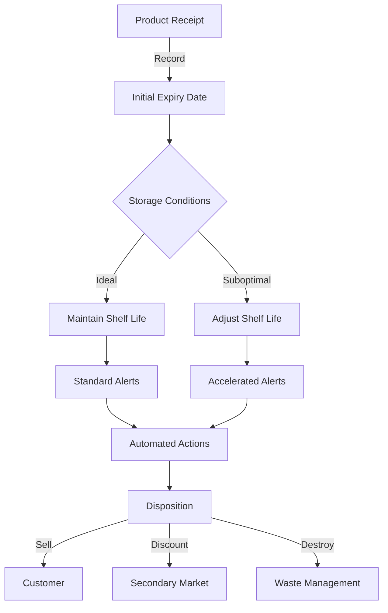
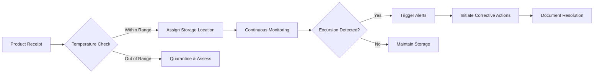
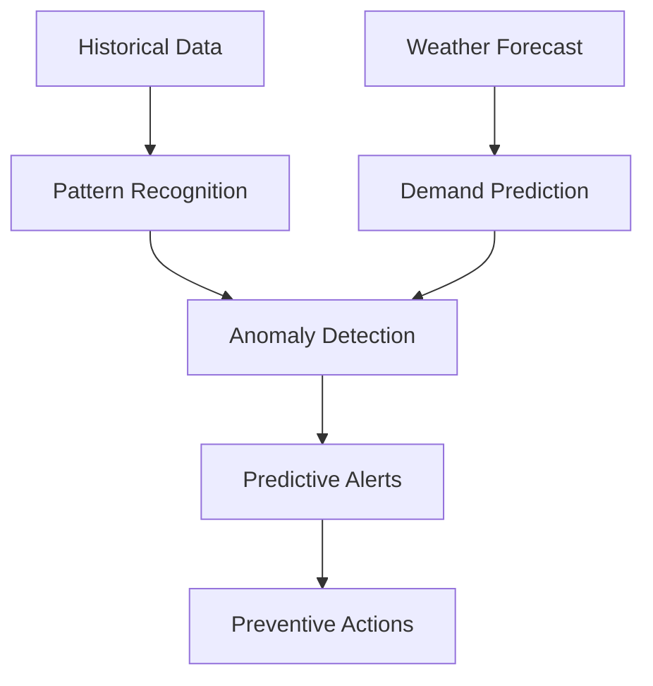
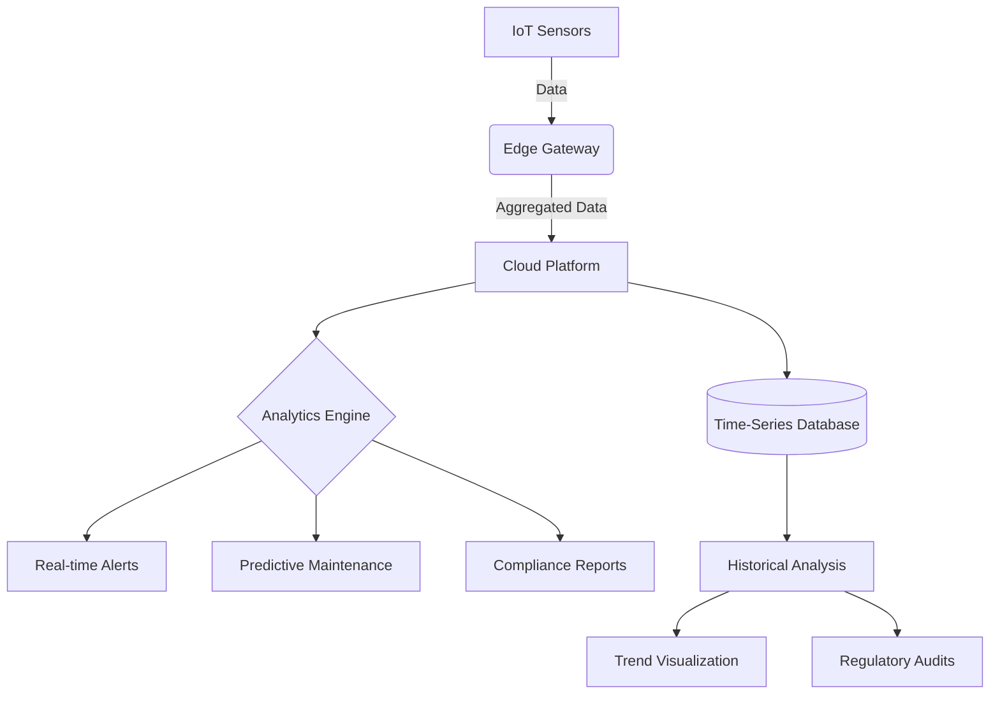
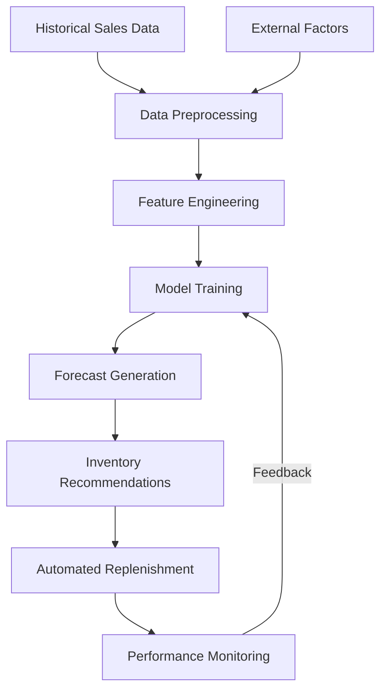

# Inventory Management Domain

# Expiration Date Management

## Overview

Expiration Date Management is a critical component of EFI's food safety and quality assurance program, ensuring that all products are tracked, monitored, and managed according to their shelf life characteristics. This system prevents the sale or distribution of expired products, reduces waste, and ensures regulatory compliance across all jurisdictions where EFI operates.

## Core Capabilities

### 1. Intelligent Expiration Tracking



### 2. Dynamic Shelf Life Adjustment

```typescript
interface ShelfLifeAdjustment {
  productId: string;
  batchId: string;
  originalExpiry: Date;
  adjustedExpiry: Date;
  adjustmentReason: 'TEMPERATURE' | 'HUMIDITY' | 'PACKAGING' | 'QUALITY_ASSESSMENT';
  adjustmentFactor: number; // 0-1 representing % of original shelf life
  recordedBy: string;
  recordedAt: Date;
  supportingEvidence?: {
    temperatureReadings?: TemperatureLog[];
    qualityTests?: QualityTestResult[];
    images?: string[];
  };
  approval?: {
    required: boolean;
    approvedBy?: string;
    approvedAt?: Date;
    notes?: string;
  };
}
```

### 3. Multi-Level Alerting System

| Alert Level | Trigger | Actions |
|-------------|---------|---------|
| **Green** | >30 days to expiry | Normal operations |
| **Yellow** | 15-30 days to expiry | Priority picking, Promotional bundling |
| **Orange** | 7-14 days to expiry | Manager notification, Discount pricing |
| **Red** | <7 days to expiry | Removal from primary sales channels, Donation coordination |
| **Black** | Expired | Immediate quarantine, Destruction scheduling |

### 4. Automated Workflows

1. **Receiving Workflow**
   - Scan product barcode
   - Capture batch/lot and expiry information
   - Verify against purchase order
   - Apply initial quality assessment
   - Assign storage location based on temperature requirements

2. **Daily Monitoring**
   - Scan storage areas for expired/near-expiry products
   - Record environmental conditions
   - Generate exception reports
   - Trigger automated actions based on rules

3. **Disposition Workflow**
   - Quarantine expired products
   - Document destruction process
   - Record waste for sustainability reporting
   - Update inventory records

## Integration Points

### 1. Supplier Collaboration
- Share expiry date requirements in purchase orders
- Receive advance shipping notices with batch/lot details
- Digital quality certificates linked to batches

### 2. Warehouse Management
- Mobile scanning for expiry date verification
- Automated storage and retrieval system integration
- Pick-to-light systems with expiry date warnings

### 3. Sales & Marketing
- Dynamic pricing based on remaining shelf life
- Promotional campaigns for short-dated products
- Customer-specific expiry date requirements

### 4. Quality Control
- Sampling plans based on expiry profile
- Non-destructive testing integration
- Microbiological testing schedules

## Implementation Roadmap

| Phase | Timeline | Key Deliverables |
|-------|----------|------------------|
| 1. Core System | 0-3 months | Basic expiry tracking, Simple alerts |
| 2. Automation | 3-6 months | Workflow automation, Integration with WMS |
| 3. Intelligence | 6-9 months | ML-based shelf life prediction |
| 4. Optimization | 9-12 months | Automated disposition, Sustainability tracking |

## Metrics & Reporting

### Key Performance Indicators
- **Expired Inventory %** - Target: <0.1% of total inventory value
- **Days of Shelf Life Remaining** - Target: >80% of products with >60 days remaining
- **Waste Reduction** - Target: 15% reduction in expired goods YOY
- **Alert Response Time** - Target: <4 hours for critical alerts

### Standard Reports
1. **Expiry Risk Report**
   - Products by expiry date range
   - Value at risk by category
   - Historical waste analysis

2. **Vendor Performance**
   - Actual vs. promised shelf life
   - Quality issues by supplier
   - On-time delivery impact on shelf life

3. **Compliance Dashboard**
   - Regulatory requirements by region
   - Audit readiness status
   - Documentation completeness

## Regulatory Compliance

### Key Regulations
1. **FDA Food Code** - Proper dating and disposition
2. **EU Food Information to Consumers (FIC)** - Clear date marking
3. **FSMA** - Preventive controls for human food
4. **Local Health Department** - Food service guidelines

### Required Documentation
- Batch/lot numbers with production/expiry dates
- Temperature logs for time/temperature control for safety (TCS) foods
- Destruction certificates for expired goods
- Donation records for food recovery

## Training & Certification

### Required Training Modules
1. Expiry Date Management 101
2. Proper Product Handling Procedures
3. Temperature Control Best Practices
4. Waste Reduction Strategies
5. Regulatory Compliance Requirements

### Certification
- Annual certification for warehouse staff
- Quarterly refresher courses
- Manager-level food safety certification

## Continuous Improvement

### Feedback Loops
1. Customer complaints analysis
2. Waste tracking and root cause analysis
3. Supplier scorecards
4. Employee suggestions program

### Technology Upgrades
- IoT sensors for real-time monitoring
- Blockchain for enhanced traceability
- AI/ML for predictive analytics
- Mobile apps for field operations

## Batch and Expiration Tracking
<!-- GAP_IMPLEMENTED: Batch and Expiration Tracking -->
<!-- stub for "Batch and Expiration Tracking" gap in the inventory context -->

Batch and Expiration Tracking is a critical component of EFI's inventory management system, ensuring food safety, quality control, and regulatory compliance. This system provides end-to-end traceability of all food products from receipt through to customer delivery.

### Core Concepts

1. **Batch Identification**
   - Unique batch/lot numbers assigned to each product batch
   - GS1-128 barcodes for standardized identification
   - QR codes linking to detailed batch information

2. **Expiration Management**
   - First-Expired-First-Out (FEFO) inventory rotation
   - Dynamic shelf-life adjustment based on storage conditions
   - Progressive status indicators (e.g., Fresh, Approaching Expiry, Expired)

3. **Traceability**
   - Full chain of custody tracking
   - Supplier and origin documentation
   - Processing and handling records

### Technical Implementation

#### Batch Attributes

```typescript
interface BatchAttributes {
  batchNumber: string;
  productionDate: Date;
  expiryDate: Date;
  bestBeforeDate?: Date;
  harvestDate?: Date;
  countryOfOrigin: string;
  supplierBatchNumber: string;
  certifications: string[]; // e.g., Organic, Fair Trade, Halal
  storageConditions: {
    minTemperature: number;
    maxTemperature: number;
    humidityRange?: [number, number];
  };
  qualityMetrics: {
    phLevel?: number;
    waterActivity?: number;
    microbialCounts?: Record<string, number>;
  };
}
```

#### Expiration Management Rules

1. **Dynamic Shelf Life**
   - Base shelf life adjusted based on:
     - Actual storage temperature history
     - Humidity exposure
     - Light exposure
     - Package integrity

2. **Quality Status Transitions**
   ```mermaid
   stateDiagram-v2
     [*] --> Fresh
     Fresh --> ApproachingExpiry: 75% of shelf life elapsed
     ApproachingExpiry --> Expired: Reached expiry date
     ApproachingExpiry --> Quarantine: Quality issue detected
     Fresh --> Quarantine: Quality issue detected
     Quarantine --> Disposed: Unfit for consumption
     Quarantine --> Released: Issue resolved
   ```

3. **Batch Quarantine**
   - Automatic quarantine triggers:
     - Temperature excursions
     - Failed quality tests
     - Customer complaints
     - Supplier recalls

### Integration Points

1. **Supplier Integration**
   - EDI 856 (Advance Ship Notice) for batch details
   - Digital certificates of analysis
   - Blockchain-based provenance verification

2. **Warehouse Management**
   - Mobile scanning for batch verification
   - Automated storage and retrieval systems
   - Pick-to-light systems with batch validation

3. **Order Fulfillment**
   - Batch selection algorithms
   - Mixed batch order processing
   - Regulatory documentation generation

### Reporting and Analytics

1. **Key Metrics**
   - Batch expiration risk scores
   - Shrinkage forecasting
   - Supplier quality performance
   - Regulatory compliance status

2. **Regulatory Reporting**
   - FDA Food Safety Modernization Act (FSMA) 204
   - EU General Food Law (Regulation 178/2002)
   - Country-specific food safety regulations

### Implementation Recommendations

1. **Technology Stack**
   - IoT sensors for environmental monitoring
   - Blockchain for immutable record-keeping
   - Computer vision for label verification
   - Mobile apps for warehouse operations

2. **Process Automation**
   - Automated quality testing workflows
   - Smart alerts for expiration risks
   - Automated documentation generation

3. **Training and Compliance**
   - Digital work instructions
   - AR-assisted inspections
   - Automated compliance checking

## Temperature-Controlled Storage Management
<!-- GAP_IMPLEMENTED: Temperature-Controlled Storage -->
<!-- stub for "Temperature-Controlled Storage" gap in the inventory context -->

## Overview

Temperature-Controlled Storage Management is the backbone of EFI's commitment to food safety and quality preservation. This comprehensive system ensures that every temperature-sensitive product maintains its integrity from the moment it enters our facilities until it reaches the customer. Our multi-layered approach combines cutting-edge technology with rigorous protocols to exceed industry standards and regulatory requirements.



## Core Capabilities

### 1. Multi-Zone Temperature Control

| Zone | Temperature Range | Humidity | Key Products | Special Features |
|------|-------------------|----------|--------------|------------------|
| **Deep Freeze** | -25°C to -18°C | N/A | Ice cream, frozen seafood | Blast freezing, rapid pulldown |
| **Frozen** | -18°C to -22°C | N/A | Meats, prepared foods | Automated defrost, door monitoring |
| **Chilled** | 0°C to 4°C | 85-95% | Fresh fish, dairy | HACCP compliance, air curtains |
| **Cool** | 5°C to 8°C | 75-85% | Fresh produce, deli | Ethylene control, CO₂ monitoring |
| **Wine Cellar** | 12°C ±1°C | 70% ±5% | Wines, spirits | Vibration control, UV protection |
| **Ambient** | 15°C to 25°C | <65% | Dry goods, canned foods | Pest control, light management |

### 2. Smart Monitoring System

```typescript
interface TemperatureMonitoringConfig {
  sensorId: string;
  location: {
    zone: string;
    coordinates: [number, number, number]; // x, y, z in meters
    nearDoor: boolean;
  };
  measurement: {
    type: 'air' | 'product' | 'surface';
    frequency: number; // seconds between readings
    precision: number; // ±°C
  };
  thresholds: {
    criticalHigh: number;
    warningHigh: number;
    warningLow: number;
    criticalLow: number;
  };
  calibration: {
    lastCalibrated: Date;
    nextCalibration: Date;
    calibrationCertificate: string;
  };
  alertRules: {
    notifyOn: 'warning' | 'critical';
    escalationPath: string[];
    autoAction?: 'adjust' | 'alert' | 'quarantine';
  };
}
```

### 3. Cold Chain Integrity

1. **Inbound Logistics**
   - Pre-cooling verification
   - Temperature data loggers
   - Seal integrity checks

2. **Storage Management**
   - FIFO/FEFO compliance
   - Hot spot identification
   - Door opening analytics

3. **Outbound Logistics**
   - Pre-cooled vehicles
   - Real-time GPS tracking
   - Customer temperature handoff

## Advanced Features

### 1. Predictive Analytics



### 2. Energy Optimization

| Strategy | Implementation | Expected Savings |
|----------|----------------|------------------|
| **Thermal Blanketing** | Phase-change materials on walls | 15-20% energy reduction |
| **AI Defrost** | Machine learning-based defrost cycles | 10-15% energy savings |
| **Door Analytics** | Reduced opening times | 5-8% energy reduction |
| **LED Lighting** | Motion-activated, cold-rated LEDs | 3-5% energy savings |

### 3. Quality Preservation

1. **Atmosphere Control**
   - Modified Atmosphere Packaging (MAP) integration
   - Ethylene and CO₂ scrubbers
   - Oxygen level management

2. **Product-Specific Protocols**
   - Chilling injury prevention
   - Respiration rate management
   - Ripening control systems

## Compliance & Documentation

### Regulatory Requirements

| Standard | Requirement | Implementation |
|----------|-------------|----------------|
| **HACCP** | Critical Control Points | Automated monitoring & verification |
| **FDA 21 CFR 11** | Electronic records | Blockchain-secured logs |
| **EU 178/2002** | Full traceability | Farm-to-fork tracking |
| **BRCGS** | Auditable records | Automated reporting |

### Required Documentation

1. **Temperature Logs**
   - Continuous monitoring records
   - Calibration certificates
   - Excursion reports

2. **Equipment Maintenance**
   - Preventive maintenance records
   - Repair logs
   - Performance validations

3. **Training Records**
   - Temperature control procedures
   - Emergency response training
   - Equipment operation certification

## Implementation Roadmap

| Phase | Timeline | Key Deliverables |
|-------|----------|------------------|
| **1. Foundation** | 0-3 months | Core monitoring, basic alerts |
| **2. Automation** | 3-6 months | Smart controls, energy optimization |
| **3. Intelligence** | 6-12 months | Predictive analytics, ML optimization |
| **4. Integration** | 12-18 months | Full supply chain visibility |

## Emergency Response

### Temperature Excursion Protocol

1. **Immediate Actions**
   - Isolate affected products
   - Document time/temperature
   - Initiate backup systems

2. **Assessment**
   - Product impact analysis
   - Root cause investigation
   - Risk assessment

3. **Resolution**
   - Corrective actions
   - Preventative measures
   - Documentation & reporting

## Performance Metrics

| KPI | Target | Measurement |
|-----|--------|-------------|
| **Temperature Compliance** | ≥99.9% | % time in spec |
| **Energy Efficiency** | ≤0.8 kWh/m³/month | Energy usage per volume |
| **Incident Response** | <15 minutes | Time to acknowledge |
| **Product Quality** | <0.1% loss | Waste due to temp issues |

## Training & Certification

### Required Training Modules
1. Temperature Control Fundamentals
2. Equipment Operation
3. Emergency Response
4. Regulatory Compliance
5. Data Management

### Certification Requirements
- Annual refresher training
- Equipment-specific certification
- HACCP certification for managers
- Third-party audits

4. **Specialty Storage**
   - Chocolate: 15-18°C, 50-60% RH
   - Wine Cellar: 12-14°C, 60-70% RH
   - Cheese Cave: 4-10°C, 80-95% RH
   - Bread & Bakery: 18-22°C, 60-70% RH

### Technical Architecture

#### 1. Infrastructure Components



#### 2. Monitoring Stack

| Component | Technology | Purpose |
|-----------|------------|---------|
| Sensors | Bluetooth 5.0/6LoWPAN | Temperature, humidity, door status |
| Gateway | Industrial IoT Edge | Local processing, buffering |
| Cloud | AWS IoT Core | Device management, message broker |
| Database | TimescaleDB | Time-series data storage |
| Analytics | Apache Flink | Stream processing |
| Visualization | Grafana | Real-time dashboards |
| Alerting | PagerDuty | Incident management |

1. **Infrastructure**
   - Walk-in coolers and freezers with redundant cooling systems
   - Temperature mapping to identify hot/cold spots
   - Backup power systems with automatic transfer switches
   - Insulated storage areas with proper air circulation

2. **Monitoring Systems**
   - Wireless temperature sensors with real-time monitoring
   - Automated alerting for temperature excursions
   - Data logging for regulatory compliance
   - Remote monitoring capabilities

3. **Compliance & Documentation**
   - HACCP compliance monitoring
   - FDA Food Safety Modernization Act (FSMA) requirements
   - Local health department regulations
   - Audit trails for temperature data

### Advanced Monitoring & Control

#### 1. Predictive Analytics

- **Machine Learning Models**
  - Predict equipment failures 72h in advance
  - Forecast energy consumption patterns
  - Optimize defrost cycles based on usage patterns

- **Anomaly Detection**
  - Real-time pattern recognition
  - Multi-variate analysis of sensor data
  - Automated root cause analysis

#### 2. Automated Workflows

```typescript
interface TemperatureAlert {
  alertId: string;
  deviceId: string;
  zone: string;
  currentTemp: number;
  threshold: number;
  timestamp: string;
  severity: 'WARNING' | 'CRITICAL' | 'EMERGENCY';
  autoActions: {
    notification: boolean;
    equipmentAdjustment?: {
      target: string;  // e.g., 'compressor1', 'fan2'
      action: 'START' | 'STOP' | 'INCREASE' | 'DECREASE';
      value?: number;
    };
    backupActivation?: boolean;
  };
}
```

### Operational Procedures & Compliance

#### 1. Standard Operating Procedures

1. **Receiving**
   - Verify temperature of incoming shipments
   - Document temperature upon receipt
   - Reject shipments outside acceptable ranges
   - Quarantine until temperature verification

2. **Storage**
   - Follow FIFO/FEFO principles
   - Maintain proper air circulation
   - Regular defrosting of freezers
   - Scheduled equipment maintenance

3. **Handling**
   - Minimize door openings
   - Use of thermal blankets during loading/unloading
   - Time limits for products outside storage
   - Proper stacking to allow air flow

### Integration Points

1. **Inventory Management**
   - Real-time temperature data integration
   - Automated hold/release based on temperature
   - Quality status updates

2. **Order Fulfillment**
   - Pick path optimization to minimize exposure
   - Temperature-appropriate packaging
   - Time-out monitoring for order staging

3. **Quality Assurance**
   - Regular product quality checks
   - Shelf-life monitoring
   - Product testing protocols

### Key Performance Indicators

| KPI | Target | Measurement Frequency |
|-----|--------|----------------------|
| Temperature Compliance | ≥99.9% | Daily |
| Excursion Response Time | ≤15 minutes | Per Incident |
| Equipment Uptime | ≥99.5% | Monthly |
| Energy Efficiency | ≤5% variance from baseline | Monthly |
| Audit Readiness | 100% compliance | Quarterly |

### Implementation Roadmap

1. **Phase 1: Foundation (0-3 months)**
   - Install monitoring infrastructure
   - Implement basic alerting
   - Train staff on procedures

2. **Phase 2: Optimization (3-6 months)**
   - Integrate with inventory management
   - Implement predictive maintenance
   - Refine storage layouts

3. **Phase 3: Advanced (6-12 months)**
   - AI-driven temperature optimization
   - Automated quality prediction
   - Blockchain for chain of custody

### Related Documents
- Temperature Monitoring SOP
- Emergency Response Plan
- Equipment Maintenance Logs
- Regulatory Compliance Checklist

## Domain Overview

The Inventory Management domain is responsible for tracking, controlling, and optimizing the stock of specialty food products throughout Elias Food Imports' supply chain. This domain handles inventory levels, warehouse management, batch tracking, expiration date monitoring, and inventory forecasting. It serves as a critical component that ensures product availability while minimizing waste, particularly important for specialty food items that often have limited shelf life, special storage requirements, and varying seasonal availability.

The current implementation of the Inventory Management domain has been identified as having significant gaps, particularly in batch/expiration tracking, temperature-controlled storage management, and forecasting capabilities for perishable items. This document outlines the comprehensive domain model for Inventory Management with a focus on addressing these gaps to better support Elias Food Imports' specialty food business.

> **Note**: The Batch and Expiration Tracking section has been significantly enhanced to address the critical gap identified in the domain analysis, providing comprehensive traceability and quality control for EFI's specialty food products.

## Strategic Importance

**Classification**: Core Domain

**Justification**: The Inventory Management domain is classified as a core domain for Elias Food Imports because effective inventory management of specialty food products represents a significant competitive advantage in the market. The ability to maintain optimal inventory levels of premium, often perishable products while ensuring quality, freshness, and authenticity directly impacts customer satisfaction, operational efficiency, and profitability. The specialized requirements of food inventory management—including batch tracking, expiration monitoring, temperature control, and regulatory compliance—make this domain a key differentiator for Elias Food Imports rather than a commodity function.

## Core Concepts

### Inventory Item
The basic unit of inventory tracking, representing a specific product at a specific location with attributes including quantity, status, and storage conditions.

### Inventory Batch
A group of inventory items that share common characteristics such as production date, expiration date, supplier, and quality attributes, allowing for precise tracking and management of product lifecycle.

### Storage Location
A physical or logical location where inventory is stored, including attributes such as temperature range, humidity level, and storage capacity, critical for maintaining food quality.

### Inventory Reservation
A temporary allocation of inventory that prevents it from being assigned to other orders or processes, ensuring availability during customer checkout or other operations.

### Inventory Movement
A record of inventory changing location, status, or ownership within the system, providing a complete audit trail of product flow.

### Expiration Tracking
The monitoring and management of product expiration dates to ensure food safety, minimize waste, and optimize inventory rotation.

### Temperature Control
The monitoring and management of storage temperatures for products requiring specific temperature ranges to maintain quality and safety.

### Inventory Forecast
Predictions of future inventory levels based on historical data, seasonality, promotions, and other factors to optimize purchasing and production planning.

### Quality Control
The processes and checks that ensure inventory meets quality standards, including sensory evaluation, laboratory testing, and compliance verification.

### Inventory Allocation
The assignment of specific inventory to fulfill customer orders or other business needs, often following FIFO (First In, First Out) or FEFO (First Expired, First Out) principles.

## Business Rules

### Inventory Tracking and Management

1. All inventory items must be associated with a specific storage location and product SKU.
2. Inventory levels must be updated in real-time when products are received, allocated, shipped, or adjusted.
3. Negative inventory is not permitted; inventory operations that would result in negative quantities must be rejected.
4. Each inventory transaction must be recorded with timestamp, user, quantity, reason code, and reference information.
5. Inventory counts must be reconciled with physical counts at least weekly for high-value items and monthly for standard items.
6. Inventory accuracy must be maintained at ≥ 99.9% as measured by physical inventory counts.
7. Inventory adjustments exceeding $500 in value require manager approval and documentation.
8. Real-time inventory visibility must be provided to all relevant stakeholders, including sales, purchasing, and fulfillment teams.

### Batch and Expiration Management

1. All perishable products must be tracked at the batch level with production and expiration dates.
2. Inventory allocation must follow FEFO (First Expired, First Out) principles for perishable items.
3. System must generate alerts for products approaching expiration: 30 days, 14 days, and 7 days before expiration.
4. Products that have reached 75% of their shelf life must be flagged for potential promotional pricing.
5. Expired products must be automatically quarantined and not available for sale.
6. Batch information must include supplier, country of origin, production date, and any applicable certification information.
7. Complete batch traceability must be maintained from supplier to customer for food safety and recall management.
8. Batch sampling protocols must be defined and executed for quality assurance purposes.

### Temperature-Controlled Inventory

1. Products must be stored in locations with appropriate temperature ranges as defined in their product specifications.
2. Temperature-controlled storage locations must be continuously monitored with alerts for out-of-range conditions.
3. Temperature excursions must be logged with duration and magnitude to assess product quality impact.
4. Cold chain compliance must be maintained and documented throughout the receiving, storage, and shipping processes.
5. Products exposed to temperature excursions must be evaluated by quality control before being made available for sale.
6. Temperature logs must be maintained for regulatory compliance and quality assurance for a minimum of 3 years.
7. Different temperature zones (ambient, refrigerated, frozen) must be clearly defined with appropriate inventory segregation.
8. Temperature-sensitive products must be labeled with appropriate handling instructions.

### Inventory Reservations

1. Inventory reservations are created when items are added to a shopping cart with a default duration of 30 minutes.
2. Reservations are automatically extended during active cart sessions.
3. Expired reservations are automatically released back to available inventory.
4. Reservations are converted to allocations when an order is placed.
5. Reservation conflicts must be resolved with priority given to completed orders over cart reservations.
6. Reservation status must be visible to customer service and sales teams.
7. Bulk reservations for B2B customers may have extended durations based on customer agreements.
8. Reservation capacity must not exceed 25% of available inventory for any SKU to prevent artificial stockouts.

### Inventory Forecasting and Planning

1. Inventory forecasts must be generated weekly for a 12-week forward horizon.
2. Forecast accuracy must be measured and maintained at ≥ 85% for A-category items.
3. Seasonal patterns must be incorporated into forecast algorithms for specialty food items.
4. Safety stock levels must be dynamically calculated based on demand variability, lead time, and service level targets.
5. Reorder points must trigger purchase recommendations automatically.
6. Slow-moving inventory (no movement in 60 days) must be flagged for review.
7. Forecast models must incorporate promotional events, seasonality, and historical sales patterns.
8. Inventory optimization must balance service levels (target ≥ 98%) with inventory carrying costs.

### Quality Control and Compliance

1. All received inventory must pass quality inspection before being made available for sale.
2. Quality control samples must be taken from each batch according to the sampling plan.
3. Products failing quality checks must be quarantined pending supplier resolution.
4. All quality control results must be recorded and linked to the specific inventory batch.
5. Regulatory compliance documentation must be maintained for each product batch.
6. Allergen control protocols must be followed for storage location assignments to prevent cross-contamination.
7. Recall procedures must enable identification and quarantine of affected batches within 2 hours of notification.
8. Quality metrics must be tracked and reported monthly, including rejection rates and quality incidents.

## Advanced Forecasting
<!-- GAP_IMPLEMENTED: Advanced Forecasting -->
<!-- stub for "Advanced Forecasting" gap in the inventory context -->

Advanced Forecasting is a critical capability for EFI's inventory management, enabling data-driven decision making for perishable and seasonal food products. This system leverages historical sales data, market trends, and external factors to optimize inventory levels and reduce waste.

### Core Capabilities

1. **Demand Forecasting**
   - Time-series analysis of historical sales data
   - Seasonality and trend detection
   - Promotional impact modeling
   - New product introduction forecasting

2. **Machine Learning Models**
   - Product clustering for similar demand patterns
   - Anomaly detection for unusual demand patterns
   - External factor integration (weather, events, economic indicators)
   - Continuous model retraining and validation

3. **Inventory Optimization**
   - Safety stock calculations
   - Reorder point optimization
   - Service level targeting
   - Multi-echelon inventory optimization

### Implementation Approach



### Integration Points

- **Order Processing**: Informs inventory availability and lead times
- **Supplier Management**: Drives purchase order quantities and timing
- **Pricing**: Supports dynamic pricing decisions based on inventory levels
- **Marketing**: Aligns promotions with inventory availability

### Success Metrics

- Forecast accuracy (MAPE)
- Inventory turnover ratio
- Stockout rate
- Waste percentage
- Service level achieved

## Domain Events

### InventoryReceived

**Description**: Triggered when new inventory is received and recorded in the system.

**Payload**:
```typescript
interface InventoryReceivedEvent {
  inventoryBatchId: string;
  productId: string;
  warehouseId: string;
  quantity: number;
  receivedAt: Date;
  expirationDate?: Date;
  supplierId: string;
  purchaseOrderId?: string;
  qualityStatus: 'PENDING_INSPECTION' | 'APPROVED' | 'REJECTED';
  storageRequirements: StorageRequirements;
  batchAttributes: Record<string, string>;
}
```

**Producer Context**: Inventory

**Consumer Contexts**:
- **Catalog**: To update product availability
- **Analytics**: To track inventory metrics
- **Purchasing**: To update purchase order status

### InventoryAdjusted

**Description**: Triggered when inventory quantities are manually adjusted due to counts, damage, or other non-transactional reasons.

**Payload**:
```typescript
interface InventoryAdjustedEvent {
  inventoryBatchId: string;
  productId: string;
  warehouseId: string;
  previousQuantity: number;
  newQuantity: number;
  adjustmentReason: string;
  adjustmentType: 'COUNT' | 'DAMAGE' | 'EXPIRATION' | 'QUALITY' | 'OTHER';
  adjustedAt: Date;
  adjustedBy: string;
  notes?: string;
}
```

**Producer Context**: Inventory

**Consumer Contexts**:
- **Catalog**: To update product availability
- **Analytics**: To track inventory adjustments
- **Finance**: To account for inventory value changes

### InventoryReserved

**Description**: Triggered when inventory is temporarily reserved for a cart or order.

**Payload**:
```typescript
interface InventoryReservedEvent {
  reservationId: string;
  productId: string;
  batchIds: string[];
  warehouseId: string;
  quantity: number;
  reservationType: 'CART' | 'ORDER' | 'OTHER';
  expiresAt: Date;
  reservedAt: Date;
  referenceId: string; // cartId or orderId
}
```

**Producer Context**: Inventory

**Consumer Contexts**:
- **Order**: To update order fulfillment status
- **Shopping Cart**: To confirm inventory availability

### InventoryReleased

**Description**: Triggered when a temporary inventory reservation is released.

**Payload**:
```typescript
interface InventoryReleasedEvent {
  reservationId: string;
  productId: string;
  batchIds: string[];
  warehouseId: string;
  quantity: number;
  releaseReason: 'EXPIRATION' | 'CART_ABANDONED' | 'ORDER_CANCELLED' | 'MANUAL';
  releasedAt: Date;
  referenceId?: string; // cartId or orderId
}
```

**Producer Context**: Inventory

**Consumer Contexts**:
- **Shopping Cart**: To update cart status
- **Order**: To update order status
- **Catalog**: To update product availability

### InventoryAllocated

**Description**: Triggered when inventory is permanently allocated to fulfill an order.

**Payload**:
```typescript
interface InventoryAllocatedEvent {
  allocationId: string;
  orderId: string;
  orderLineItemId: string;
  productId: string;
  batchIds: string[];
  warehouseId: string;
  quantity: number;
  allocatedAt: Date;
}
```

**Producer Context**: Inventory

**Consumer Contexts**:
- **Order**: To update order fulfillment status
- **Shipping**: To enable shipment planning

### InventoryLow

**Description**: Triggered when product inventory falls below threshold.

**Payload**:
```typescript
interface InventoryLowEvent {
  productId: string;
  warehouseId: string;
  currentQuantity: number;
  threshold: number;
  detectedAt: Date;
  projectedStockoutDate?: Date;
  reorderSuggestion?: {
    suggestedQuantity: number;
    suggestedSupplier: string;
    estimatedLeadTime: number; // in days
  };
}
```

**Producer Context**: Inventory

**Consumer Contexts**:
- **Notification**: To alert inventory managers
- **Analytics**: To update inventory risk metrics
- **Purchasing**: To trigger reorder processes

### BatchExpirationWarning

**Description**: Triggered when a product batch is approaching its expiration date.

**Payload**:
```typescript
interface BatchExpirationWarningEvent {
  batchId: string;
  productId: string;
  warehouseId: string;
  currentQuantity: number;
  expirationDate: Date;
  daysRemaining: number;
  warningLevel: 'CRITICAL' | 'WARNING' | 'NOTICE';
  detectedAt: Date;
}
```

**Producer Context**: Inventory

**Consumer Contexts**:
- **Notification**: To alert inventory managers
- **Marketing**: To consider for promotions
- **Pricing**: To consider for dynamic pricing

### TemperatureExcursionDetected

**Description**: Triggered when a temperature-controlled storage location experiences a temperature outside of acceptable range.

**Payload**:
```typescript
interface TemperatureExcursionEvent {
  storageLocationId: string;
  warehouseId: string;
  detectedAt: Date;
  expectedRange: {
    min: number;
    max: number;
    unit: 'CELSIUS' | 'FAHRENHEIT';
  };
  actualTemperature: number;
  excursionDuration: number; // in minutes
  severity: 'CRITICAL' | 'MAJOR' | 'MINOR';
  affectedBatchIds: string[];
}
```

**Producer Context**: Inventory

**Consumer Contexts**:
- **Notification**: To alert facilities management
- **Quality Control**: To assess product impact
- **Catalog**: To potentially update product availability

## Aggregates, Entities, and Value Objects

### InventoryBatch Aggregate

**Attributes**:

| Attribute | Type | Description |
|-----------|------|-------------|
| id | BatchId | Unique identifier for the inventory batch |
| productId | ProductId | Reference to the associated product |
| warehouseId | WarehouseId | Reference to the storage location |
| quantity | number | Current quantity in stock |
| receivedAt | Date | Date when batch was received |
| expirationDate | Date | Expiration date for perishable items |
| supplierId | SupplierId | Reference to the supplier |
| qualityStatus | QualityStatus | Current quality control status |
| storageConditions | StorageConditions | Required storage parameters |
| batchAttributes | Record<string, string> | Additional batch-specific attributes |

**Invariants**:

1. Batch quantity must be non-negative
2. Expiration date must be after received date for perishable items
3. Storage conditions must match product requirements
4. Quality status must be valid for batch operations

**Methods**:

```typescript
class InventoryBatch {
  constructor(
    id: BatchId,
    productId: ProductId,
    warehouseId: WarehouseId,
    quantity: number,
    receivedAt: Date,
    expirationDate?: Date,
    supplierId: SupplierId,
    qualityStatus: QualityStatus
  ) {}

  public reserve(quantity: number, reservationType: ReservationType): void {
    // Validate available quantity
    // Update batch status
    // Emit InventoryReserved event
  }

  public releaseReservation(reservationId: string): void {
    // Update batch status
    // Emit InventoryReleased event
  }

  public allocateToOrder(orderId: string, quantity: number): void {
    // Validate available quantity
    // Update batch status
    // Emit InventoryAllocated event
  }

  public adjustQuantity(
    adjustment: number,
    reason: AdjustmentReason,
    notes?: string
  ): void {
    // Update quantity
    // Record adjustment
    // Emit InventoryAdjusted event
  }

  public updateQualityStatus(
    newStatus: QualityStatus,
    reason: string
  ): void {
    // Update quality status
    // Record change
    // Emit QualityStatusChanged event
  }
}
```

### StorageLocation Aggregate

**Attributes**:

| Attribute | Type | Description |
|-----------|------|-------------|
| id | LocationId | Unique identifier for the storage location |
| warehouseId | WarehouseId | Reference to the warehouse |
| locationType | LocationType | Type of storage (ambient, refrigerated, frozen) |
| capacity | number | Maximum storage capacity |
| currentOccupancy | number | Current quantity stored |
| temperatureRange | TemperatureRange | Required temperature range |
| humidityRange | HumidityRange | Required humidity range |
| locationAttributes | Record<string, string> | Additional location attributes |

**Invariants**:

1. Temperature range must be valid for location type
2. Humidity range must be valid for location type
3. Capacity must be positive
4. Current occupancy cannot exceed capacity

**Methods**:

```typescript
class StorageLocation {
  constructor(
    id: LocationId,
    warehouseId: WarehouseId,
    locationType: LocationType,
    capacity: number,
    temperatureRange: TemperatureRange,
    humidityRange: HumidityRange
  ) {}

  public canStoreProduct(product: Product): boolean {
    // Validate if location meets product storage requirements
  }

  public updateTemperatureReading(reading: TemperatureReading): void {
    // Update current temperature
    // Check for excursions
    // Emit TemperatureExcursionDetected if needed
  }

  public calculateRemainingCapacity(): number {
    // Calculate available capacity
  }
}
```

### Value Objects

#### BatchId

```typescript
interface BatchId {
  value: string;
  isValid(): boolean;
  equals(other: BatchId): boolean;
}
```

#### LocationId

```typescript
interface LocationId {
  value: string;
  isValid(): boolean;
  equals(other: LocationId): boolean;
}
```

#### TemperatureRange

```typescript
interface TemperatureRange {
  min: number;
  max: number;
  unit: 'CELSIUS' | 'FAHRENHEIT';
  isValid(): boolean;
  contains(temperature: number): boolean;
}
```

#### StorageConditions

```typescript
interface StorageConditions {
  temperatureRange: TemperatureRange;
  humidityRange: HumidityRange;
  lightExposure: LightExposure;
  vibrationSensitivity: boolean;
  stackingHeight: number;
  meetsRequirements(): boolean;
}
```

#### QualityStatus

```typescript
enum QualityStatus {
  PENDING_INSPECTION = 'PENDING_INSPECTION',
  APPROVED = 'APPROVED',
  REJECTED = 'REJECTED',
  QUARANTINED = 'QUARANTINED',
  EXPIRED = 'EXPIRED'
}
```

#### ReservationType

```typescript
enum ReservationType {
  CART = 'CART',
  ORDER = 'ORDER',
  OTHER = 'OTHER'
}
```

#### AdjustmentReason

```typescript
enum AdjustmentReason {
  COUNT = 'COUNT',
  DAMAGE = 'DAMAGE',
  EXPIRATION = 'EXPIRATION',
  QUALITY = 'QUALITY',
  OTHER = 'OTHER'
}

## Domain Services

### InventoryReservationService

**Purpose**: Manages temporary inventory reservations for cart and order processes.

```typescript
interface InventoryReservationService {
  reserveInventory(
    productId: string,
    quantity: number,
    reservationType: ReservationType,
    duration: Duration
  ): ReservationResult;

  extendReservation(reservationId: string, newDuration: Duration): void;

  releaseReservation(reservationId: string): void;

  resolveReservationConflict(
    reservationId: string,
    orderId: string
  ): ReservationResolution;
}

### BatchManagementService

**Purpose**: Manages inventory batch lifecycle and operations.

```typescript
interface BatchManagementService {
  createBatch(
    productId: string,
    warehouseId: string,
    quantity: number,
    supplierId: string,
    expirationDate?: Date,
    batchAttributes?: Record<string, string>
  ): BatchCreationResult;
  
  updateBatchAttributes(
    batchId: string,
    attributes: Record<string, string>
  ): void;
  
  mergeBatches(
    sourceBatchIds: string[],
    targetLocationId: string
  ): BatchMergeResult;
  
  splitBatch(
    sourceBatchId: string,
    quantities: Record<string, number>
  ): BatchSplitResult;
  
  quarantineBatch(
    batchId: string,
    reason: string
  ): void;
  
  releaseBatchFromQuarantine(
    batchId: string,
    approvedBy: string
  ): void;
}

### TemperatureMonitoringService

**Purpose**: Monitors and manages temperature conditions for storage locations.

```typescript
interface TemperatureMonitoringService {
  registerTemperatureReading(
    locationId: string,
    temperature: number,
    recordedAt: Date
  ): void;
  
  getTemperatureHistory(
    locationId: string,
    startDate: Date,
    endDate: Date
  ): TemperatureReading[];
  
  detectExcursions(
    locationId: string,
    timeWindow: Duration
  ): TemperatureExcursion[];
  
  evaluateProductImpact(
    excursionId: string
  ): ProductImpactAssessment[];
}

### InventoryForecastingService

**Purpose**: Provides inventory forecasting and planning capabilities.

```typescript
interface InventoryForecastingService {
  generateForecast(
    productId: string,
    forecastHorizon: Duration,
    granularity: 'DAILY' | 'WEEKLY' | 'MONTHLY'
  ): InventoryForecast;
  
  calculateSafetyStock(
    productId: string,
    serviceLevel: number
  ): number;
  
  calculateReorderPoint(
    productId: string,
    leadTime: Duration,
    serviceLevel: number
  ): number;
  
  identifySlowMovingInventory(
    thresholdDays: number
  ): SlowMovingInventoryReport;
}

## Integration Points

### With Order Context

- **Inventory Reservation**: When items are added to cart or orders are placed, the Order Context requests inventory reservations from the Inventory Context.
- **Order Fulfillment**: When orders are ready for fulfillment, the Order Context requests inventory allocation from the Inventory Context.
- **Events Consumed**:
  - `OrderPlaced`: Triggers conversion of reservations to allocations
  - `OrderCancelled`: Triggers release of allocated inventory
  - `OrderModified`: Triggers adjustment of allocated inventory

### With Catalog Context

- **Product Availability**: Inventory Context provides real-time availability information to the Catalog Context.
- **Product Information**: Catalog Context provides product specifications including storage requirements to the Inventory Context.
- **Events Consumed**:
  - `ProductCreated`: Triggers setup of inventory tracking for new products
  - `ProductUpdated`: Updates storage requirements and other inventory-related attributes
  - `ProductDiscontinued`: Triggers inventory disposition planning

### With Purchasing Context

- **Inventory Levels**: Inventory Context provides current levels and forecasts to inform purchasing decisions.
- **Purchase Orders**: Purchasing Context provides information about incoming inventory from purchase orders.
- **Events Consumed**:
  - `PurchaseOrderCreated`: Creates expected receipts in the inventory system
  - `PurchaseOrderDelivered`: Triggers inventory receiving process

### With Shipping Context

- **Inventory Allocation**: Inventory Context provides allocated inventory information for shipment planning.
- **Shipment Confirmation**: Shipping Context confirms when inventory has been shipped, triggering inventory deduction.
- **Events Consumed**:
  - `ShipmentCreated`: Finalizes inventory allocation
  - `ShipmentShipped`: Triggers inventory reduction

### With Analytics Context

- **Inventory Metrics**: Inventory Context provides data on inventory levels, turns, accuracy, and other KPIs.
- **Forecasting Models**: Analytics Context provides advanced forecasting models to improve inventory planning.
- **Events Consumed**:
  - `ForecastGenerated`: Updates inventory planning parameters
  - `AnalyticsModelUpdated`: Improves inventory optimization algorithms

### With Catalog Authentication Context

- **Product Authentication**: Catalog Authentication Context provides verification of product authenticity for inventory.
- **Quarantine Management**: Inventory Context quarantines products that fail authentication.
- **Events Consumed**:
  - `ProductAuthenticated`: Updates inventory quality status
  - `AuthenticationFailed`: Triggers inventory quarantine

## Implementation Recommendations

### Architecture

1. **Microservice Architecture**: Implement the Inventory Context as a dedicated microservice with its own database to ensure scalability and isolation.
2. **Event-Driven Communication**: Use an event-driven architecture for communication between contexts, with a robust message broker (e.g., Apache Kafka, RabbitMQ) to ensure reliable event delivery.
3. **CQRS Pattern**: Implement Command Query Responsibility Segregation to separate read and write operations, optimizing for both high-volume inventory transactions and complex queries.
4. **Domain-Driven Design**: Structure the implementation following DDD principles with clear boundaries between aggregates and strong enforcement of invariants.

### Technical Implementation

1. **Database**: 
   - Use a relational database for core inventory transactions to ensure ACID compliance
   - Consider time-series database for temperature monitoring data
   - Implement optimistic concurrency control for inventory operations

2. **API Design**:
   - RESTful APIs for synchronous operations
   - GraphQL for complex inventory queries
   - Asynchronous APIs using webhooks for long-running processes

3. **Batch Processing**:
   - Implement batch processing for inventory counts, adjustments, and reconciliation
   - Use idempotent operations to prevent duplicate processing

4. **Caching Strategy**:
   - Cache inventory levels with appropriate invalidation strategies
   - Implement read-through and write-through caching for high-volume SKUs

### Scalability and Performance

1. **Horizontal Scaling**: Design the service to scale horizontally for increased load, particularly during peak seasons.
2. **Partitioning Strategy**: Partition inventory data by warehouse or product category to improve performance.
3. **Query Optimization**: Implement specialized read models for common inventory queries.
4. **Background Processing**: Move non-critical operations to background jobs to maintain responsiveness.

### Data Quality and Resilience

1. **Data Validation**: Implement strict validation rules for all inventory operations.
2. **Audit Trail**: Maintain a comprehensive audit trail of all inventory changes.
3. **Reconciliation Process**: Implement automated reconciliation between physical counts and system records.
4. **Disaster Recovery**: Design robust backup and recovery procedures with point-in-time recovery capability.

### Implementation Phases

1. **Phase 1**: Core inventory tracking and batch management
   - Basic inventory operations (receive, adjust, allocate)
   - Batch tracking and expiration management
   - Integration with Order and Catalog contexts

2. **Phase 2**: Advanced inventory capabilities
   - Temperature monitoring system
   - Reservation system
   - Integration with Shipping and Purchasing contexts

3. **Phase 3**: Optimization and intelligence
   - Forecasting and planning capabilities
   - Advanced analytics integration
   - Machine learning for demand prediction

### Testing Strategy

1. **Unit Testing**: Comprehensive unit tests for all domain logic and business rules.
2. **Integration Testing**: Test interactions between Inventory Context and other contexts.
3. **Performance Testing**: Ensure the system can handle peak loads and maintain response times.
4. **Chaos Testing**: Verify system resilience under failure conditions.
5. **Domain Scenario Testing**: Test complete business scenarios that cross multiple contexts.
