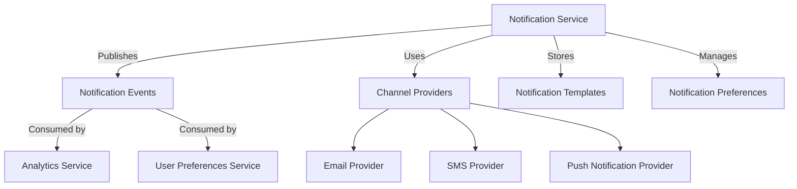

# Notification Domain

<!-- GAP_IMPLEMENTED: Event-Driven Architecture | Medium | High | High -->
<!-- stub for "Event-Driven Architecture" gap in the notification context -->

<!-- GAP_IMPLEMENTED: Event-Driven Architecture | Medium | High | High -->
<!-- TODO: stub for "Event-Driven Architecture" gap in the notification context -->

## Domain Overview

The Notification Domain for Elias Food Imports (EFI) is responsible for managing all types of communications with customers, partners, and internal stakeholders. It serves as a central hub for processing, formatting, delivering, and tracking notifications across multiple channels while ensuring appropriate targeting, personalization, regulatory compliance, and delivery confirmation.

## Strategic Importance

The Notification Domain is strategically important to Elias Food Imports for the following reasons:

1. **Customer Experience**: Timely, relevant communication is essential for positive customer experience
2. **Operational Efficiency**: Centralized notification management reduces duplication and overhead
3. **Regulatory Compliance**: Ensures all communications adhere to legal requirements (e.g., GDPR, CAN-SPAM)
4. **Brand Consistency**: Maintains uniform messaging and branding across all communication channels
5. **Business Agility**: Enables rapid deployment of new notification types without modifying consuming systems
6. **Customer Engagement**: Provides insights into communication effectiveness and engagement patterns
7. **Cross-Selling Opportunity**: Creates touchpoints for targeted marketing and cross-selling
8. **Cost Optimization**: Consolidated communication channels reduce per-message costs

## Core Concepts

### 1. Notification

A message or alert sent to a recipient through one or more channels, containing relevant information about a business event, update, or action required.

### 2. Notification Template

A structured format defining the content, layout, and presentation of a notification, with placeholders for dynamic data insertion.

### 3. Notification Channel

A medium through which notifications are delivered to recipients, such as email, SMS, push notification, in-app message, or physical mail.

### 4. Notification Preference

A recipient's explicit choices regarding which notifications to receive, through which channels, and at what frequency.

### 5. Delivery Status

The current state of a notification within its lifecycle, tracking whether it has been sent, delivered, opened, or acted upon.

### 6. Notification Campaign

A coordinated series of notifications sent to a group of recipients for a specific purpose, often with sequential or triggered logic.

### 7. Personalization

The process of tailoring notification content to individual recipients based on their characteristics, behavior, or preferences.

### 8. Communication Digest

A compilation of multiple notifications into a single message to reduce communication frequency while maintaining information delivery.

## Business Rules

### Notification Creation and Scheduling

1. All notifications must be associated with a specific notification type defined in the system
2. Every notification must have a clearly identified recipient with a valid delivery endpoint
3. Critical notifications (e.g., food safety alerts, delivery confirmations) must have delivery guarantees and fallback channels
4. Non-critical notifications may be batched and delivered according to recipient preference
5. Marketing notifications must respect opt-in status for the specific marketing category
6. All notifications must have a defined expiry time after which delivery attempts should cease
7. Notifications must be scheduled according to recipient timezone where known
8. Multiple notifications of the same type to the same recipient within a short time window must be consolidated

### Template Management

1. All notification templates must be version-controlled with audit history
2. Templates must support multi-language content with consistent variable placeholders
3. Template content must adhere to brand guidelines and accessibility standards
4. Legal-required content (e.g., unsubscribe links, company address) must be included in appropriate templates
5. All templates must pass content validation before activation
6. Template placeholders must have default values for fallback when personalization data is unavailable
7. Templates must support responsive design when delivered to channels that support it
8. Critical notification templates must be approved by both business and legal stakeholders

### Channel Selection and Delivery

1. Channel selection must follow recipient preferences when available
2. Critical notifications must attempt delivery through at least two channels if primary fails
3. Delivery through regulated channels (e.g., SMS) must comply with time-of-day restrictions
4. Channel capacity limitations must be honored (e.g., SMS character limits, email size)
5. Channel-specific formatting requirements must be automatically applied
6. Secondary channel delivery must only occur after primary channel failure or timeout
7. Cost-optimal channel selection must be used for non-critical communications
8. Channel provider failover must occur automatically when primary provider fails

### Personalization and Content

1. Personalized content must be sanitized to prevent injection vulnerabilities
2. Personalization must respect recipient's preferred language when available
3. All personalization variables must be validated before insertion into templates
4. Personally identifiable information must be minimized in notification content
5. Product information in notifications must be current at time of delivery
6. Pricing information must include applicable currency and tax disclaimer
7. Links in notifications must use tracking parameters where analytics are required
8. Images in notifications must have appropriate alt text and fallback content

### Preference Management

1. Recipients must be able to update notification preferences through a self-service interface
2. Preference changes must take effect within 24 hours of submission
3. Mandatory notifications (e.g., account security, recall notices) cannot be disabled by recipients
4. Preference options must be grouped logically by notification category
5. Unsubscribe requests must be honored immediately across all relevant categories
6. New notification types must default to opt-out for marketing and opt-in for operational communications
7. Preference history must be maintained for compliance and dispute resolution
8. Global communication stops ("do not contact") must override all optional notification types

### Delivery Tracking and Analytics

1. All notification attempts must be logged with timestamp, channel, and status
2. Delivery confirmations must be captured when supported by the channel
3. Notification open/engagement metrics must be tracked where technically possible
4. Failed deliveries must generate appropriate retry or escalation based on notification priority
5. Aggregate delivery statistics must be maintained by notification type and channel
6. Engagement trends must be analyzed to optimize notification strategy
7. Delivery failures exceeding threshold percentages must trigger alerts
8. A/B testing of notification content must maintain consistent measurement methodology

### Compliance and Privacy

1. All notifications must include required regulatory content for their classification
2. Consent records must be maintained for marketing communications with timestamp and source
3. Personal data included in notifications must be minimized and aligned with privacy policy
4. Retention periods for notification content and delivery records must align with data policies
5. Geographic communication regulations must be enforced based on recipient location
6. Sensitive product categories (e.g., alcohol) must follow additional notification restrictions
7. Internal notifications containing customer data must be appropriately classified and secured
8. Data subject access requests must include notification history within scope

## Domain Events

### Events Published by Notification Domain

| Event Name | Description | Payload | Consumers |
|-----------|-------------|---------|------------|
| `NotificationCreated` | Fired when a new notification is created in the system | Notification ID, Type, Recipient ID, Channel, Priority, Scheduled Time | Analytics, Internal monitoring |
| `NotificationDeliveryAttempted` | Fired when a notification delivery attempt is made | Notification ID, Channel, Attempt Number, Timestamp, Status, Provider | Analytics, Internal monitoring |
| `NotificationDelivered` | Fired when a notification is successfully delivered to recipient | Notification ID, Channel, Delivery Time, Delivery Confirmation | Order, Customer, Marketing, Analytics |
| `NotificationFailed` | Fired when a notification permanently fails after retry policy | Notification ID, Channel, Failure Reason, Attempt Count | Customer, Internal monitoring |
| `NotificationEngagementRecorded` | Fired when a recipient engages with a notification (open, click) | Notification ID, Engagement Type, Timestamp, Link ID (if click) | Marketing, Analytics, Customer |
| `NotificationPreferencesUpdated` | Fired when a recipient updates their notification preferences | Customer ID, Updated Preferences, Previous Preferences, Update Source | Customer, Marketing |
| `NotificationTemplateActivated` | Fired when a notification template is approved and activated | Template ID, Version, Type, Languages, Approver ID | Internal monitoring |
| `NotificationTemplateDeprecated` | Fired when a notification template is deprecated | Template ID, Version, Replacement Template ID | Internal monitoring |
| `NotificationCampaignLaunched` | Fired when a notification campaign begins execution | Campaign ID, Type, Target Segment, Estimated Recipient Count | Marketing, Analytics |
| `NotificationProviderFailoverOccurred` | Fired when provider failover happens for a communication channel | Channel, Primary Provider, Failover Provider, Reason, Impact Count | Internal monitoring |

### Events Consumed by Notification Domain

| Event Name | Producer Context | Purpose | Response |
|-----------|----------------|--------|----------|
| `OrderPlaced` | Order | Trigger order confirmation notification | Send order confirmation |
| `OrderStatusChanged` | Order | Notify customer of order status update | Send order status update |
| `ShipmentCreated` | Shipping | Notify customer of shipment creation with tracking | Send shipping confirmation |
| `ShipmentDelivered` | Shipping | Notify customer of completed delivery | Send delivery confirmation |
| `ShipmentException` | Shipping | Alert customer to shipping problems | Send shipping exception alert |
| `PaymentConfirmed` | Payment | Confirm payment receipt to customer | Send payment confirmation |
| `PaymentFailed` | Payment | Alert customer to failed payment | Send payment failure notice |
| `ProductRestocked` | Inventory | Notify interested customers of product availability | Send back-in-stock notification |
| `PriceDropped` | Pricing | Alert customers watching a product | Send price alert notification |
| `ReviewRequested` | Review | Request post-purchase product review | Send review request |
| `CustomerAccountCreated` | Customer | Welcome new customer to platform | Send welcome notification |
| `SubscriptionRenewalUpcoming` | Subscription | Remind customer of upcoming renewal | Send renewal reminder |
| `SubscriptionChanged` | Subscription | Confirm subscription changes to customer | Send subscription update |
| `FoodSafetyAlertIssued` | Quality Assurance | Alert customers to potential food safety concern | Send critical safety alert |

## Aggregates

### Notification Aggregate

**Description**: Represents a single communication instance from EFI to a recipient, managing its lifecycle from creation through delivery and engagement tracking.

**Identifier**: `NotificationId` (Value Object)

**Entities**:
- Notification (Root)
- DeliveryAttempt
- EngagementRecord
- NotificationAttachment
- DeliveryReceipt

**Value Objects**:
- NotificationId
- NotificationContent
- RecipientAddress
- DeliveryChannel
- NotificationPriority
- DeliveryStatus
- ScheduleTime
- ExpirationTime

**Business Rules**:
- Notification content must be validated against channel-specific constraints
- Delivery attempts must follow retry policy based on priority
- Expiration time must be enforced to prevent stale notifications
- Engagement can only be recorded for delivered notifications
- Critical notifications require delivery confirmation

**Consistency Boundaries**:
- Notification content and metadata must be strongly consistent
- Delivery status can be eventually consistent
- Engagement metrics can be eventually consistent

### NotificationTemplate Aggregate

**Description**: Defines the structure, content, and presentation of notifications, enabling consistent communication while supporting personalization.

**Identifier**: `TemplateId` (Value Object)

**Entities**:
- NotificationTemplate (Root)
- TemplateVersion
- TemplateApproval
- TemplateLocalization
- TemplateAsset

**Value Objects**:
- TemplateId
- TemplateType
- ContentFormat
- TemplateStatus
- VersionNumber
- PlaceholderDefinition
- ChannelCompatibility

**Business Rules**:
- Templates must be versioned with clear active version
- Critical templates require approval before activation
- Templates must include all legally required content
- Templates must support all mandatory channels for their type
- Template content must validate against channel constraints

**Consistency Boundaries**:
- Template definition and content must be strongly consistent
- Template usage metrics can be eventually consistent

### NotificationPreference Aggregate

**Description**: Manages a recipient's communication preferences across various notification types and channels.

**Identifier**: `PreferenceId` (Value Object)

**Entities**:
- NotificationPreference (Root)
- ChannelPreference
- CategoryPreference
- FrequencyPreference
- OptOutRecord

**Value Objects**:
- PreferenceId
- RecipientId
- PreferenceSource
- ConsentTimestamp
- OptInStatus
- ContactRestriction

**Business Rules**:
- All marketing preferences must have associated consent record
- Mandatory notifications cannot be fully opted out
- Global opt-out overrides all category preferences
- Preferences must respect jurisdictional requirements
- Preference changes must maintain audit history

**Consistency Boundaries**:
- Preference settings must be strongly consistent
- Preference history can be eventually consistent

### NotificationCampaign Aggregate

**Description**: Coordinates a planned series of notifications to a defined audience for a specific business purpose.

**Identifier**: `CampaignId` (Value Object)

**Entities**:
- NotificationCampaign (Root)
- CampaignSchedule
- AudienceSegment
- CampaignAnalytics
- CampaignVariant

**Value Objects**:
- CampaignId
- CampaignType
- CampaignStatus
- SchedulingStrategy
- DeliveryParameters
- SuccessCriteria

**Business Rules**:
- All campaign notifications must respect recipient preferences
- Campaigns must define clear start and end conditions
- A/B testing requires minimum audience thresholds
- Campaign execution must honor rate limiting
- Campaign analytics must track defined success metrics

**Consistency Boundaries**:
- Campaign definition and targeting must be strongly consistent
- Campaign analytics can be eventually consistent

## Entities

### Notification Entity

**Description**: Core entity representing a single communication to be sent to a recipient.

**Attributes**:
- NotificationId: Unique identifier for the notification
- Type: The category or type of notification (e.g., OrderConfirmation, ShipmentUpdate)
- RecipientId: Identifier of the intended recipient
- SourceSystemReference: Reference to the originating system or event
- TemplateId: Reference to the template used for content generation
- Status: Current status in the notification lifecycle
- Priority: Importance level determining delivery urgency
- CreatedAt: Timestamp of notification creation
- ScheduledFor: When the notification should be delivered
- ExpiresAt: When the notification becomes invalid
- Metadata: Additional contextual information for personalization
- CorrelationId: Business transaction identifier for tracing

**Behaviors**:
- Create: Initialize a new notification
- Schedule: Set delivery time
- Cancel: Prevent delivery if not yet sent
- UpdateStatus: Change current status
- AddAttachment: Associate content to be included
- ApplyPersonalization: Populate template with recipient-specific data
- RecordEngagement: Track recipient interactions

### DeliveryAttempt Entity

**Description**: Represents a single attempt to deliver a notification through a specific channel.

**Attributes**:
- AttemptId: Unique identifier for the delivery attempt
- NotificationId: Reference to the parent notification
- Channel: Communication medium used (Email, SMS, Push, etc.)
- ProviderReference: Identifier in the delivery provider's system
- AttemptNumber: Sequential number of this attempt
- Status: Outcome of the delivery attempt
- Timestamp: When the attempt was made
- DeliveryAddress: Recipient address on the channel
- ErrorDetails: Information about failures if applicable
- ProviderMetadata: Channel-specific delivery information

**Behaviors**:
- Initiate: Start delivery process
- Complete: Record successful delivery
- Fail: Record failed delivery with reason
- ScheduleRetry: Plan subsequent attempt
- GetDeliveryProof: Retrieve delivery confirmation

### NotificationTemplate Entity

**Description**: Defines the structure and content patterns for notifications.

**Attributes**:
- TemplateId: Unique identifier for the template
- Name: Descriptive name for the template
- Type: Category of notifications using this template
- Description: Purpose and usage explanation
- Version: Current version number
- Status: Active, Draft, Deprecated, etc.
- DefaultLanguage: Primary language of the template
- SupportedChannels: Channels this template can be used with
- CreatedBy: Author of the template
- ApprovedBy: User who authorized template use
- LastUpdated: When template was last modified
- ValidationRules: Content constraints and requirements

**Behaviors**:
- Create: Initialize a new template
- Update: Modify template content or metadata
- Publish: Make template available for use
- Deprecate: Mark template for retirement
- ValidateContent: Check content against requirements
- CloneVersion: Create new version from existing

### NotificationPreference Entity

**Description**: Stores a recipient's communication preferences and opt-in statuses.

**Attributes**:
- PreferenceId: Unique identifier for preference set
- RecipientId: User or customer the preferences belong to
- LastUpdated: When preferences were last changed
- GlobalOptOut: Master switch for all optional communications
- PreferredChannels: Ranked list of preferred communication methods
- PreferredLanguage: Language choice for communications
- PreferredTimezone: Time zone for scheduling
- UpdateSource: How preferences were last updated (self-service, customer support, etc.)
- MarketingConsent: Opt-in status for marketing communications

**Behaviors**:
- Update: Modify preference settings
- OptIn: Enable specific notification types
- OptOut: Disable specific notification types
- RecordConsentChange: Log consent status changes with source
- ApplyDefaultPreferences: Set initial values
- ValidateRestrictions: Ensure mandatory notifications aren't blocked

### EngagementRecord Entity

**Description**: Tracks recipient interactions with delivered notifications.

**Attributes**:
- EngagementId: Unique identifier for the engagement
- NotificationId: Reference to the associated notification
- Type: Kind of engagement (Open, Click, Reply, etc.)
- Timestamp: When the engagement occurred
- Channel: Where the engagement happened
- DeviceInfo: Information about the recipient's device
- LinkId: Specific link clicked if applicable
- Duration: Time spent engaging if measurable
- LocationInfo: Geographic location if available
- CustomData: Additional engagement context

**Behaviors**:
- Record: Document a new engagement
- Aggregate: Combine with other engagements for analysis
- AttributeToCampaign: Connect to larger campaign metrics
- ValidateAuthenticity: Confirm engagement is genuine

### NotificationCampaign Entity

**Description**: Organizes a series of related notifications with shared goals and audience.

**Attributes**:
- CampaignId: Unique identifier for the campaign
- Name: Descriptive name of the campaign
- Type: Campaign category (Marketing, Operational, Informational)
- Purpose: Business goal of the campaign
- StartDate: When the campaign begins
- EndDate: When the campaign concludes
- Status: Current state of the campaign
- Owner: Business unit or individual responsible
- TargetAudience: Recipient segment definition
- SuccessMetrics: KPIs for measuring effectiveness
- FrequencyCap: Limits on notification volume

**Behaviors**:
- Launch: Begin campaign execution
- Pause: Temporarily suspend notifications
- Resume: Restart paused campaign
- Complete: Mark campaign as finished
- TrackPerformance: Monitor campaign effectiveness
- AdjustParameters: Modify campaign based on performance

### NotificationChannel Entity

**Description**: Represents a communication medium through which notifications can be delivered.

**Attributes**:
- ChannelId: Unique identifier for the channel
- Name: Descriptive name (Email, SMS, Push, etc.)
- Status: Current operational status
- Capabilities: Features supported by this channel
- RateLimits: Maximum send volume constraints
- CostTier: Relative expense category
- Providers: Available service providers for this channel
- DeliveryTimeTarget: Expected delivery time SLA
- FormatConstraints: Content limitations
- RequiredCredentials: Authentication needs

**Behaviors**:
- Configure: Set up channel parameters
- Enable: Activate the channel
- Disable: Deactivate the channel
- ValidateContent: Check if content is suitable
- EstimateDelivery: Calculate expected delivery time
- SelectProvider: Choose optimal service provider

## Value Objects

### NotificationId

**Description**: Uniquely identifies a notification instance within the system.

**Attributes**:
- UUID: Globally unique identifier

**Validation Rules**:
- Must be in valid UUID format
- Must be globally unique across all notifications

### NotificationContent

**Description**: Contains the actual content to be delivered in a notification.

**Attributes**:
- Subject: Title or headline
- Body: Main message content
- RichContent: HTML or other formatted content
- PlainTextEquivalent: Text-only version
- MessageSignature: Standardized signature or footer
- Images: Related visual elements
- Links: Actionable URLs

**Validation Rules**:
- Subject must not exceed channel-specific length limits
- Required placeholders must be valid
- HTML content must be well-formed when applicable
- Link URLs must be properly formed and tracked when required
- Content must not contain prohibited words or patterns

### RecipientAddress

**Description**: Specifies the destination for a notification on a specific channel.

**Attributes**:
- Channel: Communication medium (Email, SMS, etc.)
- Value: The actual address (email, phone number, device ID)
- Status: Validity status (Valid, Invalid, Unknown)
- Verified: Whether address has been confirmed
- LastVerificationDate: When last confirmed valid

**Validation Rules**:
- Email addresses must be in valid format
- Phone numbers must include country code and be properly formatted
- Push notification tokens must be in valid format for the platform
- Physical addresses must include required fields for postal delivery

### NotificationPriority

**Description**: Indicates the urgency and importance of a notification, affecting delivery behavior.

**Attributes**:
- Level: Enumerated priority level (Critical, High, Medium, Low)
- RetryPolicy: Rules for reattempting failed deliveries
- ExpirationPolicy: How long the notification remains valid

**Validation Rules**:
- Priority level must be one of the defined enum values
- Critical priority requires justification code
- Priority level must be appropriate for notification type

### DeliveryStatus

**Description**: Represents the current state of a notification in its lifecycle.

**Attributes**:
- Status: Current state (Draft, Scheduled, Sending, Delivered, Failed, Expired)
- LastUpdated: When status last changed
- StatusReason: Explanation for current status

**Validation Rules**:
- Status transitions must follow the allowed notification lifecycle
- Failed status must include a failure reason
- Delivered status requires confirmation from delivery provider when available

### TemplateId

**Description**: References a specific notification template and version.

**Attributes**:
- Template: Identifier for the template
- Version: Specific version number
- Locale: Language variant

**Validation Rules**:
- Must reference an existing template
- Version must be active or specifically approved for use
- Template must support the intended delivery channel

### ScheduleTime

**Description**: Defines when a notification should be delivered.

**Attributes**:
- TargetTime: Intended delivery timestamp
- TimeZone: Recipient's time zone
- SmartDelivery: Whether optimal timing should be calculated
- DeliveryWindow: Acceptable time range

**Validation Rules**:
- Target time must not be in the past (except for redelivery)
- Time zone must be valid
- Delivery window must respect quiet hours for channel
- Must respect frequency capping rules

### ConsentRecord

**Description**: Documents recipient opt-in for specific types of communications.

**Attributes**:
- ConsentType: Category of consent (Marketing, Operational, etc.)
- Status: Current opt-in status
- Timestamp: When consent was recorded
- Source: How consent was obtained
- ExpirationDate: When consent must be renewed (if applicable)
- ProofReference: Link to stored proof of consent

**Validation Rules**:
- Consent source must be documented
- Marketing consent requires explicit opt-in evidence
- Consent record must include IP address or other verification when legally required
- Consent must not be expired for controlled communication types

### ChannelCapabilities

**Description**: Defines the features and limitations of a communication channel.

**Attributes**:
- SupportedContentTypes: Formats the channel can deliver
- RichMediaSupport: Whether images, videos, etc. are supported
- InteractiveElements: Support for buttons, forms, etc.
- CharacterLimit: Maximum content length
- DeliverySpeed: Expected transmission time
- CostCategory: Relative expense classification

**Validation Rules**:
- Capabilities must be kept in sync with actual provider features
- Character limits must be enforced during content validation
- Cost category must be regularly reviewed against actual costs

### NotificationMetrics

**Description**: Collects performance and engagement statistics for notifications.

**Attributes**:
- DeliveryRate: Percentage successfully delivered
- OpenRate: Percentage viewed by recipients (when trackable)
- ClickRate: Percentage with link interactions (when applicable)
- ResponseRate: Percentage generating recipient actions
- FailureRate: Percentage of failed deliveries
- OptOutRate: Percentage triggering subscription cancellations

**Validation Rules**:
- Metrics must be calculated using consistent methodology
- Sample sizes must be statistically significant
- Benchmarking must use comparable historical data

### FrequencyCap

**Description**: Limits the volume of notifications to prevent recipient fatigue.

**Attributes**:
- MaximumPerDay: Daily notification limit
- MaximumPerWeek: Weekly notification limit
- MaximumPerChannel: Limit specific to each channel
- CooldownPeriod: Required interval between notifications
- PriorityOverride: Rules for exceeding limits for critical messages

**Validation Rules**:
- Caps must not be violated except by explicit override
- Priority overrides must be logged and justified
- Caps must consider notifications across categories

## Domain Services

### NotificationSchedulingService

**Responsibility**: Determines optimal delivery timing based on notification priority, recipient preferences, time zone, and channel constraints.

**Operations**:
- `ScheduleNotification`: Plans delivery time for a notification
- `RescheduleFailedNotification`: Adjusts timing after a failed attempt
- `CalculateOptimalSendTime`: Determines the best time to deliver based on engagement patterns
- `ApplyQuietHoursRestrictions`: Prevents notifications during recipient's quiet hours
- `ManageBatchDeliveryWindow`: Controls notification distribution to prevent system overload

**Dependencies**:
- NotificationPreference Aggregate
- Channel-specific delivery constraints
- Analytics data on optimal engagement times

### NotificationPersonalizationService

**Responsibility**: Customizes notification content based on recipient data, preferences, and interaction history.

**Operations**:
- `ApplyPersonalizedContent`: Populates notification template with recipient-specific data
- `ValidatePersonalizationData`: Ensures required personalization fields are available and valid
- `ApplyLocalization`: Adapts content for recipient's language and region
- `ResolvePersonalizationTokens`: Replaces placeholders with actual values
- `ApplyFallbackValues`: Uses default content when personalization data is missing

**Dependencies**:
- Customer context (for recipient data)
- Catalog context (for product information)
- Order context (for order details)

### ChannelRoutingService

**Responsibility**: Selects and orchestrates appropriate delivery channels for notifications based on content type, priority, and recipient preferences.

**Operations**:
- `SelectOptimalChannel`: Determines best channel based on content, priority, and preferences
- `ConfigureChannelSpecificFormat`: Adapts content for selected channel
- `ManageChannelFailover`: Handles transition to backup channels when primary fails
- `EnforceChannelRateLimits`: Prevents exceeding provider rate restrictions
- `OptimizeChannelCosts`: Selects cost-effective channels for non-critical communications

**Dependencies**:
- Channel provider configurations
- NotificationPreference Aggregate
- SLA requirements by notification type

### NotificationComplianceService

**Responsibility**: Ensures all notifications adhere to legal requirements, privacy regulations, and internal governance policies.

**Operations**:
- `ValidateConsentStatus`: Confirms recipient has appropriate opt-in for notification type
- `ApplyJurisdictionalRules`: Enforces location-specific regulations
- `EnsureMandatoryDisclosures`: Adds required legal text to notifications
- `ValidateContentCompliance`: Checks content against prohibited patterns and terms
- `MaintainComplianceAuditTrail`: Records compliance verification for each notification

**Dependencies**:
- Legal requirements by jurisdiction
- ConsentRecord Value Object
- Privacy and compliance rules by notification type

### DeliveryAttemptService

**Responsibility**: Manages the process of sending notifications through selected channels, including error handling, retries, and confirmations.

**Operations**:
- `ExecuteDeliveryAttempt`: Sends notification through selected channel
- `ProcessDeliveryReceipt`: Handles confirmation from delivery provider
- `ManageRetryStrategy`: Determines if and when to retry failed deliveries
- `RecordDeliveryMetrics`: Captures performance metrics for each attempt
- `ValidateProviderResponse`: Interprets results from delivery provider

**Dependencies**:
- External notification delivery providers
- Channel adapters for each supported channel
- Retry policies by notification priority

### NotificationAnalyticsService

**Responsibility**: Captures, analyzes, and reports on notification performance across channels, types, and campaigns.

**Operations**:
- `TrackDeliveryPerformance`: Records success rates by channel and type
- `MeasureEngagementMetrics`: Captures open, click, and response rates
- `GenerateEffectivenessReports`: Produces analytics on notification effectiveness
- `IdentifyDeliveryTrends`: Recognizes patterns in notification performance
- `OptimizeContentPerformance`: Provides insights for improving engagement

**Dependencies**:
- Analytics context
- Tracking data from delivery channels
- Business metric definitions

### PreferenceManagementService

**Responsibility**: Manages the collection, storage, and enforcement of recipient communication preferences.

**Operations**:
- `UpdateRecipientPreferences`: Modifies preference settings based on recipient input
- `ProcessOptOutRequest`: Handles unsubscribe requests across channels
- `EnforcePreferenceRules`: Ensures notifications respect preference settings
- `RecordConsentHistory`: Maintains audit trail of preference changes
- `ResolvePreferenceConflicts`: Handles contradictions in preference settings

**Dependencies**:
- Customer context (for recipient identity)
- Compliance requirements for preference management
- Self-service preference management UI

### NotificationCampaignService

**Responsibility**: Coordinates complex notification sequences, including multi-channel campaigns and triggered notification flows.

**Operations**:
- `ExecuteCampaignStrategy`: Implements sequence and timing of campaign notifications
- `ManageCampaignAudience`: Controls recipient targeting and segmentation
- `TrackCampaignProgress`: Monitors completion and engagement metrics
- `OptimizeCampaignParameters`: Adjusts campaign based on performance data
- `EnforceCampaignFrequencyRules`: Prevents campaign saturation for recipients

**Dependencies**:
- Marketing context (for campaign definitions)
- Customer context (for audience segmentation)
- Analytics context (for performance measurement)

## Administrative Capabilities

### Admin Application Services

#### NotificationConfigAdminService

**Responsibility**: Manages system-wide notification configuration and policies

**Operations**:
- Configure global notification rate limits and throttling rules
- Define system-wide quiet hours and emergency override policies
- Manage channel provider configurations and failover settings
- Configure notification priority levels and delivery guarantees
- Define compliance and regulatory rule sets by jurisdiction

**Authorization**: Requires `notification:config:manage` permission

#### TemplateAdminService

**Responsibility**: Manages notification templates and their lifecycle

**Operations**:
- Create, update, and archive notification templates
- Manage template approval workflows and publishing
- Configure template versioning and rollback capabilities
- Define template validation rules and constraints
- Manage template localization and translation workflows

**Authorization**: Requires `notification:template:manage` permission

#### NotificationCampaignAdminService

**Responsibility**: Provides administrative control over notification campaigns

**Operations**:
- Override campaign scheduling and delivery parameters
- Configure campaign throttling and pacing rules
- Manage campaign emergency stop and resume capabilities
- Define campaign audience override rules
- Configure campaign analytics and reporting parameters

**Authorization**: Requires `notification:campaign:manage` permission

### Admin Read Models

#### NotificationSystemHealthDashboardModel

**Purpose**: Provides visibility into the operational health of the notification system

**Key Metrics**:
- Channel provider availability and performance
- Queue depths and processing latencies
- Error rates by notification type and channel
- Rate limit utilization and throttling events
- System capacity and scaling metrics

#### NotificationComplianceDashboardModel

**Purpose**: Monitors regulatory compliance across notification operations

**Key Metrics**:
- Consent verification success rates
- Preference enforcement accuracy
- Regulatory violation incidents
- Opt-out processing performance
- Data retention policy adherence

#### NotificationEffectivenessDashboardModel

**Purpose**: Tracks the business impact and performance of notifications

**Key Metrics**:
- Delivery success rates by channel and type
- Engagement metrics (open, click, conversion rates)
- A/B test performance comparisons
- Cost per notification by channel
- Revenue attribution to notification campaigns

### Admin Domain Events

#### GlobalNotificationPolicyModifiedByAdmin

**Payload**:
```json
{
  "eventId": "uuid",
  "timestamp": "ISO-8601 datetime",
  "adminUserId": "string",
  "policyType": "string",
  "previousConfiguration": {
    "rateLimits": {
      "maxPerMinute": "integer",
      "maxPerHour": "integer",
      "maxPerDay": "integer"
    },
    "quietHours": {
      "enabled": "boolean",
      "startTime": "string (HH:MM)",
      "endTime": "string (HH:MM)",
      "timeZoneStrategy": "string"
    },
    "emergencyOverrideEnabled": "boolean"
  },
  "newConfiguration": {
    "rateLimits": {
      "maxPerMinute": "integer",
      "maxPerHour": "integer",
      "maxPerDay": "integer"
    },
    "quietHours": {
      "enabled": "boolean",
      "startTime": "string (HH:MM)",
      "endTime": "string (HH:MM)",
      "timeZoneStrategy": "string"
    },
    "emergencyOverrideEnabled": "boolean"
  },
  "reason": "string",
  "effectiveDate": "ISO-8601 datetime"
}
```

#### NotificationTemplateApprovedByAdmin

**Payload**:
```json
{
  "eventId": "uuid",
  "timestamp": "ISO-8601 datetime",
  "adminUserId": "string",
  "templateId": "string",
  "templateName": "string",
  "templateVersion": "string",
  "notificationType": "string",
  "supportedChannels": ["string"],
  "supportedLocales": ["string"],
  "approvalNotes": "string",
  "complianceVerification": {
    "verified": "boolean",
    "verificationMethod": "string",
    "verificationDate": "ISO-8601 datetime"
  },
  "effectiveDate": "ISO-8601 datetime",
  "expirationDate": "ISO-8601 datetime"
}
```

#### NotificationCampaignEmergencyHaltedByAdmin

**Payload**:
```json
{
  "eventId": "uuid",
  "timestamp": "ISO-8601 datetime",
  "adminUserId": "string",
  "campaignId": "string",
  "campaignName": "string",
  "haltReason": "string",
  "severity": "string",
  "affectedRecipients": {
    "total": "integer",
    "notified": "integer",
    "pending": "integer"
  },
  "affectedChannels": ["string"],
  "mitigationActions": ["string"],
  "estimatedResolutionTime": "ISO-8601 datetime",
  "businessImpact": "string"
}
```

## Integration Points

The Notification Domain is highly integrated with other bounded contexts as it serves as a central communication hub for the entire system. Below are the key integration points with other domains:

### Order Domain

**Integration Type**: Event-Driven + API

**Description**: The Order Domain generates multiple notifications throughout the order lifecycle, including confirmations, status updates, and special handling alerts.

**Key Interactions**:
- Order Domain publishes `OrderPlaced`, `OrderStatusChanged`, `OrderCancelled` events consumed by Notification Domain
- Notification Domain provides order notification templates and preference management
- Order Domain can directly request priority notifications via synchronous API for critical status changes
- Notification engagement data (opens, clicks) related to orders is shared back to Order Domain for analysis

**Data Exchange**:
- Order information (ID, items, quantities, prices, customer details)
- Order status changes and relevant timestamps
- Delivery estimates and fulfilment information

### Customer Domain

**Integration Type**: API + Shared Database (Read) + Event-Driven

**Description**: The Customer Domain provides essential recipient information and manages customer notification preferences.

**Key Interactions**:
- Customer Domain maintains core customer profile data accessed by Notification Domain
- Notification Domain publishes preference changes via `NotificationPreferencesUpdated` event
- Customer Domain publishes lifecycle events like `CustomerAccountCreated`, `CustomerProfileUpdated`
- Notification Domain queries Customer Domain for contact channels and preference data
- Customer engagement with notifications feeds back to customer profile analytics

**Data Exchange**:
- Customer contact information (email, phone, address)
- Communication preferences and opt-in statuses
- Language and locale settings
- Account status information

### Shipping Domain

**Integration Type**: Event-Driven

**Description**: The Shipping Domain triggers various shipment-related notifications throughout the delivery process.

**Key Interactions**:
- Shipping Domain publishes events like `ShipmentCreated`, `ShipmentDelivered`, `ShipmentException`
- Notification Domain consumes these events to generate appropriate customer communications
- Shipping status updates trigger time-sensitive notifications with tracking information
- Delivery confirmation notifications include survey/feedback requests

**Data Exchange**:
- Shipment tracking numbers and carrier information
- Estimated delivery dates and time windows
- Delivery confirmation details and proof of delivery
- Exception information for delayed or problematic shipments

### Payment Domain

**Integration Type**: Event-Driven

**Description**: The Payment Domain triggers financial notifications for payment events and status updates.

**Key Interactions**:
- Payment Domain publishes `PaymentConfirmed`, `PaymentFailed`, `RefundIssued` events
- Notification Domain generates appropriate financial communications
- Payment receipts and invoices are delivered as notification attachments
- Payment reminders are scheduled through notification scheduling service

**Data Exchange**:
- Transaction IDs and payment amounts
- Payment method information (partial, masked)
- Payment status and result information
- Receipt and invoice data

### Inventory Domain

**Integration Type**: Event-Driven

**Description**: The Inventory Domain triggers availability notifications for products customers have expressed interest in.

**Key Interactions**:
- Inventory Domain publishes `ProductRestocked`, `ProductLowStock` events
- Notification Domain filters these events against customer interest records
- Back-in-stock notifications are generated for interested customers
- Prioritized access notifications for loyal customers when inventory is limited

**Data Exchange**:
- Product identifiers and names
- Stock levels and availability status
- Warehouse and location information
- Restock quantities and timing

### Catalog Domain

**Integration Type**: API (Read) + Event-Driven

**Description**: The Catalog Domain provides product information needed for rich, accurate notifications.

**Key Interactions**:
- Notification Domain queries Catalog Domain for current product details
- Catalog Domain publishes events like `PriceChanged`, `ProductUpdated`
- Product imagery and descriptions are included in notification content
- New product announcements trigger targeted marketing notifications

**Data Exchange**:
- Product descriptions, images, and pricing
- Category and attribute information
- Product comparison data
- Related and recommended product information

### Marketing Domain

**Integration Type**: API + Event-Driven

**Description**: The Marketing Domain defines campaign strategies executed through the Notification Domain.

**Key Interactions**:
- Marketing Domain creates campaigns that Notification Domain executes
- Notification Domain provides engagement analytics back to Marketing
- Marketing Domain queries for segmentation and targeting data
- A/B testing coordination for marketing message optimization

**Data Exchange**:
- Campaign definitions and schedules
- Audience segments and targeting criteria
- Promotional content and offers
- Performance metrics and engagement data

### Subscription Domain

**Integration Type**: Event-Driven

**Description**: The Subscription Domain triggers lifecycle notifications for subscription management.

**Key Interactions**:
- Subscription Domain publishes events like `SubscriptionCreated`, `SubscriptionRenewalUpcoming`
- Notification Domain generates renewal reminders and subscription updates
- Subscription changes trigger confirmation notifications
- Dunning communications for failed subscription payments

**Data Exchange**:
- Subscription plan details and pricing
- Renewal dates and billing cycles
- Subscription status changes
- Payment method expiration warnings

### Quality Assurance Domain

**Integration Type**: Event-Driven + Priority API

**Description**: The Quality Assurance Domain triggers critical safety and recall notifications that require immediate delivery.

**Key Interactions**:
- Quality Assurance Domain issues high-priority food safety alerts
- Recall notifications bypass normal frequency caps and quiet hours
- Multi-channel delivery confirmation required for critical safety notices
- Regulatory reporting on notification delivery for compliance

**Data Exchange**:
- Product recall information and lot numbers
- Safety risk descriptions and severity levels
- Recommended customer actions
- Regulatory compliance information

### Analytics Domain

**Integration Type**: Event Stream + API

**Description**: The Analytics Domain consumes notification event streams and provides optimization insights.

**Key Interactions**:
- Notification Domain streams events to Analytics for processing
- Analytics Domain provides optimal delivery time recommendations
- Engagement patterns inform notification strategy
- ROI analysis for different notification types and channels

**Data Exchange**:
- Notification delivery and engagement events
- Performance metrics by channel and notification type
- Customer response patterns
- A/B testing results

## Implementation Recommendations

### Architecture


*Figure 1: High-level architecture of the Notification Domain*

### Technical Implementation

1. **Technology Stack**
   - **Core Framework**: Node.js with TypeScript
   - **Message Queue**: RabbitMQ for event-driven communication
   - **Database**: MongoDB for notification templates and delivery tracking
   - **Caching**: Redis for rate limiting and template caching
   - **Monitoring**: Prometheus + Grafana for metrics

2. **Key Components**
   - Notification Orchestrator: Manages notification lifecycle
   - Template Engine: Handles personalization and rendering
   - Channel Handlers: Abstract communication with different providers
   - Preference Manager: Handles user notification preferences
   - Delivery Tracker: Monitors and reports on notification status

3. **Performance Considerations**
   - Implement message batching for high-volume notifications
   - Use connection pooling for external provider APIs
   - Implement circuit breakers for provider failover
   - Cache frequently accessed templates and preferences

### Implementation Phases

1. **Phase 1: Core Notification Delivery**
   - Basic email and SMS notifications
   - Simple template system
   - Basic delivery tracking

2. **Phase 2: Advanced Features**
   - Multi-channel support
   - Advanced personalization
   - Preference management UI
   - Comprehensive analytics

3. **Phase 3: Optimization**
   - Rate limiting and throttling
   - Provider failover and load balancing
   - Advanced scheduling and batching

### Testing Strategy

1. **Unit Testing**
   - Test template rendering with various inputs
   - Verify personalization logic
   - Test validation rules

2. **Integration Testing**
   - Test end-to-end notification flow
   - Verify channel provider integrations
   - Test failure scenarios and retries

3. **Performance Testing**
   - Load test with production-like volumes
   - Measure end-to-end delivery latency
   - Test horizontal scaling

### Monitoring and Alerting

1. **Key Metrics**
   - Notification delivery success rate
   - End-to-end notification latency
   - Channel provider availability
   - Queue depths and processing rates

2. **Alerts**
   - Delivery failure rates above threshold
   - Provider API errors
   - Queue build-up warnings
   - Latency spikes

### Security Considerations

1. **Data Protection**
   - Encrypt sensitive data at rest and in transit
   - Mask PII in logs and monitoring
   - Implement proper access controls

2. **Rate Limiting**
   - Per-recipient rate limits
   - Global rate limits
   - Circuit breakers for providers

3. **Compliance**
   - Log all notifications for audit
   - Support for data subject requests
   - Document retention policies

## Related Documents

- [Domain Event Catalog](../domain-events/README.md)
- [Ubiquitous Language Glossary](../ubiquitous-language/glossary.md)
- [API Documentation](../../api/notification/README.md)

## Review History

| Date       | Reviewer          | Comments                  |
|------------|-------------------|---------------------------|
| 2025-06-10 | Initial Draft     | Initial documentation     |

### Architecture Recommendations

#### Microservices Structure

1. **Core Notification Service**
   - Manages notification lifecycle, scheduling, and coordination
   - Maintains notification aggregate state and history
   - Exposes API for direct notification creation requests
   - Responsible for event-driven notification triggers

2. **Template Management Service**
   - Handles template creation, versioning, and validation
   - Provides template rendering capabilities with personalization
   - Enforces compliance and brand guidelines
   - Manages multi-language support and localization

3. **Channel Delivery Services** (potentially multiple services)
   - Dedicated services for each major channel (Email, SMS, Push, etc.)
   - Manages channel-specific formatting requirements
   - Handles provider integration and failover
   - Optimizes delivery for specific channel constraints

4. **Preference Management Service**
   - Stores and enforces recipient communication preferences
   - Manages opt-in/opt-out processing
   - Maintains consent records and regulatory compliance
   - Provides preference center API for user interface

5. **Analytics & Reporting Service**
   - Aggregates notification performance metrics
   - Tracks engagement across channels
   - Provides optimization insights
   - Generates compliance and business reporting

#### Event-Driven Architecture

1. **Publisher-Subscriber Model**
   - All domain events published to a central event bus
   - Notification services subscribe to relevant events from other domains
   - Internal notification events feed analytics and reporting
   - Event-sourcing pattern for complete notification history

2. **Command-Query Responsibility Segregation (CQRS)**
   - Separate command model for notification processing
   - Optimized query models for analytics and reporting
   - Eventual consistency for reporting and analytics data
   - Strong consistency for critical notification status

3. **Event Schema Management**
   - Strictly versioned event schemas
   - Backward compatible event evolution
   - Consumer-driven contract testing
   - Schema registry integration

### Technical Considerations

#### Scalability 

1. **Horizontal Scaling**
   - Stateless notification services that scale horizontally
   - Queue-based workload distribution
   - Partitioning by notification type or priority
   - Auto-scaling based on queue depth and processing latency

2. **Volume Management**
   - Rate limiting per recipient and channel
   - Prioritization framework for high-volume periods
   - Backpressure mechanisms for traffic spikes
   - Scheduled distribution for non-time-critical notifications

3. **Database Considerations**
   - Sharding by customer or notification type
   - Time-based partitioning for historical data
   - Hot/warm/cold data tiering strategy
   - Read replicas for analytics and reporting queries

#### Performance

1. **Latency Requirements**
   - Critical notifications: <1 second end-to-end processing
   - Standard notifications: <5 seconds processing
   - Bulk campaign notifications: Throughput optimization over latency

2. **Caching Strategy**
   - Template caching with versioning awareness
   - Customer preference caching with TTL
   - Delivery status cache for high-volume recipients
   - Provider capability caching

3. **Asynchronous Processing**
   - Non-blocking I/O for all external service calls
   - Background processing for non-critical operations
   - Async delivery confirmation handling
   - Parallel personalization processing

#### Resilience

1. **Fault Tolerance**
   - Circuit breakers for all external dependencies
   - Fallback channels for critical notifications
   - Graceful degradation (e.g., simplified templates)
   - Redundant provider configuration

2. **Retry Policies**
   - Exponential backoff for transient failures
   - Priority-based retry scheduling
   - Dead letter queues with alerts
   - Manual intervention workflows for critical failures

3. **Data Integrity**
   - Idempotent event handlers
   - Outbox pattern for reliable event publishing
   - Transactional boundaries aligned with aggregates
   - Compensating transactions for failed operations

#### Security

1. **Data Protection**
   - Encryption at rest for all notification content
   - Encryption in transit for all communications
   - Tokenization of sensitive personalization data
   - Retention policies enforced at database level

2. **Authentication & Authorization**
   - API security with OAuth 2.0/OpenID Connect
   - Fine-grained permission model for notification operations
   - Role-based access control for template management
   - Audit logging for all privileged operations

3. **Privacy Compliance**
   - Data minimization in notification content
   - Automatic PII detection and masking
   - Consent enforcement before delivery
   - Subject access request support

### Implementation Priority

#### Phase 1: Foundation (1-3 months)

1. **Core Infrastructure**
   - Event bus implementation
   - Basic notification processing service
   - Initial channel providers (email, SMS)
   - Simple template system

2. **Essential Integrations**
   - Order notification triggers
   - Customer data integration
   - Basic preference management
   - Fundamental analytics capture

#### Phase 2: Enhanced Capabilities (3-6 months)

1. **Advanced Template System**
   - Rich template editor
   - Versioning and approval workflow
   - Multi-language support
   - Personalization engine

2. **Additional Channels**
   - Push notification support
   - In-app messaging
   - Web notification center
   - Physical mail integration

3. **Preference Management**
   - Self-service preference center
   - Granular category preferences
   - Consent management system
   - Preference insights dashboard

#### Phase 3: Optimization (6-9 months)

1. **Advanced Analytics**
   - Engagement scoring
   - A/B testing framework
   - Notification effectiveness reporting
   - ROI analysis by notification type

2. **Intelligent Delivery**
   - AI-driven send time optimization
   - Smart channel selection
   - Content optimization suggestions
   - Personalization effectiveness metrics

3. **Campaign Management**
   - Multi-step campaign orchestration
   - Cross-channel campaign coordination
   - Triggered notification sequences
   - Campaign performance analytics

### Testing Strategy

1. **Unit Testing Focus Areas**
   - Template rendering logic
   - Preference enforcement rules
   - Personalization token resolution
   - Content validation rules
   - Channel selection algorithms

2. **Integration Testing Focus**
   - Event consumption reliability
   - Provider API integration
   - Cross-service dependencies
   - Database interaction patterns
   - Event publishing verification

3. **Performance Testing**
   - High-volume notification processing
   - Burst handling capabilities
   - Database scaling characteristics
   - Recipient-specific rate limiting
   - Channel provider throughput

4. **Compliance Testing**
   - Preference enforcement verification
   - Consent recording accuracy
   - Opt-out functionality
   - Data retention policy enforcement
   - Regulatory requirement adherence

### Monitoring and Observability

1. **Key Metrics**
   - Notification delivery success rate
   - End-to-end notification latency
   - Channel provider availability
   - Queue depths and processing rates
   - Template rendering performance
   - Engagement rates by notification type

2. **Logging Strategy**
   - Correlation IDs across notification lifecycle
   - Structured logging with consistent schema
   - Compliance-relevant event logging
   - Performance bottleneck identification
   - Error categorization and aggregation

3. **Alerting Framework**
   - Critical notification delivery failures
   - Provider availability issues
   - Unusual error rate patterns
   - SLA violation predictions
   - Rate limit approaching thresholds
   - Compliance rule violations

### Compliance Considerations

1. **Regulatory Requirements**
   - GDPR compliance for EU recipients
   - CAN-SPAM compliance for email
   - TCPA compliance for SMS and calls
   - CCPA/CPRA compliance for California residents
   - Industry-specific regulations (HIPAA, FINRA, etc. where applicable)

2. **Documentation Requirements**
   - Consent records with timestamp and source
   - Preference change history
   - Notification delivery evidence
   - Opt-out request processing records
   - Data retention justification

3. **Audit Capabilities**
   - Immutable audit log of all notification activities
   - Regular compliance reporting
   - Data access tracking and justification
   - Third-party provider compliance verification
   - Automated compliance checks in CI/CD pipeline
