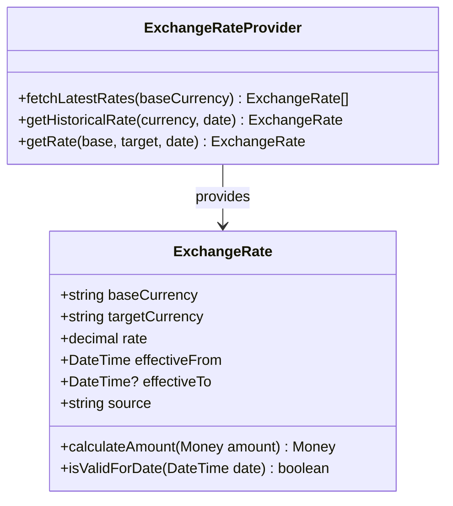

# Pricing Domain

## Domain Overview

The Pricing domain is responsible for calculating, managing, and optimizing product pricing across the Elias Food Imports catalog. As an importer of specialty foods from diverse global regions, Elias Food Imports requires a sophisticated pricing model that accounts for import costs, currency fluctuations, market demand, customer segments, and promotional strategies. This domain represents a core competitive advantage for the business.

## Strategic Classification

**Classification**: Core Domain

**Justification**: The pricing domain directly influences revenue generation, profit margins, and market competitiveness. Accurate and strategic pricing is fundamental to the company's financial success and growth strategy.

## Core Domain Concepts

### Price
A monetary value assigned to a product, calculated based on multiple factors and constraints. Prices may vary based on customer segment, purchase volume, subscription status, and market conditions.

### Pricing Rule
A configurable condition-action pair that determines when specific pricing calculations should be applied. Rules have precedence orders and validity periods.

### Margin
The difference between cost and selling price, expressed as a percentage. Different product categories have different target margin requirements.

### Import Cost
The aggregated expenses associated with importing a product, including duties, taxes, shipping, and handling fees.

### Currency Exchange
The conversion between currencies for products sourced from international suppliers, including risk management for exchange rate fluctuations.

### Promotion
A time-bound pricing adjustment applied to specific products or categories, potentially with eligibility requirements.

## Business Rules

1. All prices must maintain the minimum margin requirements specified for their product category.
2. Import cost changes must trigger automatic price recalculation.
3. Currency exchange rates must be updated at least daily for accurate pricing.
4. Subscription products must apply the appropriate discount tier based on subscription duration.
5. When multiple promotions could apply to a product, the most beneficial to the customer must be selected.
6. Premium customer segments may receive special pricing based on their tier.
7. Bulk purchase discounts must be calculated on a sliding scale based on volume.
8. Price changes exceeding 15% require management approval before taking effect.
9. Seasonal products may have dynamic pricing based on availability and demand.
10. Historical pricing data must be maintained for trend analysis and reporting.

## Domain Events

### PriceCalculated
- **Description**: Emitted when a product price is calculated for a specific context.
- **Payload**: 
  - productId: string
  - calculatedPrice: Money
  - basePrice: Money
  - appliedRules: string[]
  - customerSegment: string (optional)
  - calculationContext: object
- **Consumers**: Order, Catalog, Marketing

### PriceRuleActivated
- **Description**: Emitted when a pricing rule becomes active.
- **Payload**:
  - ruleId: string
  - ruleType: string
  - effectiveFrom: DateTime
  - effectiveTo: DateTime (optional)
  - affectedProductIds: string[]
- **Consumers**: Catalog, Marketing

### ImportCostUpdated
- **Description**: Emitted when import costs change for a product.
- **Payload**:
  - productId: string
  - previousCost: Money
  - newCost: Money
  - costComponents: ImportCostBreakdown
  - effectiveDate: DateTime
- **Consumers**: Pricing (internal), Reporting

### MarginAlertTriggered
- **Description**: Emitted when product margins fall below the required threshold.
- **Payload**:
  - productId: string
  - currentMargin: decimal
  - requiredMargin: decimal
  - reason: string
- **Consumers**: Reporting, Notifications

### ExchangeRateUpdated
- **Description**: Emitted when currency exchange rates are updated.
- **Payload**:
  - baseCurrency: string
  - targetCurrency: string
  - previousRate: decimal
  - newRate: decimal
  - effectiveTimestamp: DateTime
- **Consumers**: Pricing (internal), Catalog, Reporting

## Aggregates

### PricingCatalog
- **Root Entity**: ProductPrice
- **Description**: Manages the collection of all product prices and their calculation rules.
- **Invariants**:
  - Each product must have exactly one active base price.
  - All price calculations must respect minimum margin requirements.
  - Price effective dates must not overlap for the same product and context.
- **Commands**:
  - CalculatePrice(productId, context)
  - UpdateBasePrice(productId, newPrice)
  - SimulatePriceChange(productId, parameters)

### PromotionEngine
- **Root Entity**: Promotion
- **Description**: Manages active promotions and their application to product prices.
- **Invariants**:
  - Promotions must have valid start and end dates.
  - Overlapping promotions must have clear precedence rules.
  - Promotion discount cannot reduce price below minimum allowed.
- **Commands**:
  - CreatePromotion(promotionDetails)
  - ApplyPromotionToPrice(promotionId, productId)
  - DeactivatePromotion(promotionId)

### ImportCostManager
- **Root Entity**: ImportCostRecord
- **Description**: Tracks and manages import-related costs for products.
- **Invariants**:
  - Import costs must include all required cost components.
  - Cost records must maintain an audit trail of changes.
  - Currency conversions must use the correct exchange rate for the time period.
- **Commands**:
  - RecordImportCost(productId, costDetails)
  - UpdateDutiesAndTaxes(productId, newRates)
  - CalculateLandedCost(productId)

## Entities

### ProductPrice
- **Identifier**: productId + effectiveDate
- **Attributes**:
  - productId: string
  - basePrice: Money
  - calculationMethod: string
  - effectiveDate: DateTime
  - expirationDate: DateTime (optional)
  - lastUpdated: DateTime
  - updatedBy: string
- **Methods**:
  - applyRules(context): Money
  - calculateMargin(cost): decimal
  - isValidForDate(date): boolean

### PricingRule
- **Identifier**: ruleId
- **Attributes**:
  - ruleId: string
  - ruleType: string
  - priority: integer
  - conditions: RuleCondition[]
  - action: RuleAction
  - effectiveFrom: DateTime
  - effectiveTo: DateTime (optional)
  - isActive: boolean
- **Methods**:
  - evaluate(context): boolean
  - execute(basePrice): Money
  - conflictsWith(otherRule): boolean

### Promotion
- **Identifier**: promotionId
- **Attributes**:
  - promotionId: string
  - name: string
  - description: string
  - discountType: string (percentage, fixed, free item)
  - discountValue: decimal
  - startDate: DateTime
  - endDate: DateTime
  - eligibilityCriteria: Criteria[]
  - applicableProducts: string[]
  - maxUses: integer (optional)
  - currentUses: integer
- **Methods**:
  - isEligible(customer, order): boolean
  - calculateDiscount(price): Money
  - isActive(): boolean

### ImportCostRecord
- **Identifier**: recordId
- **Attributes**:
  - recordId: string
  - productId: string
  - supplierPrice: Money
  - dutyAmount: Money
  - taxAmount: Money
  - shippingCost: Money
  - handlingFee: Money
  - exchangeRate: decimal
  - sourceCurrency: string
  - effectiveDate: DateTime
  - supportingDocuments: string[]
- **Methods**:
  - calculateTotalCost(): Money
  - applyExchangeRate(): Money
  - generateAuditTrail(): AuditEntry[]

## Multi-Currency Support

Multi-currency support is essential for Elias Food Imports' global operations, enabling pricing, transactions, and reporting in multiple currencies while managing foreign exchange (FX) risk and maintaining consistent profit margins.

### Currency Management

```typescript
interface Currency {
  code: string;           // ISO 4217 currency code (e.g., 'USD', 'EUR', 'GBP')
  symbol: string;         // Currency symbol (e.g., '$', '€', '£')
  decimalPlaces: number;  // Standard decimal places (e.g., 2 for most currencies)
  isBaseCurrency: boolean;// Whether this is the system's base currency
  isActive: boolean;      // Whether the currency is active for use
  format: string;         // Format string for display (e.g., '#,##0.00 ¤')
}
```

### Exchange Rate Management



### Key Features

1. **Multi-Currency Pricing**
   - Store prices in multiple currencies
   - Automatic conversion using latest exchange rates
   - Support for currency-specific pricing overrides
   - Rounding rules per currency

2. **FX Risk Management**
   - Real-time FX exposure reporting
   - Automated hedging recommendations
   - Historical rate analysis
   - Forward contract integration

3. **Currency Conversion**
   - Real-time and historical conversions
   - Bulk conversion operations
   - Markup/markdown capabilities
   - Audit trail of all conversions

### Integration Points

| System | Integration Type | Purpose |
|--------|-----------------|---------|
| FX Data Providers | API | Real-time and historical exchange rates |
| ERP | Data Sync | Financial reporting in base currency |
| Payment Processors | API | Multi-currency transaction processing |
| Tax Systems | Events | Currency-specific tax calculations |
| Reporting | Data Export | Multi-currency financial reports |

### Implementation Phases

| Phase | Timeline | Deliverables |
|-------|----------|--------------|
| 1. Core Currency Support | 0-2 months | Basic currency model, exchange rate management |
| 2. Multi-Currency Pricing | 2-4 months | Currency-specific prices, conversions |
| 3. FX Risk Management | 4-6 months | Exposure reporting, hedging |
| 4. Localization | 6-8 months | Regional formatting, compliance |

## Value Objects

### Money

**Enhanced with Multi-Currency Support**

```typescript
class Money {
  private readonly amount: number;
  private readonly currency: string;
  
  constructor(amount: number, currency: string) {
    this.amount = this.roundToDecimalPlaces(amount, this.getDecimalPlaces(currency));
    this.currency = currency.toUpperCase();
    this.validate();
  }
  
  convert(targetCurrency: string, exchangeRateService: ExchangeRateService): Money {
    if (this.currency === targetCurrency) {
      return this;
    }
    
    const rate = exchangeRateService.getRate(this.currency, targetCurrency);
    const convertedAmount = this.amount * rate.rate;
    
    return new Money(convertedAmount, targetCurrency);
  }
  
  format(locale: string = 'en-US'): string {
    return new Intl.NumberFormat(locale, {
      style: 'currency',
      currency: this.currency,
      minimumFractionDigits: this.getDecimalPlaces(this.currency),
      maximumFractionDigits: this.getDecimalPlaces(this.currency)
    }).format(this.amount);
  }
  
  private getDecimalPlaces(currency: string): number {
    // Standard decimal places (can be overridden per currency)
    const decimalPlaces: Record<string, number> = {
      'JPY': 0,  // Japanese Yen
      'KRW': 0,  // South Korean Won
      'BIF': 0,  // Burundian Franc
      'CLP': 0,  // Chilean Peso
      'DJF': 0,  // Djiboutian Franc
      'GNF': 0,  // Guinean Franc
      'ISK': 0,  // Icelandic Króna
      'KMF': 0,  // Comorian Franc
      'PYG': 0,  // Paraguayan Guaraní
      'RWF': 0,  // Rwandan Franc
      'UGX': 0,  // Ugandan Shilling
      'VND': 0,  // Vietnamese Đồng
      'VUV': 0,  // Vanuatu Vatu
      'XAF': 0,  // CFA Franc BEAC
      'XOF': 0,  // CFA Franc BCEAO
      'XPF': 0,  // CFP Franc
      'MRO': 0   // Mauritanian Ouguiya
    };
    
    return decimalPlaces[currency] ?? 2; // Default to 2 decimal places
  }
  
  private roundToDecimalPlaces(value: number, places: number): number {
    const factor = Math.pow(10, places);
    return Math.round((value + Number.EPSILON) * factor) / factor;
  }
  
  private validate(): void {
    if (!isValidCurrency(this.currency)) {
      throw new Error(`Invalid currency code: ${this.currency}`);
    }
    
    if (isNaN(this.amount)) {
      throw new Error('Amount must be a valid number');
    }
  }
}
```

**Usage Example**:

```typescript
// Create prices in different currencies
const usdPrice = new Money(19.99, 'USD');
const eurPrice = new Money(18.50, 'EUR');

// Convert between currencies
const exchangeRateService = new ExchangeRateService();
const convertedPrice = usdPrice.convert('EUR', exchangeRateService);

// Format for display
console.log(usdPrice.format('en-US'));  // $19.99
console.log(convertedPrice.format('de-DE'));  // 18,50 €
console.log(new Money(1000, 'JPY').format('ja-JP'));  // ¥1,000
```

**Key Enhancements**:
1. Strict currency code validation
2. Proper rounding based on currency-specific decimal places
3. Immutable value object pattern
4. Built-in formatting using Intl API
5. Type-safe currency conversions
6. Support for zero-decimal currencies

This implementation ensures accurate financial calculations while providing a clean, type-safe API for working with monetary values across different currencies.
- **Attributes**:
  - amount: decimal
  - currency: string
- **Methods**:
  - convert(targetCurrency, exchangeRate): Money
  - add(money): Money
  - subtract(money): Money
  - multiply(factor): Money
  - isGreaterThan(money): boolean

### RuleCondition
- **Attributes**:
  - field: string
  - operator: string
  - value: any
  - conjunction: string (AND, OR)
- **Methods**:
  - evaluate(context): boolean
  - toString(): string

### RuleAction
- **Attributes**:
  - actionType: string
  - parameters: object
- **Methods**:
  - apply(price, context): Money
  - describe(): string

### ImportCostBreakdown
- **Attributes**:
  - basePrice: Money
  - dutyPercentage: decimal
  - taxPercentage: decimal
  - shippingFlatRate: Money
  - handlingPercentage: decimal
- **Methods**:
  - calculateDutyAmount(): Money
  - calculateTaxAmount(): Money
  - calculateHandlingAmount(): Money
  - getTotalCost(): Money

### PriceHistory
- **Attributes**:
  - entries: PriceHistoryEntry[]
  - productId: string
- **Methods**:
  - addEntry(price, date, reason): void
  - getPriceAt(date): Money
  - getAveragePrice(startDate, endDate): Money
  - getPriceChangeRate(): decimal

## Domain Services

### PriceCalculationService
- **Responsibility**: Orchestrates the price calculation process, applying all relevant rules and promotions.
- **Key Operations**:
  - calculateProductPrice(productId, context): Money
  - applyCustomerSegmentRules(price, customerSegment): Money
  - applyVolumeDiscounts(price, quantity): Money
  - applySeasonalAdjustments(price, date): Money

### ImportCostService
- **Responsibility**: Manages the calculation and tracking of all import-related costs.
- **Key Operations**:
  - calculateImportCost(product, importDetails): ImportCostBreakdown
  - updateExchangeRates(): void
  - optimizeImportStrategy(product): ImportStrategy
  - generateLandedCostReport(dateRange): Report

### MarginAnalysisService
- **Responsibility**: Analyzes and optimizes product margins based on costs and market conditions.
- **Key Operations**:
  - analyzeProductMargin(productId): MarginAnalysis
  - suggestOptimalPricePoint(productId, targetMargin): Money
  - identifyMarginRisks(): ProductId[]
  - generateMarginReport(categoryId): Report

### PromotionOptimizationService
- **Responsibility**: Designs and optimizes promotional strategies for revenue and margin goals.
- **Key Operations**:
  - recommendPromotions(businessGoal): PromotionStrategy[]
  - analyzePromotionPerformance(promotionId): PerformanceMetrics
  - forecastPromotionImpact(promotionDraft): ForecastResult
  - schedulePromotionCalendar(timeframe): PromotionCalendar

## Administrative Capabilities

### Admin Application Services

#### PriceManagementAdminService

**Responsibility**: Provides advanced price management capabilities for administrative users

**Operations**:
- Override automated pricing rules with proper authorization
- Approve price changes exceeding threshold limits
- Configure pricing strategy parameters and constraints
- Manage margin requirements by product category
- Execute batch price updates with approval workflow

**Authorization**: Requires `pricing:manage` permission

#### ImportCostAdminService

**Responsibility**: Manages import cost configurations and adjustments

**Operations**:
- Configure duty and tax rates for different product origins
- Manage exchange rate sources and update frequencies
- Override calculated import costs with manual adjustments
- Configure landed cost calculation parameters
- Generate import cost analysis reports

**Authorization**: Requires `pricing:importcost:manage` permission

#### PromotionAdminService

**Responsibility**: Manages promotional pricing and discount configurations

**Operations**:
- Create and manage promotional campaigns and rules
- Configure promotion eligibility criteria and constraints
- Manage promotion schedules and activation workflows
- Override promotion conflicts and stacking rules
- Analyze promotion performance and ROI metrics

**Authorization**: Requires `pricing:promotion:manage` permission

### Admin Read Models

#### PricingPerformanceDashboardModel

**Purpose**: Provides insights into pricing strategy effectiveness

**Key Metrics**:
- Margin performance by product category and region
- Price elasticity and competitive positioning analysis
- Price change impact on sales volume and revenue
- Exchange rate impact on import costs and margins

#### PromotionEffectivenessDashboardModel

**Purpose**: Evaluates promotion performance and financial impact

**Key Metrics**:
- Promotion redemption rates and revenue impact
- Discount depth analysis and margin effects
- Customer segment response to promotions
- Cannibalization effects on non-promoted products

#### ImportCostManagementDashboardModel

**Purpose**: Monitors import cost trends and optimization opportunities

**Key Metrics**:
- Import cost breakdown by component (duties, taxes, shipping)
- Exchange rate fluctuation effects on landed costs
- Supplier cost comparison and optimization opportunities
- Duty optimization opportunities by country of origin

### Admin Domain Events

#### BasePriceModifiedByAdmin

**Payload**:
```json
{
  "eventId": "uuid",
  "timestamp": "ISO-8601 datetime",
  "adminUserId": "string",
  "productId": "string",
  "previousPrice": {
    "amount": "decimal",
    "currency": "string"
  },
  "newPrice": {
    "amount": "decimal",
    "currency": "string"
  },
  "reason": "string",
  "approvalId": "string",
  "effectiveDate": "ISO-8601 datetime"
}
```

#### PricingRuleCreatedByAdmin

**Payload**:
```json
{
  "eventId": "uuid",
  "timestamp": "ISO-8601 datetime",
  "adminUserId": "string",
  "ruleId": "string",
  "ruleType": "string",
  "conditions": [
    {
      "field": "string",
      "operator": "string",
      "value": "any"
    }
  ],
  "actions": [
    {
      "type": "string",
      "parameters": {}
    }
  ],
  "priority": "integer",
  "effectiveFrom": "ISO-8601 datetime",
  "effectiveTo": "ISO-8601 datetime"
}
```

#### ImportCostAdjustedByAdmin

**Payload**:
```json
{
  "eventId": "uuid",
  "timestamp": "ISO-8601 datetime",
  "adminUserId": "string",
  "productId": "string",
  "costComponentType": "DUTY|TAX|SHIPPING|HANDLING",
  "previousValue": {
    "amount": "decimal",
    "currency": "string"
  },
  "newValue": {
    "amount": "decimal",
    "currency": "string"
  },
  "justification": "string",
  "effectiveDate": "ISO-8601 datetime"
}
```

## Integration Points

### Inbound
- **From Catalog**: Product creation and updates trigger price assignment.
- **From Supplier**: Cost updates initiate price recalculation.
- **From Marketing**: Promotion creation applies special pricing.
- **From Finance**: Exchange rate updates affect import cost calculations.

### Outbound
- **To Catalog**: Price updates for display in product listings.
- **To Order**: Current product prices for order processing.
- **To Reporting**: Margin and pricing data for analysis.
- **To Customer**: Special offers and personalized pricing.

## Implementation Considerations

### Performance Requirements
- Price calculation must complete in under 100ms for individual products.
- Bulk price updates must be processed within 5 minutes for the entire catalog.
- Exchange rate updates must propagate to prices within 15 minutes.

### Data Consistency
- Price calculations must use atomic import cost data to ensure consistency.
- Caching strategies should be employed for frequently accessed price data.
- Price history must be maintained with immutable records for audit purposes.

### Security Concerns
- Price manipulation protection through role-based access control.
- Audit logging for all price changes with user attribution.
- Encryption of sensitive pricing strategy data.

## Success Metrics

### Business Metrics
- Price calculation accuracy = 100%
- Weighted gross margin across catalog ≥ 35% 
- FX risk hedging coverage ≥ 80%
- Price optimization revenue lift ≥ 5%
- Promotion overlap errors = 0
- Import cost calculation accuracy ≥ 99.5%

### Technical Metrics
- Price calculation response time ≤ 100ms
- Pricing rule evaluation time ≤ 50ms
- System availability ≥ 99.99%
- Data consistency errors = 0
- Price update propagation time ≤ 5 minutes

## Related Resources

- [Business Problem Acceptance Criteria](../../business-problems/acceptance-criteria.md)
- [Domain Event Catalog](../../integrations/events.md)
- [Bounded Context Map](../../integrations/context-map.md)
- [Pricing Algorithm ADR](../../../adr/004-pricing-algorithm.md)

---

*This document represents the canonical source of knowledge for the Pricing domain within Elias Food Imports. All implementations and design decisions should align with the concepts, rules, and structures defined herein.*
