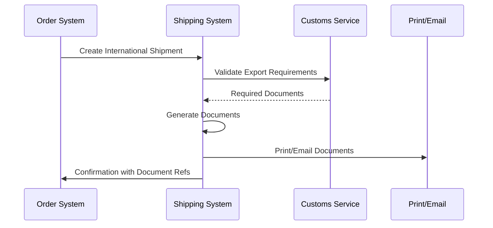

# Shipping Domain

<!-- GAP_IMPLEMENTED: International Shipping Compliance -->
<!-- stub for "International Shipping Compliance" gap in the shipping context -->

## International Shipping Compliance

International Shipping Compliance ensures that all cross-border shipments meet the complex regulatory requirements of both origin and destination countries. This is critical for EFI's global operations, particularly for food products that are subject to strict import/export controls, tariffs, and safety regulations.

### Core Compliance Areas

1. **Customs Documentation**
   - Commercial invoices with harmonized tariff codes (HS Codes)
   - Certificates of Origin (COO)
   - Export/Import licenses and permits
   - Food safety certifications (FDA, EU health certificates)
   - Phytosanitary certificates for plant-based products

2. **Regulatory Requirements**
   - **FDA Prior Notice**: Required for all food imports into the US
   - **EU Food Law**: Compliance with Regulation (EC) No 178/2002
   - **Country-Specific Bans/Restrictions**: E.g., certain food additives, GMO regulations
   - **Labeling Requirements**: Allergens, nutritional info, and language requirements

3. **Duties & Taxes**
   - Automated duty calculation based on:
     - Product classification (HS Code)
     - Country of origin
     - Trade agreements (e.g., USMCA, EU-UK TCA)
   - VAT/GST calculation and collection
   - Deferred duty payment options

### Technical Implementation

#### 1. Product Classification System

```typescript
interface ProductClassification {
  hsCode: string;           // 6-10 digit HS code
  eccn?: string;            // Export Control Classification Number
  countryOfOrigin: string;  // ISO 3166-1 alpha-2
  fdaProductCode?: string;  // For FDA-regulated products
  euNovelFood?: boolean;    // EU Novel Food Regulation
  containsGMO: boolean;
  containsAllergens: string[];
  shelfLifeDays: number;
  storageConditions: {
    minTemp?: number;
    maxTemp?: number;
    humidityRange?: [number, number];
  };
}
```

#### 2. Automated Document Generation



### Compliance Workflows

1. **Pre-Shipment Check**
   - Verify all required documents are complete
   - Validate product classifications
   - Check for any import restrictions or embargoes
   - Confirm proper labeling and marking

2. **Customs Clearance**
   - Electronic submission of customs data (e.g., ACE, CDS, ATLAS)
   - Real-time duty and tax calculation
   - Document upload and management
   - Status tracking and alerts

3. **Post-Clearance**
   - Record retention for audits
   - Duty drawback processing
   - Compliance reporting

### Integration Points

| System | Data Exchange | Purpose |
|--------|--------------|---------|
| ERP | Product master data | HS codes, country of origin |
| WMS | Inventory data | Batch/lot tracking, storage conditions |
| CRM | Customer data | Importer of record, tax IDs |
| Carrier Systems | Shipping data | Electronic manifest, customs docs |
| Government Portals | Customs filings | Automated submissions |

### Risk Management

1. **Restricted Party Screening**
   - Automated screening against:
     - Denied Parties Lists (DPL)
     - Specially Designated Nationals (SDN)
     - Office of Foreign Assets Control (OFAC)

2. **Embargo & Sanction Checks**
   - Real-time validation of:
     - Embargoed countries
     - Sanctioned entities
     - Dual-use goods restrictions

3. **Audit Trail**
   - Complete document history
   - User access logs
   - Change tracking for compliance data

### Implementation Roadmap

| Phase | Timeline | Key Deliverables |
|-------|----------|------------------|
| 1. Foundation | 0-3 months | Basic HS code classification, document templates |
| 2. Automation | 3-6 months | Automated document generation, duty calculation |
| 3. Integration | 6-9 months | Carrier/Government system integration |
| 4. Optimization | 9-12 months | AI-powered classification, predictive analytics |

### Key Performance Indicators

| KPI | Target | Measurement |
|-----|--------|-------------|
| Customs Clearance Time | < 4 hours | Average time from submission to release |
| Document Accuracy | > 99% | Error-free submissions |
| Duty Optimization | > 15% savings | Through trade agreements and classification |
| Audit Compliance | 100% | Successful regulatory audits |

### Related Documents

- [Export Compliance Manual](./export-compliance-manual.md)
- [Country-Specific Import Requirements](./country-requirements/)
- [Customs Documentation Templates](./templates/customs/)
- [Trade Agreement Matrix](./trade-agreements.md)

<!-- GAP_IMPLEMENTED: Temperature-Controlled Logistics -->
<!-- stub for "Temperature-Controlled Logistics" gap in the shipping context -->

## Temperature-Controlled Logistics

Temperature-Controlled Logistics ensures that perishable and temperature-sensitive food products maintain their quality, safety, and compliance throughout the shipping process. This is critical for EFI's specialty food products that require specific temperature ranges to preserve freshness and meet regulatory requirements.

### Key Components

1. **Temperature Ranges**
   - **Frozen**: -18°C to -22°C (0°F to -5°F)
   - **Refrigerated**: 2°C to 8°C (36°F to 46°F)
   - **Controlled Room Temperature**: 15°C to 25°C (59°F to 77°F)

2. **Monitoring & Compliance**
   - Real-time temperature tracking with IoT sensors
   - Automated alerts for temperature excursions
   - Digital temperature logs for regulatory compliance
   - Chain of custody documentation

3. **Carrier Requirements**
   - Certified cold chain carriers with temperature-controlled vehicles
   - Pre-shipment equipment validation
   - Emergency protocols for temperature deviations
   | Requirement | Frozen | Refrigerated | Ambient |
   |-------------|--------|--------------|---------|
   | Max Transit Time | 48h | 24h | 72h |
   | Temp Tolerance | ±2°C | ±1°C | ±3°C |

4. **Packaging Solutions**
   - Insulated shipping containers
   - Phase change materials (PCM)
   - Vacuum insulation panels
   - Dry ice management for ultra-low temperatures

5. **Quality Assurance**
   - Pre-shipment quality checks
   - Temperature data analysis
   - Post-delivery product inspection
   - Non-compliance investigation process

6. **Regulatory Compliance**
   - HACCP (Hazard Analysis Critical Control Points)
   - FDA Food Safety Modernization Act (FSMA)
   - EU Food Safety Regulations
   - Local food transportation regulations

7. **Exception Handling**
   - Immediate notification of temperature excursions
   - Quarantine procedures for compromised shipments
   - Root cause analysis and corrective actions
   - Customer communication protocols

8. **Performance Metrics**
   - On-time delivery within temperature range
   - Temperature excursion rate
   - Product spoilage rate
   - Customer satisfaction scores

### Implementation Requirements

- Integration with IoT temperature monitoring devices
- Automated alerting system for temperature excursions
- Digital documentation and audit trail
- Carrier performance tracking
- Customer portal for real-time tracking

### Future Enhancements

- Predictive analytics for temperature forecasting
- Blockchain for end-to-end cold chain visibility
- AI-driven route optimization for temperature-sensitive shipments
- Automated quality assessment using computer vision

### Related Domains

- **Inventory Management**: For temperature-controlled storage
- **Order Fulfillment**: For special handling instructions
- **Customer Service**: For temperature-related inquiries
- **Quality Assurance**: For product quality verification

### API Endpoints

- `POST /api/shipments/{id}/temperature` - Record temperature reading
- `GET /api/shipments/{id}/temperature` - Retrieve temperature history
- `GET /api/shipments/{id}/compliance` - Check compliance status
- `POST /api/shipments/{id}/exceptions` - Report temperature exception

### Event Types

- `TemperatureExceeded`
- `ColdChainBreachDetected`
- `TemperatureRestored`
- `CompromisedProductQuarantined`

### Monitoring Dashboard

- Real-time temperature graphs
- Alert status and history
- Compliance reports
- Carrier performance metrics

### Training Requirements

- Cold chain handling procedures
- Emergency response protocols
- Regulatory compliance training
- Equipment operation and maintenance

### Risk Management

- Risk assessment for new shipping lanes
- Contingency planning for equipment failure
- Backup carrier arrangements
- Insurance coverage verification

### Continuous Improvement

- Regular review of temperature data
- Analysis of temperature excursions
- Process optimization based on findings
- Implementation of corrective actions

### Documentation

- Standard Operating Procedures (SOPs)
- Training materials
- Compliance certificates
- Audit reports

### Technology Stack

- IoT temperature sensors
- Cloud-based monitoring platform
- Mobile applications for drivers
- Integration with existing ERP/WMS

### Key Performance Indicators (KPIs)

- Temperature compliance rate
- On-time delivery performance
- Product spoilage rate
- Customer satisfaction with cold chain
- Cost per temperature-controlled shipment

### Change Management

- Stakeholder communication plan
- Training and certification program
- Phased rollout strategy
- Performance monitoring and feedback

### References

- FDA Guidance on Temperature Control for Foods
- Global Cold Chain Alliance Standards
- International Safe Transit Association (ISTA) Guidelines
- Local Food Safety Regulations

### Appendices

- Temperature Log Templates
- Emergency Contact List
- Equipment Maintenance Schedule
- Regulatory Compliance Checklist

### Version History

| Version | Date | Author | Changes |
|---------|------|--------|---------|
| 1.0 | 2025-06-10 | AI Assistant | Initial version |

### Review Cycle

This document should be reviewed and updated:
- Annually for regulatory compliance
- After any temperature-related incident
- When introducing new temperature-sensitive products
- When changing carriers or shipping routes

### Approval

| Role | Name | Signature | Date |
|------|------|-----------|------|
| Shipping Manager | | | |
| Quality Assurance | | | |
| Operations | | | |

### Distribution List

- Shipping Department
- Quality Assurance
- Operations Management
- IT Department
- Customer Service

### Related Documents

- Food Safety Management System Manual
- HACCP Plan
- Emergency Response Plan
- Carrier Performance Reports

### Glossary

- **Cold Chain**: Temperature-controlled supply chain
- **Excursion**: Temperature deviation from required range
- **PCM**: Phase Change Material
- **HACCP**: Hazard Analysis and Critical Control Points

### Contact Information

For questions or updates to this document, please contact:
- Shipping Department: shipping@eliasfoodimports.com
- Quality Assurance: qa@eliasfoodimports.com
- IT Support: itsupport@eliasfoodimports.com

### Document Control

- **Document Owner**: Shipping Department
- **Last Updated**: 2025-06-10
- **Next Review**: 2026-06-10
- **Status**: Draft

### Notes

This document is a living document and should be updated as processes and regulations change. All employees are responsible for ensuring they are working with the most current version.

## Domain Overview

The Shipping Domain for Elias Food Imports (EFI) manages the transportation, delivery, and logistics processes that move products from EFI warehouses to customers. This domain handles all aspects of order fulfillment after products have been picked and packed, including carrier selection, shipment scheduling, tracking, delivery confirmation, and handling of exceptions such as returns and damaged deliveries.

## Strategic Importance

The Shipping Domain is strategically important to Elias Food Imports for the following reasons:

1. **Customer Satisfaction**: On-time and intact delivery is critical for customer experience and retention
2. **Cost Management**: Shipping represents a significant operational cost that must be optimized
3. **Brand Reputation**: Delivery quality directly impacts brand perception and customer trust
4. **Operational Efficiency**: Effective shipping processes improve overall operational efficiency
5. **Food Safety Compliance**: Proper shipping methods ensure food product quality and safety requirements are met
6. **Competitive Advantage**: Fast, reliable shipping options provide market differentiation
7. **Global Reach**: Enables access to international markets through effective cross-border shipping

## Core Concepts

### 1. Shipment

A shipment represents a collection of order items being delivered to a specific customer address via a selected carrier and service level. It has a defined origin, destination, status, and tracking information.

### 2. Carrier

A logistics service provider responsible for transporting packages from EFI's facilities to customer destinations. Carriers offer different service levels, pricing, and coverage areas.

### 3. Service Level

A defined standard of shipping service with specific attributes such as delivery speed, tracking capabilities, and special handling requirements.

### 4. Delivery Window

A specified timeframe during which a shipment is expected to be delivered to the customer, typically defined by a date range or specific appointment time.

### 5. Shipping Manifest

A comprehensive document detailing all shipments scheduled for pickup by a carrier on a specific date, including package counts, weights, and destinations.

### 6. Tracking Information

Data provided by carriers about the current status and location of a shipment throughout its journey to the customer.

### 7. Shipping Exception

Any deviation from the standard shipping process, including delivery delays, address issues, damaged packages, or customs problems.

### 8. Cold Chain Management

Specialized shipping processes for temperature-sensitive food items that must maintain specific temperature ranges throughout transit.

## Business Rules

### Shipment Planning and Creation

1. All shipments must be associated with an existing order in the Order Domain
2. Shipments can only be created for orders that have been successfully picked and packed
3. A single order may be split into multiple shipments based on inventory location, product type, or special handling requirements
4. Cold chain products must be assigned to specialized shipments with temperature-controlled transport
5. International shipments must include all necessary customs documentation and comply with destination country regulations

### Carrier Selection and Service Levels

1. Carrier selection must follow a prioritized list based on destination, package dimensions, service level, and cost
2. Express shipping must only be used when explicitly requested by the customer or required by product type
3. Signature-required service must be used for orders exceeding $500 in value
4. Specialty carriers must be used for wine, spirits, and other regulated products
5. Rural or remote destinations must include extended delivery time estimates

### Scheduling and Pickup

1. Shipment manifests must be submitted to carriers according to their specified cutoff times
2. Pickup scheduling must account for warehouse processing time and carrier pickup windows
3. Bulk shipments to the same region must be consolidated when possible to reduce shipping costs
4. Carrier capacity constraints must be considered when scheduling large volume shipments
5. Pickup exceptions must be escalated within 30 minutes of the scheduled pickup time

### Tracking and Notifications

1. All shipments must have a valid tracking number before leaving EFI facilities
2. Tracking status updates must be processed and stored within 15 minutes of receipt from carriers
3. Customers must be notified of shipment creation and provided with tracking information
4. Delivery exceptions must trigger customer notifications within 2 hours
5. Estimated delivery dates must be dynamically updated based on carrier tracking information

### Delivery and Confirmation

1. Proof of delivery must be captured and stored for all completed deliveries
2. Delivery confirmation must trigger inventory and order status updates
3. Failed deliveries must be rescheduled or returned according to product-specific rules
4. Delivery to an alternate address must be pre-approved by the customer
5. Special handling instructions must be followed and confirmed by the carrier

### Exception Handling

1. Shipping exceptions must be categorized by severity and impact on delivery timeline
2. Lost shipments must be investigated if no tracking updates occur within 24 hours of expected delivery
3. Damaged shipments must trigger the claims process with the carrier within 48 hours
4. Address issues must be resolved with the customer within 24 hours or the shipment returned
5. Weather and force majeure exceptions must be communicated to customers with updated delivery expectations

### Returns and Reverse Logistics

1. Return shipping labels must be provided for approved returns through the Returns Management process
2. Return shipments must be tracked and receipt confirmed at EFI facilities
3. Damaged returns must be documented with photos upon receipt
4. Return shipment status must be made available to customers throughout the return process
5. Bulk returns from B2B customers must follow specialized receiving procedures

## Domain Events

### Events Published by Shipping Domain

| Event Name | Description | Payload | Consumers |
|-----------|-------------|---------|------------|
| `ShipmentCreated` | Fired when a new shipment is created | Shipment ID, Order ID, Customer ID, Destination, Service Level, Expected Delivery Window, Carrier, Items | Order, Customer, Notification, Analytics |
| `ShipmentScheduled` | Fired when a shipment is scheduled for carrier pickup | Shipment ID, Scheduled Pickup Time, Carrier, Manifest Reference | Inventory, Order, Analytics |
| `ShipmentPickedUp` | Fired when a carrier has collected the shipment | Shipment ID, Pickup Time, Carrier Tracking Number | Order, Customer, Notification, Analytics |
| `TrackingUpdated` | Fired when new tracking information is received | Shipment ID, Tracking Status, Location, Timestamp, Estimated Delivery Date | Order, Customer, Notification, Analytics |
| `ShipmentDelivered` | Fired when a shipment is confirmed delivered | Shipment ID, Delivery Time, Proof of Delivery, Recipient | Order, Customer, Notification, Analytics, Finance |
| `ShipmentException` | Fired when a shipping exception occurs | Shipment ID, Exception Type, Description, Impact Severity, Resolution Status | Order, Customer, Notification, Inventory |
| `DeliveryFailed` | Fired when a delivery attempt fails | Shipment ID, Failure Reason, Next Attempt Date | Order, Customer, Notification, Analytics |
| `ShipmentReturned` | Fired when a shipment is returned to origin | Shipment ID, Return Reason, Return Tracking, Return Status | Order, Customer, Inventory, Finance |
| `ColdChainComplianceAlert` | Fired when temperature monitoring indicates compliance issues | Shipment ID, Temperature Reading, Threshold Breached, Alert Severity | Order, Quality Assurance, Inventory, Notification |
| `CustomsClearanceUpdated` | Fired when customs status changes for international shipments | Shipment ID, Customs Status, Required Documents, Estimated Clearance Time | Order, Customer, Notification |

### Events Consumed by Shipping Domain

| Event Name | Producer Context | Purpose | Response |
|-----------|----------------|--------|----------|
| `OrderReadyForShipment` | Order | Indicates an order has been packed and is ready to be shipped | Create shipment(s) for the order |
| `InventoryAllocated` | Inventory | Confirms inventory has been allocated and is available to ship | Proceed with shipment creation |
| `CustomerAddressUpdated` | Customer | Updates to customer shipping address | Update address for unshipped orders |
| `OrderCancelled` | Order | Stops shipping process for a cancelled order | Cancel any unshipped shipments |
| `ReturnAuthorized` | Order | Initiates return shipping process | Generate return label and tracking |
| `PaymentConfirmed` | Payment | Confirms payment has been received for an order | Release shipment hold if applicable |
| `ServiceLevelChanged` | Order | Change to the desired shipping service level | Update carrier selection and scheduling |
| `ShipmentPriorityChanged` | Order | Change in shipping priority | Reschedule pickup and update service level |
| `SpecialHandlingRequired` | Inventory | Indicates special handling required for certain products | Apply special handling procedures to shipment |

## Aggregates

### Shipment Aggregate

**Description**: The primary aggregate representing a shipping unit from origin to destination, including all tracking and status information.

**Identifier**: `ShipmentId` (Value Object)

**Entities**:
- Shipment (Root)
- ShipmentItem
- TrackingHistory
- DeliveryAttempt
- ShipmentException
- CustomsDocumentation

**Value Objects**:
- ShipmentId
- ServiceLevel
- ShippingAddress
- DeliveryWindow
- CarrierDetails
- TrackingNumber
- ShipmentStatus
- PackageDimensions
- TemperatureRequirements

**Business Rules**:
- Shipment status transitions must follow the defined workflow
- Tracking updates can only be applied to active shipments
- Delivery confirmation requires proof of delivery
- Shipment can only be canceled before carrier pickup
- Cold chain shipments must maintain temperature logging

**Consistency Boundaries**:
- Shipment status and tracking history must be strongly consistent
- Delivery estimated windows can be eventually consistent

### ShippingManifest Aggregate

**Description**: Represents a collection of shipments scheduled for pickup by a specific carrier at a specific time.

**Identifier**: `ManifestId` (Value Object)

**Entities**:
- ShippingManifest (Root)
- ManifestShipment
- PickupConfirmation
- ManifestException

**Value Objects**:
- ManifestId
- ScheduledPickupWindow
- CarrierAccount
- ManifestStatus
- ManifestSummary

**Business Rules**:
- Manifests can only be submitted before carrier cutoff times
- All shipments in a manifest must be physically ready for pickup
- Manifests must be electronically transmitted to carriers
- Pickup confirmation must be recorded for completed manifests
- Manifests must include accurate package counts and weights

**Consistency Boundaries**:
- Manifest content must be strongly consistent at submission time
- Manifest status updates can be eventually consistent

### CarrierRelationship Aggregate

**Description**: Manages the relationship with a shipping carrier, including service level agreements, account information, and performance metrics.

**Identifier**: `CarrierId` (Value Object)

**Entities**:
- CarrierRelationship (Root)
- ServiceLevelAgreement
- CarrierAccount
- CarrierPerformanceHistory

**Value Objects**:
- CarrierId
- CarrierCapabilities
- ContractTerms
- ServiceAreaCoverage
- PerformanceMetrics

**Business Rules**:
- Carrier selection must consider service level agreements
- Performance metrics must be updated based on delivery outcomes
- Carrier accounts must maintain valid authentication credentials
- Service coverage areas must be regularly updated
- Rate cards must reflect current contract terms

**Consistency Boundaries**:
- Carrier configuration is strongly consistent
- Performance metrics are eventually consistent

### ReturnShipment Aggregate

**Description**: Manages the return shipping process from customer back to EFI facilities.

**Identifier**: `ReturnShipmentId` (Value Object)

**Entities**:
- ReturnShipment (Root)
- ReturnLabel
- ReturnTracking
- ReturnReceipt
- ReturnInspection

**Value Objects**:
- ReturnShipmentId
- ReturnReason
- ReturnAuthorization
- ReturnStatus
- ReturnShippingMethod

**Business Rules**:
- Returns must have a valid return authorization
- Return labels must be associated with original shipments
- Return receipt must be documented upon arrival
- Return condition must be inspected and recorded
- Return status must be communicated to relevant contexts

**Consistency Boundaries**:
- Return authorization is strongly consistent
- Return status updates are eventually consistent

## Entities

### Shipment Entity

**Description**: Core entity representing the process of transporting ordered items from EFI facilities to a customer.

**Attributes**:
- ShipmentId: Unique identifier for the shipment (Value Object)
- OrderId: Reference to the associated order
- CustomerId: Reference to the customer receiving the shipment
- Origin: Warehouse or facility from which the shipment originates
- Destination: Customer address where the shipment will be delivered
- CarrierDetails: Information about the selected carrier
- ServiceLevel: Selected shipping service level
- TrackingNumber: Carrier-provided tracking identifier
- Status: Current status of the shipment
- CreationDate: When the shipment was created
- ScheduledPickupDate: When the carrier is expected to collect the shipment
- EstimatedDeliveryWindow: Expected delivery timeframe
- ActualDeliveryDate: When the shipment was actually delivered
- Weight: Total weight of the shipment
- Dimensions: Package dimensions
- SpecialHandling: Any special handling requirements
- Temperature: Temperature requirements for cold chain items

**Behaviors**:
- Create: Initialize a new shipment
- Schedule: Set pickup date with carrier
- AssignTrackingNumber: Assign carrier tracking info
- UpdateStatus: Change shipment status
- RecordPickup: Document carrier pickup
- RecordDelivery: Document successful delivery
- RecordException: Document a shipping exception
- Cancel: Cancel a shipment before pickup

### ShipmentItem Entity

**Description**: Represents an individual item within a shipment.

**Attributes**:
- ItemId: Unique identifier for the shipment item
- ShipmentId: Reference to the parent shipment
- ProductId: Reference to the product being shipped
- Quantity: Number of units
- Weight: Item weight
- RequiresSpecialHandling: Flag for special handling requirements
- TemperatureRequirements: Required temperature range if applicable
- Customs: Customs information for international shipments
- SerialNumbers: Product serial numbers if applicable
- PackageLocation: Location within the shipment packaging

**Behaviors**:
- AddToShipment: Include item in shipment
- RemoveFromShipment: Remove item from shipment
- UpdateQuantity: Change item quantity
- MarkAsShipped: Update item status to shipped

### TrackingHistory Entity

**Description**: Historical record of a shipment's journey from origin to destination.

**Attributes**:
- TrackingId: Unique identifier for the tracking entry
- ShipmentId: Reference to the associated shipment
- StatusCode: Carrier status code
- StatusDescription: Human-readable status
- Location: Geographic location of the scan
- Timestamp: When the tracking event occurred
- CarrierNotes: Additional information from carrier
- IsException: Whether this is an exception event

**Behaviors**:
- AddTrackingEvent: Record a new tracking update
- GetLatestStatus: Retrieve most recent status
- CalculateTransitTime: Compute current transit duration
- DetectAnomalies: Identify unusual patterns in tracking

### DeliveryAttempt Entity

**Description**: Record of an attempt to deliver a shipment to its destination.

**Attributes**:
- AttemptId: Unique identifier for the delivery attempt
- ShipmentId: Reference to the associated shipment
- AttemptNumber: Sequential number of the attempt
- AttemptDate: When delivery was attempted
- DeliveryAgent: Person who attempted delivery
- Outcome: Result of the attempt (successful, failed, etc.)
- FailureReason: Why delivery failed, if applicable
- RecipientName: Who received the shipment, if successful
- ProofOfDelivery: Evidence of successful delivery
- Notes: Additional information about the attempt

**Behaviors**:
- RecordAttempt: Document a delivery attempt
- ScheduleNextAttempt: Plan subsequent delivery
- CaptureProofOfDelivery: Record delivery confirmation
- NotifyCustomer: Send delivery status to customer

### ShippingManifest Entity

**Description**: A collection of shipments scheduled for pickup by a carrier.

**Attributes**:
- ManifestId: Unique identifier for the manifest
- CarrierId: Reference to the associated carrier
- PickupLocation: Where shipments will be collected
- ScheduledPickupTime: When carrier will arrive
- TotalShipments: Number of shipments in manifest
- TotalWeight: Combined weight of all packages
- Status: Current status of the manifest
- CreationDate: When manifest was created
- TransmissionDate: When sent to carrier
- PickupConfirmation: Verification of carrier pickup

**Behaviors**:
- CreateManifest: Initialize a new manifest
- AddShipment: Include a shipment in the manifest
- RemoveShipment: Remove a shipment from the manifest
- TransmitToCarrier: Send manifest to carrier system
- ConfirmPickup: Record successful carrier pickup
- CloseManifest: Finalize the manifest after pickup

### CarrierRelationship Entity

**Description**: Represents EFI's relationship with a shipping carrier.

**Attributes**:
- CarrierId: Unique identifier for the carrier
- CarrierName: Name of the shipping carrier
- AccountNumbers: Carrier account identifiers
- ServiceLevels: Available shipping services
- ContactInformation: Carrier contact details
- IntegrationDetails: API and system integration info
- ContractTerms: Current contract information
- PerformanceRatings: Metrics on carrier reliability
- CoverageAreas: Geographic service areas
- SpecialCapabilities: Specialized services offered

**Behaviors**:
- AddServiceLevel: Include new service option
- UpdateRates: Refresh pricing information
- LogPerformanceIssue: Document service problems
- CalculateReliability: Compute performance metrics
- UpdateCoverageArea: Modify service region data

## Value Objects

### ShipmentId

**Description**: Unique identifier for a shipment in the system.

**Attributes**:
- Value: String with format "SHP-YYYYMMDD-XXXXXXXX" (Year-Month-Day-Sequence)

**Validation Rules**:
- Must follow the defined format pattern
- Must be globally unique across all shipments
- Cannot be null or empty

### ServiceLevel

**Description**: Defines the shipping speed and handling characteristics of a shipment.

**Attributes**:
- Code: Standardized service level code (e.g., "STD", "EXP", "PRO")
- Name: Human-readable service name (e.g., "Standard Shipping", "Express Shipping", "Premium Shipping")
- EstimatedTransitDays: Expected number of days in transit
- HasTrackingCapability: Whether tracking is provided
- HasSignatureRequirement: Whether signature is required
- HasInsurance: Whether insurance is included
- HasSaturdayDelivery: Whether Saturday delivery is allowed

**Validation Rules**:
- Code must match one of the predefined service level codes
- EstimatedTransitDays must be a positive integer

### ShippingAddress

**Description**: Represents a shipping destination or origin location.

**Attributes**:
- RecipientName: Name of the receiving person or organization
- StreetLine1: Primary address line
- StreetLine2: Secondary address line (optional)
- City: City or locality
- State: State, province, or region
- PostalCode: ZIP or postal code
- Country: Country code (ISO-3166)
- PhoneNumber: Contact phone number
- AddressType: Type of address (residential, commercial)
- DeliveryInstructions: Special delivery instructions
- IsValidated: Flag indicating address verification status

**Validation Rules**:
- RecipientName, StreetLine1, City, State, PostalCode, Country are required
- PostalCode must match format for the specified country
- PhoneNumber must be in valid international format

### TrackingNumber

**Description**: Carrier-specific identifier used to track a shipment.

**Attributes**:
- Value: The tracking number string
- CarrierCode: Code identifying the carrier
- IsActive: Whether the tracking number is currently active
- TrackingUrl: URL to check tracking status on carrier site

**Validation Rules**:
- Must conform to carrier-specific validation format
- Cannot be empty
- Must be unique per shipment

### ShipmentStatus

**Description**: Represents the current state of a shipment in its lifecycle.

**Attributes**:
- Code: Status code (e.g., "CREATED", "PENDING", "IN_TRANSIT", "DELIVERED")
- Name: Human-readable status name
- Description: Detailed description of the status
- Timestamp: When the status was last updated
- IsTerminal: Whether this is a final status

**Validation Rules**:
- Code must be one of the predefined status values
- Status transitions must follow the allowed workflow
- Timestamp cannot be in the future

### PackageDimensions

**Description**: Physical measurements of a shipping package.

**Attributes**:
- Length: Package length in appropriate unit of measure
- Width: Package width in appropriate unit of measure
- Height: Package height in appropriate unit of measure
- DimensionalWeight: Calculated weight based on dimensions
- Unit: Unit of measurement (cm, in)

**Validation Rules**:
- All dimensions must be positive numbers
- Unit must be a valid unit of measurement
- Dimensional weight calculation must follow the carrier formula

### DeliveryWindow

**Description**: Timeframe during which a shipment is expected to be delivered.

**Attributes**:
- EarliestDate: Beginning of delivery window
- LatestDate: End of delivery window
- TimeZone: Applicable time zone for the window
- IsGuaranteed: Whether delivery within window is guaranteed
- Type: Window type (estimated, appointment, guaranteed)

**Validation Rules**:
- EarliestDate must be before or equal to LatestDate
- EarliestDate cannot be in the past for new shipments
- TimeZone must be a valid IANA time zone

### TemperatureRequirements

**Description**: Defines the required temperature conditions for cold chain shipments.

**Attributes**:
- MinTemperature: Lowest allowable temperature
- MaxTemperature: Highest allowable temperature
- Unit: Unit of measurement (Celsius, Fahrenheit)
- MonitoringRequired: Whether continuous monitoring is needed
- ExcursionTolerance: Allowed time outside temperature range

**Validation Rules**:
- MinTemperature must be less than MaxTemperature
- Unit must be a valid temperature unit
- ExcursionTolerance must be a positive duration

### ManifestId

**Description**: Unique identifier for a shipping manifest.

**Attributes**:
- Value: String with format "MNF-YYYYMMDD-XXXXX" (Year-Month-Day-Sequence)

**Validation Rules**:
- Must follow the defined format pattern
- Must be unique across all manifests
- Cannot be null or empty

### CarrierDetails

**Description**: Information about the carrier handling a shipment.

**Attributes**:
- CarrierId: Unique identifier for the carrier
- CarrierName: Name of the carrier
- ServiceCode: Code for the specific carrier service
- AccountNumber: Account used for the shipment
- PickupConfirmation: Carrier's pickup confirmation code

**Validation Rules**:
- CarrierId must reference a valid carrier
- ServiceCode must be valid for the specified carrier
- AccountNumber must be a valid account for the carrier

## Domain Services

### ShipmentRoutingService

**Description**: Determines the optimal shipping route based on origin, destination, service level, and carrier capabilities.

**Key Methods**:
- `determineOptimalCarrier(shipment)`: Selects the best carrier for a given shipment
- `calculateDeliveryWindow(shipment, carrier)`: Estimates the delivery window
- `optimizeShipmentBatches(shipments)`: Groups shipments for efficient routing
- `validateServiceAvailability(origin, destination, serviceLevel)`: Checks if service level is available for the route
- `handleRoutingException(shipment, exception)`: Manages routing exceptions

**Dependencies**:
- CarrierRelationshipRepository
- GeographicZoningService
- ServiceLevelRepository
- ShippingRateService

**Usage Context**:
- Used during shipment creation to select carriers
- Consulted during checkout to provide delivery estimates
- Used for batch shipping optimization

### ShipmentManifestService

**Description**: Manages the creation, validation, and submission of shipment manifests to carriers.

**Key Methods**:
- `createManifest(shipments, carrier, pickupTime)`: Creates a new manifest
- `addShipmentToManifest(manifest, shipment)`: Adds shipment to existing manifest
- `validateManifest(manifest)`: Ensures manifest meets carrier requirements
- `submitManifestToCarrier(manifest)`: Transmits manifest to carrier
- `reconcilePickupConfirmation(manifest, confirmation)`: Reconciles pickup with manifest

**Dependencies**:
- ShipmentRepository
- CarrierApiService
- CarrierRelationshipRepository
- ShippingDocumentService

**Usage Context**:
- End-of-day carrier manifest processing
- Scheduled pickups from EFI facilities
- Integrating with carrier pickup APIs

### TrackingService

**Description**: Manages the processing and interpretation of tracking updates from carriers.

**Key Methods**:
- `processTrackingUpdate(trackingNumber, statusUpdate)`: Processes carrier tracking updates
- `requestTrackingInformation(shipment)`: Polls carrier for current tracking status
- `reconcileTrackingDiscrepancies(shipment)`: Resolves inconsistencies in tracking data
- `determineShipmentStatus(trackingHistory)`: Interprets tracking data to determine shipment status
- `detectDeliveryExceptions(trackingHistory)`: Identifies unusual patterns in tracking data

**Dependencies**:
- ShipmentRepository
- CarrierApiService
- NotificationService
- ExceptionManagementService

**Usage Context**:
- Processing carrier webhook notifications
- Scheduled tracking status updates
- Customer tracking inquiries

### ColdChainMonitoringService

**Description**: Monitors and manages temperature-controlled shipments to ensure compliance with requirements.

**Key Methods**:
- `registerTemperatureMonitor(shipment, deviceId)`: Associates temperature monitor with shipment
- `processTemperatureReading(shipment, reading)`: Processes temperature data points
- `detectTemperatureExcursion(shipment, readings)`: Identifies temperature violations
- `calculateTemperatureCompliance(shipment)`: Evaluates overall compliance with requirements
- `generateTemperatureReport(shipment)`: Creates compliance documentation

**Dependencies**:
- ShipmentRepository
- IoTDeviceService
- AlertService
- QualityAssuranceService

**Usage Context**:
- Monitoring perishable food products in transit
- Compliance reporting for regulatory requirements
- Quality assurance validation

### CustomsDocumentationService

**Description**: Manages international shipping documentation and customs compliance.

**Key Methods**:
- `generateCustomsDocuments(shipment)`: Creates required customs paperwork
- `validateCustomsInformation(shipment)`: Ensures customs data meets requirements
- `submitElectronicCustomsData(shipment, country)`: Transmits customs data to authorities
- `trackCustomsClearance(shipment)`: Monitors customs clearance status
- `handleCustomsException(shipment, issue)`: Resolves customs-related problems

**Dependencies**:
- ShipmentRepository
- CountryRegulationRepository
- CarrierApiService
- DocumentGenerationService

**Usage Context**:
- International shipping preparation
- Customs clearance monitoring
- Import/export compliance

### DeliveryConfirmationService

**Description**: Manages the capture and verification of delivery confirmation information.

**Key Methods**:
- `processDeliveryConfirmation(shipment, confirmation)`: Processes proof of delivery
- `validateDeliverySignature(signature, shipment)`: Verifies delivery signature
- `reconcileDeliveryDiscrepancy(shipment, issue)`: Handles delivery disputes
- `archiveProofOfDelivery(shipment, proof)`: Stores delivery confirmation
- `generateDeliveryReport(shipments, period)`: Creates delivery performance reports

**Dependencies**:
- ShipmentRepository
- DocumentStorageService
- OrderService
- NotificationService

**Usage Context**:
- Processing carrier delivery confirmations
- Customer delivery disputes
- Order completion workflows

### ShippingRateService

**Description**: Calculates and optimizes shipping rates across carriers and service levels.

**Key Methods**:
- `calculateShippingRate(shipment, carrier, serviceLevel)`: Determines shipping cost
- `compareCarrierRates(shipment)`: Compares rates across multiple carriers
- `applyDiscountRules(shipment, rate)`: Applies negotiated discounts
- `estimateShippingCosts(order)`: Provides cost estimates for orders
- `auditShippingCharges(invoice, shipments)`: Verifies carrier billing accuracy

**Dependencies**:
- CarrierRateRepository
- ContractTermsRepository
- ShipmentRepository
- FinanceService

**Usage Context**:
- Customer checkout shipping cost calculation
- Carrier selection optimization
- Finance reconciliation processes

### ReturnShippingService

**Description**: Manages the logistics of product returns from customers to EFI facilities.

**Key Methods**:
- `generateReturnLabel(returnAuthorization)`: Creates return shipping label
- `scheduleReturnPickup(return, address, date)`: Arranges carrier pickup for return
- `trackReturnShipment(return)`: Monitors return in transit
- `processReturnReceipt(return, condition)`: Processes received returns
- `reconcileReturnDiscrepancies(return, inventory)`: Handles return inconsistencies

**Dependencies**:
- ReturnAuthorizationRepository
- CarrierApiService
- InventoryService
- OrderService

**Usage Context**:
- Customer return workflows
- Return logistics management
- Return inventory processing

## Integration Points

### Order Context

**Relationship Type**: Bidirectional

**Integration Methods**:
- Domain Events
- Command APIs
- Query APIs

**Key Interactions**:
- Order Context publishes `OrderReadyForShipment` events when orders are packed
- Shipping Context creates shipments based on order information
- Shipping Context publishes `ShipmentCreated`, `ShipmentPickedUp`, and `ShipmentDelivered` events
- Order Context updates order status based on shipping events
- Shipping Context consumes `OrderCancelled` events to cancel pending shipments
- Order Context queries shipping for tracking information and delivery estimates

### Inventory Context

**Relationship Type**: Bidirectional

**Integration Methods**:
- Domain Events
- Command APIs

**Key Interactions**:
- Inventory Context publishes `InventoryAllocated` events to confirm stock availability
- Inventory Context publishes `SpecialHandlingRequired` for products with special requirements
- Shipping Context publishes `ShipmentPickedUp` to confirm inventory departure
- Shipping Context publishes `ShipmentReturned` for returned products
- Inventory Context updates inventory status based on shipping events
- Shipping Context consumes cold chain requirements from inventory for specialized shipping

### Customer Context

**Relationship Type**: Bidirectional

**Integration Methods**:
- Domain Events
- Query APIs

**Key Interactions**:
- Customer Context provides shipping address and contact information
- Customer Context publishes `CustomerAddressUpdated` events
- Shipping Context consumes customer preference information for delivery options
- Shipping Context provides tracking and delivery status to Customer Context
- Customer Context retrieves historical shipping information for customer profiles

### Notification Context

**Relationship Type**: Unidirectional (Shipping to Notification)

**Integration Methods**:
- Domain Events
- Command APIs

**Key Interactions**:
- Shipping Context publishes events that trigger customer notifications
- Notification Context sends shipment creation, tracking updates, and delivery notifications
- Shipping Context requests delivery exception notifications via Command API
- Shipping Context provides tracking links and delivery windows for notifications
- Notification Context delivers alerts for cold chain compliance issues

### Payment Context

**Relationship Type**: Bidirectional

**Integration Methods**:
- Domain Events

**Key Interactions**:
- Payment Context publishes `PaymentConfirmed` events to release shipment holds
- Shipping Context publishes `ShipmentDelivered` events for payment completion
- Payment Context calculates shipping costs for order total
- Shipping Context provides final shipping costs for invoice reconciliation

### Quality Assurance Context (Internal)

**Relationship Type**: Bidirectional

**Integration Methods**:
- Domain Events
- Direct API

**Key Interactions**:
- Shipping Context publishes `ColdChainComplianceAlert` for temperature excursions
- Quality Assurance monitors shipping conditions for food safety compliance
- Shipping Context provides temperature logs and handling reports
- Quality Assurance provides specialized handling instructions for sensitive products

### Analytics Context

**Relationship Type**: Unidirectional (Shipping to Analytics)

**Integration Methods**:
- Domain Events
- Data Export API

**Key Interactions**:
- Shipping Context publishes events for shipping metrics collection
- Analytics Context consumes shipping performance and cost data
- Shipping Context provides carrier performance metrics
- Analytics Context generates shipping optimization recommendations
- Analytics Context performs trend analysis on shipping data

### Finance Context (Internal)

**Relationship Type**: Bidirectional

**Integration Methods**:
- Domain Events
- Data Export API

**Key Interactions**:
- Shipping Context provides shipping cost data for financial reporting
- Finance Context performs shipping invoice reconciliation
- Shipping Context publishes delivery confirmation for payment releases
- Finance Context provides budget constraints for shipping service selection
- Shipping Context supplies carrier billing data for accounts payable

## Implementation Recommendations

### Architecture Recommendations

1. **Event-Driven Architecture**:
   - Implement a publish-subscribe pattern for shipping events
   - Use event sourcing for tracking history and shipment status changes
   - Leverage event streams for real-time tracking updates
   - Ensure idempotent event handlers for carrier webhook integration

2. **Microservices Structure**:
   - Core Shipment Service: Manages shipment lifecycle
   - Carrier Integration Service: Abstracts carrier-specific integrations
   - Tracking Service: Processes and normalizes tracking data
   - Manifest Service: Handles carrier manifests and pickups
   - Cold Chain Service: Monitors temperature-controlled shipments
   - Returns Service: Manages reverse logistics

3. **API Design**:
   - RESTful APIs for shipment and tracking resource management
   - GraphQL API for flexible tracking and shipment queries
   - Webhook endpoints for carrier tracking updates
   - Command-based APIs for shipment operations

4. **Data Storage Strategy**:
   - Shipment Core Data: Relational database for transactional consistency
   - Tracking History: Event store for complete audit trail
   - Shipping Analytics: Time-series database for performance metrics
   - Document Storage: Binary storage for proof of delivery and customs docs
   - Cache Layer: For frequently accessed tracking and rate data

### Technical Considerations

1. **Performance Optimization**:
   - Implement tracking data aggregation to handle high-volume updates
   - Use read models for efficient tracking lookups
   - Implement carrier API rate limiting and batching
   - Create materialized views for shipping analytics
   - Use asynchronous processing for non-critical operations

2. **Integration Patterns**:
   - Adapter pattern for carrier API integration
   - Circuit breaker for external carrier services
   - Anti-corruption layer between shipping and order contexts
   - Data transformation services for carrier format compatibility
   - Bulk operations for manifest submission

3. **Resilience Strategies**:
   - Implement graceful degradation when carrier services are unavailable
   - Design for carrier API fallback mechanisms
   - Maintain tracking data durability through outages
   - Implement retry logic with exponential backoff
   - Design for manual intervention workflows when automation fails

4. **Security Requirements**:
   - Encrypt sensitive shipment and customer data
   - Implement secure carrier API authentication
   - Maintain audit trails for all shipping operations
   - Control access to shipping label generation
   - Protect carrier account credentials

### Priority Implementations

1. **Phase 1 (Core Foundation)**:
   - Basic shipment creation and management
   - Primary carrier integration (top 2-3 carriers)
   - Shipment tracking and status updates
   - Order-shipment association
   - Customer notification framework

2. **Phase 2 (Enhanced Capabilities)**:
   - Expanded carrier integration
   - Advanced tracking and exception handling
   - Cold chain monitoring foundation
   - International shipping and customs support
   - Returns management system

3. **Phase 3 (Optimization)**:
   - Carrier performance analytics
   - Advanced rate optimization
   - Machine learning for delivery window prediction
   - Automated exception resolution
   - Shipping cost allocation and analysis

### Testing Strategy

1. **Unit Testing**:
   - Service level selection logic
   - Rate calculation algorithms
   - Tracking status transitions
   - Shipment validation rules
   - Carrier selection optimization

2. **Integration Testing**:
   - Carrier API communication
   - Event propagation between contexts
   - Tracking update processing
   - Manifest generation and submission
   - Order-to-shipment workflow

3. **Performance Testing**:
   - High-volume tracking update processing
   - Concurrent shipment creation
   - Carrier API throughput limits
   - Tracking query response times
   - Shipping document generation

4. **Business Acceptance Testing**:
   - End-to-end order-to-delivery process
   - Exception handling workflows
   - Cold chain compliance monitoring
   - Customer notification accuracy
   - Return shipping process

### Monitoring and Observability

1. **Key Metrics**:
   - Shipment creation to pickup time
   - Carrier pickup compliance
   - Delivery time accuracy
   - Exception rate by carrier and service level
   - Cold chain compliance percentage
   - Tracking update processing latency
   - Return processing time

2. **Alerting Thresholds**:
   - Missed carrier pickups
   - Delayed deliveries exceeding 24 hours
   - Cold chain temperature excursions
   - Carrier API failure rate > 1%
   - Tracking update processing backlog > 15 minutes
   - Unresolved shipping exceptions > 4 hours

3. **Logging Strategy**:
   - Structured logging for all carrier interactions
   - Complete tracking event history
   - Shipment lifecycle state changes
   - Carrier API request/response logging
   - Exception handling detailed logs
   - Performance metric capture at key points

### Compliance Considerations

1. **Food Safety Compliance**:
   - Implement temperature monitoring for cold chain items
   - Maintain complete chain of custody records
   - Support food safety audits with shipping documentation
   - Enforce special handling requirements for regulated products

2. **International Shipping Compliance**:
   - Support country-specific customs documentation
   - Maintain export compliance records
   - Implement restricted destination checks
   - Support international shipping regulations
   - Provide harmonization code management
