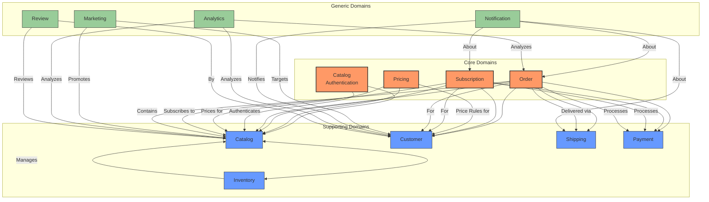
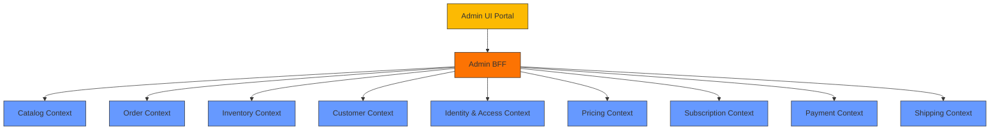

# Elias Food Imports Bounded Context Map

## Document Purpose
This document provides a comprehensive visualization and description of the bounded contexts within the Elias Food Imports domain model, defines the relationships between them, and documents the integration patterns used for inter-context communication.

## Version History
| Date       | Version | Description                  | Author          |
|------------|---------|------------------------------|-----------------|
| 2025-06-10 | 1.1.0   | Enhanced documentation, added sections, improved formatting | Architecture Team |
| 2025-06-06 | 1.0.0   | Initial version              | Architecture Team |

## Glossary

### Core Concepts
- **Bounded Context**: A boundary within which a particular domain model is defined and applicable
- **Core Domain**: The central, most valuable part of the business that provides competitive advantage
- **Supporting Domain**: Supports the core domain but is not a differentiator
- **Generic Domain**: Common functionality that doesn't provide competitive advantage
- **Integration Pattern**: Standardized approach for communication between bounded contexts
- **Anti-Corruption Layer (ACL)**: A layer that isolates a model from external influence by translating between different models

### Relationship Types
- **Customer-Supplier**: One context provides data/services that another context consumes
- **Partnership**: Two contexts work closely together with mutual dependency
- **Conformist**: One context conforms to the model of another without influence
- **Open Host Service**: Defines a protocol that gives access to the subsystem
- **Published Language**: A well-documented, shared language for communication between contexts

## 1. Bounded Context Diagram

*Figure 1: High-level view of bounded contexts and their relationships*

## 2. Context Relationships

### 2.1 Upstream-Downstream Relationships

The following table outlines the directional relationships between bounded contexts, including the type of relationship and the integration pattern used:

| Upstream Context | Downstream Context | Relationship Type | Integration Pattern |
|-----------------|-------------------|-------------------|-------------------|
| Catalog Authentication | Catalog | Customer-Supplier | Synchronous API |
| Pricing | Catalog | Customer-Supplier | Event-Driven |
| Pricing | Order | Customer-Supplier | Synchronous API |
| Subscription | Order | Partnership | Event-Driven |
| Customer | Order | Customer-Supplier | Synchronous API |
| Customer | Subscription | Customer-Supplier | Synchronous API |
| Inventory | Catalog | Customer-Supplier | Event-Driven |
| Inventory | Order | Conformist | Event-Driven |
| Payment | Order | Customer-Supplier | Synchronous API |
| Payment | Subscription | Customer-Supplier | Synchronous API |
| Shipping | Order | Customer-Supplier | Event-Driven |

### 2.2 Anti-Corruption Layers

The following bounded contexts implement anti-corruption layers to isolate themselves from external systems or legacy domains. Each ACL includes translation logic to maintain the integrity of the domain model:

1. **Catalog ↔ External Supplier Systems**: Translates between supplier product data formats and our domain model
2. **Payment ↔ Payment Gateway**: Isolates payment domain from payment provider-specific implementations
3. **Shipping ↔ Fulfillment Partners**: Translates between shipping partners' APIs and our domain model

## 3. Bounded Context Details

This section provides detailed information about each bounded context, including its purpose, ownership, and integration points with other contexts.

### 3.1 Core Domains

Core domains represent the most valuable and differentiating aspects of the business.

#### 3.1.1 Catalog Authentication

**Business Capability**: Ensures product authenticity and provenance tracking.

**Domain Ownership**: Authentication Team

**Strategic Classification**: Core Domain (Differentiator)

**Key Domain Concepts**:
- Authentication Certificate
- Provenance Record
- Authentication Scan
- Product Verification

**Integration Points**:
- Provides authentication status to Catalog context
- Consumes product data from Catalog context
- Publishes authentication events to Analytics context

#### 3.1.2 Pricing

**Business Capability**: Dynamic price calculation and optimization

**Domain Ownership**: Pricing Strategy Team

**Strategic Classification**: Core Domain (Differentiator)

**Key Domain Concepts**:
- Price Rules
- Import Cost
- Currency Exchange
- Margin Requirements
- Promotions

**Integration Points**:
- Provides pricing information to Catalog and Order contexts
- Consumes product data from Catalog context
- Consumes customer segment data from Customer context

#### 3.1.3 Subscription

**Business Capability**: Recurring product delivery management

**Domain Ownership**: Subscription Team

**Strategic Classification**: Core Domain (Differentiator)

**Key Domain Concepts**:
- Subscription Plan
- Delivery Schedule
- Subscription Items
- Pause/Resume
- Billing Cycle

**Integration Points**:
- Creates orders via Order context
- Uses customer information from Customer context
- Processes payments through Payment context
- Subscribes to products in Catalog context

#### 3.1.4 Order

**Business Capability**: Order processing and fulfillment

**Domain Ownership**: Order Processing Team

**Strategic Classification**: Core Domain (Business Essential)

**Key Domain Concepts**:
- Order 
- Order Line Items
- Fulfillment Status
- Shipping Information
- Payment Status

**Integration Points**:
- Gets products from Catalog context
- Gets customer data from Customer context
- Verifies inventory with Inventory context
- Processes payment through Payment context
- Arranges shipping through Shipping context

### 3.2 Supporting Domains

Supporting domains provide essential functionality that supports the core business processes.

#### Catalog

**Business Capability**: Product information management

**Domain Ownership**: Product Team

**Strategic Classification**: Supporting Domain

**Key Domain Concepts**:
- Product
- Category
- Product Attributes
- Media Assets
- Product Search

**Integration Points**:
- Provides product information to all contexts
- Receives inventory updates from Inventory context
- Receives authentication status from Authentication context
- Receives pricing information from Pricing context

#### Customer

**Business Capability**: Customer relationship management

**Domain Ownership**: Customer Success Team

**Strategic Classification**: Supporting Domain

**Key Domain Concepts**:
- Customer Profile
- Preferences
- Customer Segment
- Contact Information
- Order History

**Integration Points**:
- Provides customer data to Order and Subscription contexts
- Receives order history from Order context
- Provides customer segments to Marketing and Pricing contexts

#### Inventory

**Business Capability**: Stock management and forecasting

**Domain Ownership**: Warehouse Operations Team

**Strategic Classification**: Supporting Domain

**Key Domain Concepts**:
- Stock Level
- Warehouse Location
- Reorder Point
- Reserved Inventory
- Inventory Adjustment

**Integration Points**:
- Provides inventory levels to Catalog context
- Reserves inventory for Order context
- Publishes inventory events for Analytics context

#### Payment

**Business Capability**: Payment processing and financial transactions

**Domain Ownership**: Finance Team

**Strategic Classification**: Supporting Domain

**Key Domain Concepts**:
- Payment Method
- Transaction
- Invoice
- Refund
- Payment Status

**Integration Points**:
- Processes payments for Order and Subscription contexts
- Publishes payment events for Analytics context
- Connects to external payment gateways

#### Shipping

**Business Capability**: Delivery coordination and tracking

**Domain Ownership**: Logistics Team

**Strategic Classification**: Supporting Domain

**Key Domain Concepts**:
- Shipment
- Tracking Information
- Shipping Method
- Delivery Schedule
- Carrier Information

**Integration Points**:
- Receives shipping requests from Order context
- Sends tracking updates to Notification context
- Connects to external shipping providers

### Generic Domains

#### Marketing

**Business Capability**: Campaign management and customer engagement

**Domain Ownership**: Marketing Team

**Strategic Classification**: Generic Domain

**Integration Points**:
- Uses customer segments from Customer context
- Promotes products from Catalog context
- Publishes promotion events to Pricing context

#### Notification

**Business Capability**: Multi-channel customer communications

**Domain Ownership**: Communications Team

**Strategic Classification**: Generic Domain

**Integration Points**:
- Receives events from Order, Shipping, Subscription contexts
- Uses customer contact info from Customer context

#### Analytics

**Business Capability**: Business intelligence and reporting

**Domain Ownership**: Data Analytics Team

**Strategic Classification**: Generic Domain

**Integration Points**:
- Consumes events from all domains
- Provides reports and dashboards to all teams

#### Review

**Business Capability**: Product review and rating management

**Domain Ownership**: Content Team

**Strategic Classification**: Generic Domain

**Integration Points**:
- Associates reviews with products from Catalog context
- Associates reviews with customers from Customer context
- Provides rating data to Catalog context

## 4. Integration Patterns

This section details the standard patterns used for communication between bounded contexts, including implementation guidelines and examples.

### 4.1 Pattern Catalog

#### 4.1.1 Customer-Supplier Pattern

Used when one team (upstream) provides data or services to another team (downstream) with a commitment to meet the downstream team's needs.

**Examples**:
- **Catalog → Order**: Catalog team provides product information required by the Order team.
- **Customer → Subscription**: Customer team provides customer data needed for subscription management.

#### 4.1.2 Partnership Pattern

Used when two teams have mutual dependencies and need to plan development together.

**Examples**:
- **Subscription ↔ Order**: Both teams collaborate closely to ensure subscription orders are processed correctly.
- **Pricing ↔ Marketing**: Teams coordinate promotional pricing and campaign management.

#### 4.1.3 Conformist Pattern

Used when a downstream team must adapt to the model of an upstream team without influence.

**Examples**:
- **Inventory ↔ Order**: Order processing must conform to inventory availability models.
- **Analytics ↔ All Domains**: Analytics conforms to the event structures provided by other domains.

#### 4.1.4 Anti-Corruption Layer

Used to protect a model from corruption when integrating with external systems or legacy code.

**Examples**:
- **Catalog ↔ External Suppliers**: Translates between supplier data formats and our domain model.
- **Payment → Payment Gateway**: Isolates payment domain from payment provider specifics.
- **Shipping → Fulfillment Partners**: Translates between shipping partner APIs and our domain model.

#### 4.1.5 Shared Kernel

Used when multiple teams share a subset of the domain model, including code or database schemas.

**Examples**:
- **Common Types Library**: Shared value objects and domain primitives used across contexts.
- **Shared Event Definitions**: Common event schemas used for cross-context communication.

#### 4.1.6 Open Host Service Pattern

Used to provide a well-defined interface for integration with multiple other contexts.

**Examples**:
- **Catalog API**: Provides standardized interfaces for accessing product information.
- **Customer API**: Offers standard interfaces for customer data access across contexts.

## Admin Interface Integration

The Admin interface is implemented as a cross-cutting concern rather than a bounded context, following the Composite UI pattern with Backend for Frontend (BFF).

### Customer-Supplier Relationship

The Admin BFF acts as a customer of services provided by each bounded context:

- **Admin BFF (Customer)** consumes well-defined administrative APIs from each bounded context (Supplier)
- Each context defines and owns its administrative capabilities according to its domain model
- The Admin BFF aggregates these capabilities into a unified administrative experience

### Conformist Relationship

The Admin UI conforms to the domain models of each bounded context:

- Domain concepts are preserved in the Admin UI without translation
- Admin operations follow the same business rules as defined in each context
- No anti-corruption layer is used; the Admin UI directly uses domain terminology and concepts

### Open Host Service

Each bounded context provides well-defined administrative APIs as an Open Host Service:

- Standard patterns for administrative operations across all contexts
- Consistent authentication and authorization mechanisms
- Self-documenting admin endpoints with clear permissions

### Context Map Visualization

*Figure 2: Admin Interface Integration with Bounded Contexts*

## Context Boundary Enforcement

To maintain clear boundaries between contexts, we enforce:

1. **Separate Codebases**: Each bounded context has its own dedicated codebase repository or module
2. **API Gateways**: External access to context capabilities is handled through well-defined API gateways
3. **Event Contracts**: Domain events use strict contracts for communication between contexts
4. **Context-Specific CI/CD Pipelines**: Separate build and deployment pipelines ensure independent evolution
5. **Team Alignment**: Development teams are aligned with bounded contexts

## Testing Across Context Boundaries

When testing interactions between bounded contexts:

1. **Contract Tests**: Verify that inter-context communications adhere to defined contracts
2. **Integration Tests**: Focus on the boundaries between contexts
3. **Context Map Validation**: Automated tests verify that context mappings remain valid
4. **Cross-Context Scenarios**: End-to-end tests validate complete business scenarios spanning multiple contexts

## Evolving the Context Map

This context map is a living document that evolves as the domain model matures. Changes to the context map follow this process:

1. **Context Boundary Change Proposal**: Submitted when team identifies need for boundary adjustment
2. **Impact Analysis**: Assessment of how changes affect other contexts
3. **Cross-Team Review**: Context owners review and approve changes
4. **Implementation Plan**: Detailed steps for implementing boundary changes
5. **Documentation Update**: This context map and related documentation is updated

## References

- [Domain Knowledge Repository](../README.md)
- [Domain Event Catalog](./events.md)
- [Integration Patterns](./patterns.md)
- [Architecture Decision Records](../../adr/README.md)

---

*This context map serves as the primary reference for understanding the relationships between bounded contexts in our domain model. It guides architectural decisions, team structures, and integration patterns.*

## 5. Future Considerations

### 5.1 Planned Enhancements
- [ ] Implement event-driven architecture for all cross-context communication
- [ ] Develop comprehensive contract tests for all integration points
- [ ] Create a service mesh for improved observability of cross-context communication

### 5.2 Technical Debt
- [ ] Document and standardize all event schemas
- [ ] Implement circuit breakers for all external service calls
- [ ] Add comprehensive monitoring for integration points

## 6. Related Documents

### Domain Documentation
- [Domain Event Catalog](../domain-events/README.md)
- [Integration Patterns](./integration-patterns.md)
- [Domain Glossary](../glossary.md)
- [Ubiquitous Language](../ubiquitous-language/README.md)

### Technical Documentation
- [API Design Guidelines](../technical/api-design-guidelines.md)
- [Event Sourcing Implementation](../technical/event-sourcing.md)
- [Service Mesh Architecture](../technical/service-mesh.md)

## 7. Gap Implementation Markers

<!-- GAP_IMPLEMENTED: Context Map Documentation | High | High | Medium -->
<!-- TODO: Add examples of event schemas for each integration point -->
<!-- TODO: Add sequence diagrams for key integration flows -->
<!-- TODO: Document SLAs and performance expectations for each integration point -->

## 8. Reviewers

- **Domain Experts**: Please review for accuracy of domain concepts and relationships
- **Architects**: Please review technical implementation details and patterns
- **Product Owners**: Please review alignment with business capabilities and strategy

## 9. Approval

| Role              | Name                | Date       | Approval Status |
|-------------------|---------------------|------------|-----------------|
| Domain Expert    | [Name]             | YYYY-MM-DD | Approved/Rejected |
| Architect        | [Name]             | YYYY-MM-DD | Approved/Rejected |
| Product Owner    | [Name]             | YYYY-MM-DD | Approved/Rejected |

*Table: Document approval status and sign-off*
