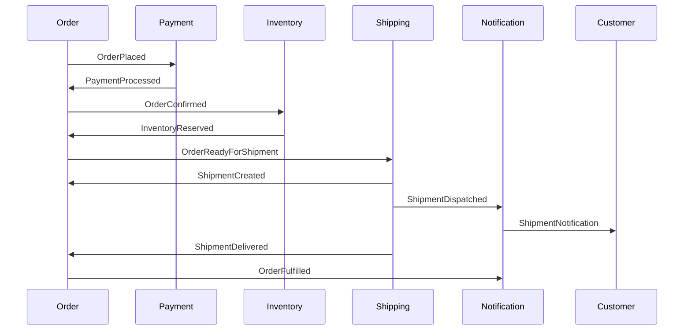
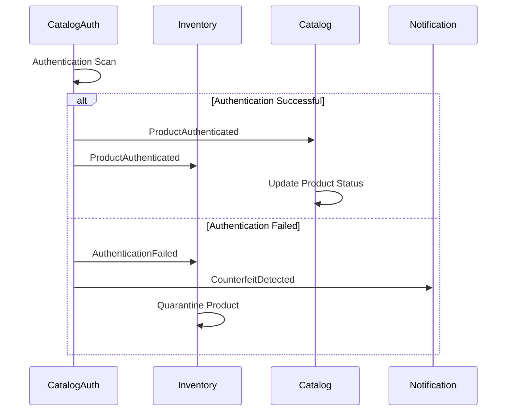
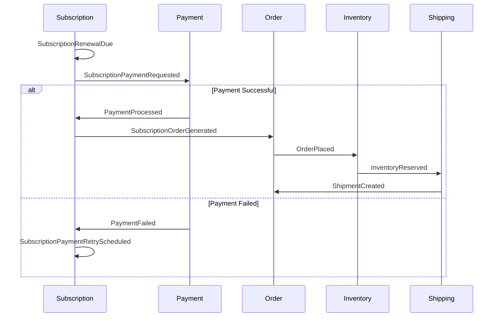

# Domain Event Catalog

This catalog documents all domain events across the Elias Food Imports domain model. Each event includes its definition, payload structure, producing and consuming contexts, and delivery guarantee mechanism.

## Table of Contents

1. [Event Naming Conventions](#event-naming-conventions)
2. [Delivery Mechanisms](#delivery-mechanisms)
3. [Events by Bounded Context](#events-by-bounded-context)
   - [Order Context](#order-context)
   - [Payment Context](#payment-context)
   - [Inventory Context](#inventory-context)
   - [Catalog Context](#catalog-context)
   - [Customer Context](#customer-context)
   - [Shipping Context](#shipping-context)
   - [Subscription Context](#subscription-context)
   - [Marketing Context](#marketing-context)
   - [Review Context](#review-context)
   - [Authentication Context](#authentication-context)
   - [Catalog Authentication Context](#catalog-authentication-context)
   - [Notification Context](#notification-context)
   - [Analytics Context](#analytics-context)
4. [Context-to-Context Event Flow Diagrams](#context-to-context-event-flow-diagrams)

## Event Naming Conventions

All domain events follow these naming conventions:

1. **Entity-First**: Events are named starting with the entity they relate to
2. **Past Tense**: Events use past tense to indicate something that has happened
3. **Specificity**: Names are specific about what changed or occurred
4. **Consistency**: Naming aligns with the Ubiquitous Language glossary

Examples: `OrderPlaced`, `PaymentProcessed`, `InventoryAdjusted`

## Delivery Mechanisms

Events use different delivery guarantees based on business criticality:

- **At-Least-Once**: Critical business flow events that must be processed (e.g., `OrderPlaced`, `PaymentProcessed`)
- **At-Most-Once**: Events where duplicates would cause issues (e.g., `InventoryReserved`)
- **Best-Effort**: Analytics and reporting events where occasional loss is acceptable

## Events by Bounded Context

### Order Context

#### OrderPlaced

- **Definition**: Created when a customer successfully places a new order
- **Payload**:
  ```json
  {
    "orderId": "UUID",
    "customerId": "UUID",
    "orderItems": [
      {
        "productId": "UUID",
        "quantity": "Number",
        "price": "Money"
      }
    ],
    "totalAmount": "Money",
    "placedAt": "Timestamp"
  }
  ```
- **Producer**: Order Context
- **Consumers**:
  - Payment Context: Initiates payment processing
  - Inventory Context: Reserves inventory
  - Customer Context: Updates purchase history
- **Delivery Guarantee**: At-Least-Once

#### OrderCancelled

- **Definition**: Created when an order is cancelled by customer or system
- **Payload**:
  ```json
  {
    "orderId": "UUID",
    "reason": "String",
    "cancelledAt": "Timestamp"
  }
  ```
- **Producer**: Order Context
- **Consumers**:
  - Payment Context: Processes refund if payment was made
  - Inventory Context: Releases reserved inventory
  - Customer Context: Updates order history
- **Delivery Guarantee**: At-Least-Once

#### OrderFulfilled

- **Definition**: Created when all items in an order have been shipped
- **Payload**:
  ```json
  {
    "orderId": "UUID",
    "shipmentIds": ["UUID"],
    "fulfilledAt": "Timestamp"
  }
  ```
- **Producer**: Order Context
- **Consumers**:
  - Customer Context: Updates order status
  - Notification Context: Sends fulfillment notification
  - Analytics Context: Updates fulfillment metrics
- **Delivery Guarantee**: At-Least-Once

### Payment Context

#### PaymentProcessed

- **Definition**: Created when payment for an order has been processed
- **Payload**:
  ```json
  {
    "paymentId": "UUID",
    "orderId": "UUID", 
    "amount": "Money",
    "paymentMethod": "String",
    "status": "String",
    "processedAt": "Timestamp"
  }
  ```
- **Producer**: Payment Context
- **Consumers**:
  - Order Context: Updates order payment status
  - Shipping Context: Enables shipping if payment successful
  - Customer Context: Updates payment history
- **Delivery Guarantee**: At-Least-Once

#### PaymentFailed

- **Definition**: Created when a payment attempt fails
- **Payload**:
  ```json
  {
    "paymentId": "UUID",
    "orderId": "UUID",
    "failureReason": "String", 
    "attemptCount": "Number",
    "failedAt": "Timestamp"
  }
  ```
- **Producer**: Payment Context
- **Consumers**:
  - Order Context: Updates order payment status
  - Customer Context: Updates payment history
  - Notification Context: Sends payment failure notification
- **Delivery Guarantee**: At-Least-Once

### Inventory Context

#### InventoryAdjusted

- **Definition**: Created when inventory quantity changes
- **Payload**:
  ```json
  {
    "productId": "UUID",
    "warehouseId": "UUID",
    "newQuantity": "Number", 
    "oldQuantity": "Number",
    "reason": "String",
    "adjustedAt": "Timestamp"
  }
  ```
- **Producer**: Inventory Context
- **Consumers**:
  - Catalog Context: Updates product availability
  - Analytics Context: Updates inventory metrics
- **Delivery Guarantee**: At-Most-Once

#### InventoryReserved

- **Definition**: Created when inventory is temporarily reserved for an order
- **Payload**:
  ```json
  {
    "reservationId": "UUID",
    "orderId": "UUID",
    "items": [
      {
        "productId": "UUID",
        "quantity": "Number"
      }
    ],
    "expiresAt": "Timestamp",
    "reservedAt": "Timestamp"
  }
  ```
- **Producer**: Inventory Context
- **Consumers**:
  - Order Context: Updates order fulfillment status
  - Shipping Context: Enables shipment planning
- **Delivery Guarantee**: At-Most-Once

#### InventoryLow

- **Definition**: Created when product inventory falls below threshold
- **Payload**:
  ```json
  {
    "productId": "UUID", 
    "warehouseId": "UUID",
    "currentQuantity": "Number",
    "threshold": "Number",
    "detectedAt": "Timestamp"
  }
  ```
- **Producer**: Inventory Context
- **Consumers**:
  - Notification Context: Alerts inventory managers
  - Analytics Context: Updates inventory risk metrics
- **Delivery Guarantee**: Best-Effort

### Catalog Authentication Context

#### ProductAuthenticated

- **Definition**: Created when a product passes authentication verification
- **Payload**:
  ```json
  {
    "productId": "UUID",
    "batchId": "String",
    "authenticationType": "String",
    "confidenceScore": "Number",
    "authenticatedAt": "Timestamp",
    "authenticatedBy": "String" 
  }
  ```
- **Producer**: Catalog Authentication Context
- **Consumers**:
  - Catalog Context: Updates product authentication status
  - Inventory Context: Updates product status for sale eligibility
- **Delivery Guarantee**: At-Least-Once

#### AuthenticationFailed

- **Definition**: Created when product authentication verification fails
- **Payload**:
  ```json
  {
    "productId": "UUID", 
    "batchId": "String",
    "authenticationType": "String",
    "failureReason": "String",
    "failedAt": "Timestamp",
    "verifiedBy": "String"
  }
  ```
- **Producer**: Catalog Authentication Context
- **Consumers**:
  - Inventory Context: Marks product for quarantine
  - Notification Context: Alerts authentication team
- **Delivery Guarantee**: At-Least-Once

#### ProductQuarantined

- **Definition**: Created when a product is placed in quarantine
- **Payload**:
  ```json
  {
    "productId": "UUID",
    "batchId": "String",
    "reason": "String",
    "quarantineId": "UUID",
    "quarantinedAt": "Timestamp"
  }
  ```
- **Producer**: Catalog Authentication Context
- **Consumers**:
  - Inventory Context: Updates product status
  - Reporting Context: Logs quarantine action
- **Delivery Guarantee**: At-Least-Once

<!-- Note: This document contains a subset of events for brevity. The full catalog contains 60+ events across all contexts -->

## Context-to-Context Event Flow Diagrams

### Order Processing Flow



### Product Authentication Flow



### Subscription Management Flow



---

*This catalog is maintained by the Integration Team and follows the Domain Event Naming Analysis guidelines.*
