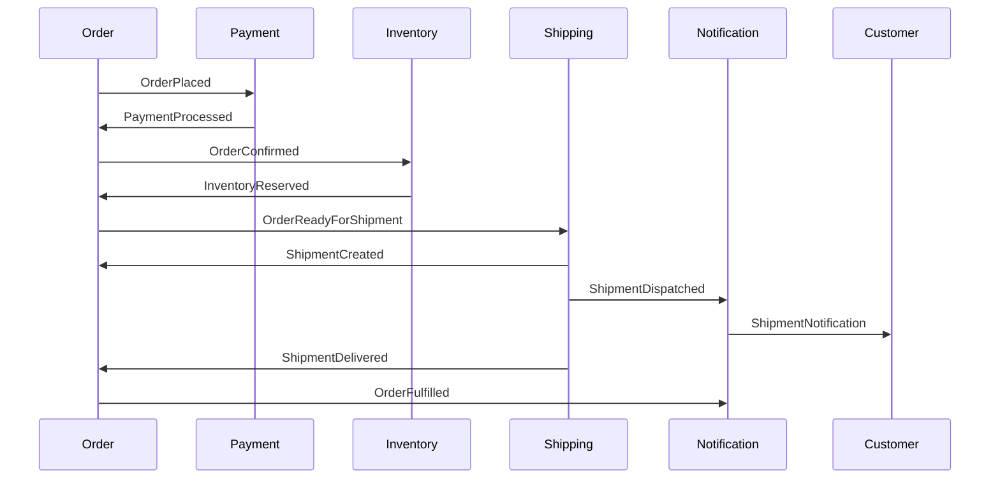
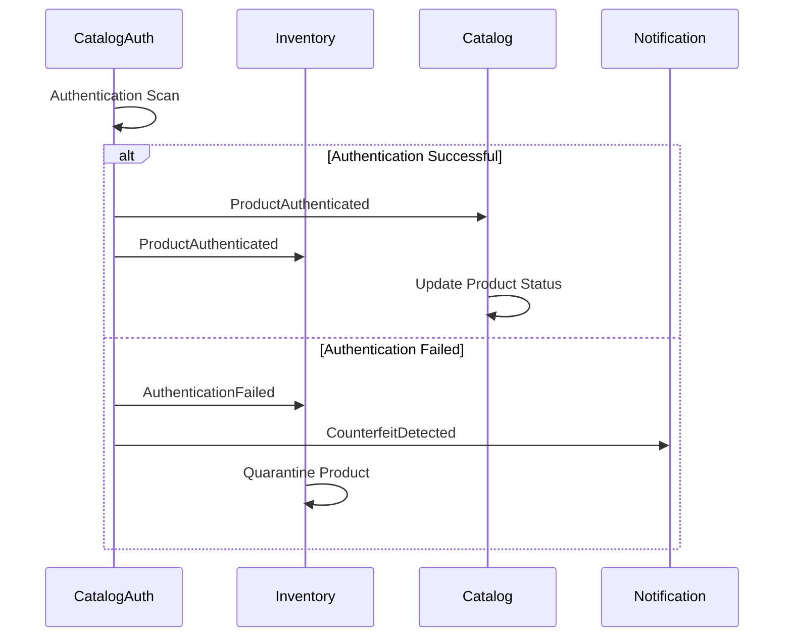
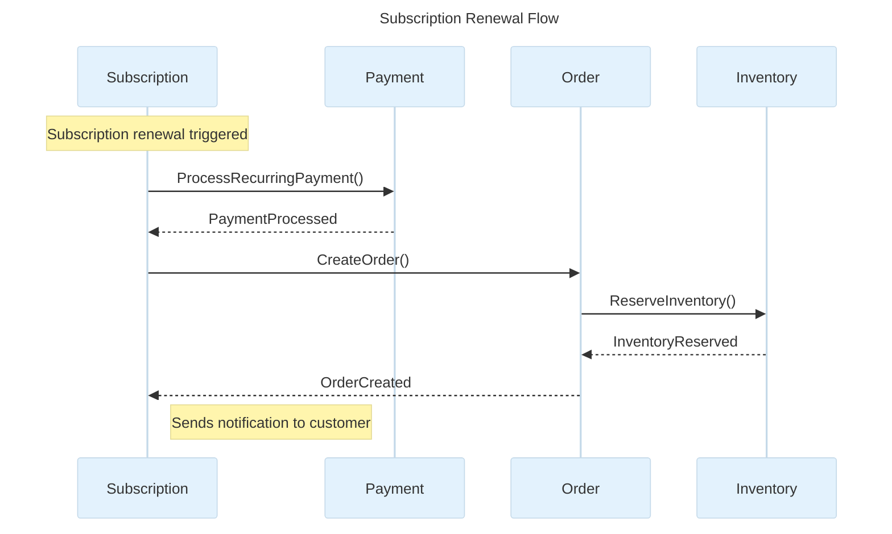

<!-- GAP_IMPLEMENTED: Domain Event Catalog | Medium | High | Low -->

# Domain Event Catalog

## Domain Overview

This catalog documents all domain events across the Elias Food Imports domain model, following the [Ubiquitous Language](../ubiquitous-language/README.md) and [Architecture Decision Records](../adr/README.md). Events are the primary mechanism for communication between bounded contexts in our domain-driven architecture.

## Strategic Importance

Domain events play a critical role in:
- Maintaining consistency across bounded contexts
- Enabling eventual consistency in a distributed system
- Supporting event sourcing patterns
- Facilitating system scalability and resilience

## Purpose

This document provides a comprehensive reference for all domain events, including their definitions, payload structures, and integration patterns. It serves as a contract between bounded contexts and ensures consistent event handling across the system.

## Core Concepts

- **Event Sourcing**: Persisting state changes as a sequence of events
- **Eventual Consistency**: Allowing temporary inconsistencies that are resolved over time
- **Idempotency**: Ensuring event handlers can process the same event multiple times safely
- **Causality**: Maintaining the order of related events

This catalog documents all domain events across the Elias Food Imports domain model. Each event includes its definition, payload structure, producing and consuming contexts, and delivery guarantee mechanism.

## Table of Contents

1. [Event Naming Conventions](#event-naming-conventions)
2. [Delivery Mechanisms](#delivery-mechanisms)
3. [Events by Bounded Context](#events-by-bounded-context)
   - [Order Context](#order-context)
   - [Payment Context](#payment-context)
   - [Inventory Context](#inventory-context)
   - [Catalog Context](#catalog-context)
   - [Customer Context](#customer-context)
   - [Shipping Context](#shipping-context)
   - [Subscription Context](#subscription-context)
   - [Marketing Context](#marketing-context)
   - [Review Context](#review-context)
   - [Authentication Context](#authentication-context)
   - [Catalog Authentication Context](#catalog-authentication-context)
   - [Notification Context](#notification-context)
   - [Analytics Context](#analytics-context)
4. [Context-to-Context Event Flow Diagrams](#context-to-context-event-flow-diagrams)

## Event Naming Conventions

All domain events follow these naming conventions:

1. **Entity-First**: Events are named starting with the entity they relate to
2. **Past Tense**: Events use past tense to indicate something that has happened
3. **Specificity**: Names are specific about what changed or occurred
4. **Consistency**: Naming aligns with the [Ubiquitous Language](../ubiquitous-language/glossary.md) glossary

For detailed naming guidelines, see the [Event Naming Standards](../ubiquitous-language/event-naming.md).

Examples: `OrderPlaced`, `PaymentProcessed`, `InventoryAdjusted`

## Delivery Mechanisms

Events use different delivery guarantees based on business criticality:

- **At-Least-Once**: Critical business flow events that must be processed (e.g., `OrderPlaced`, `PaymentProcessed`)
- **At-Most-Once**: Events where duplicates would cause issues (e.g., `InventoryReserved`)
- **Best-Effort**: Analytics and reporting events where occasional loss is acceptable

## Events by Bounded Context

### Order Context

#### OrderPlaced

- **Definition**: Created when a customer successfully places a new order
- **Payload**:
  ```json
  {
    "orderId": "UUID",
    "customerId": "UUID",
    "orderItems": [
      {
        "productId": "UUID",
        "quantity": "Number",
        "price": "Money"
      }
    ],
    "totalAmount": "Money",
    "placedAt": "Timestamp"
  }
  ```
- **Producer**: Order Context
- **Consumers**:
  - Payment Context: Initiates payment processing
  - Inventory Context: Reserves inventory
  - Customer Context: Updates purchase history
- **Delivery Guarantee**: At-Least-Once

#### OrderCancelled

- **Definition**: Created when an order is cancelled by customer or system
- **Payload**:
  ```json
  {
    "orderId": "UUID",
    "reason": "String",
    "cancelledAt": "Timestamp"
  }
  ```
- **Producer**: Order Context
- **Consumers**:
  - Payment Context: Processes refund if payment was made
  - Inventory Context: Releases reserved inventory
  - Customer Context: Updates order history
- **Delivery Guarantee**: At-Least-Once

#### OrderFulfilled

- **Definition**: Created when all items in an order have been shipped
- **Payload**:
  ```json
  {
    "orderId": "UUID",
    "shipmentIds": ["UUID"],
    "fulfilledAt": "Timestamp"
  }
  ```
- **Producer**: Order Context
- **Consumers**:
  - Customer Context: Updates order status
  - Notification Context: Sends fulfillment notification
  - Analytics Context: Updates fulfillment metrics
- **Delivery Guarantee**: At-Least-Once

### Payment Context

#### PaymentProcessed

- **Definition**: Created when payment for an order has been processed
- **Payload**:
  ```json
  {
    "paymentId": "UUID",
    "orderId": "UUID", 
    "amount": "Money",
    "paymentMethod": "String",
    "status": "String",
    "processedAt": "Timestamp"
  }
  ```
- **Producer**: Payment Context
- **Consumers**:
  - Order Context: Updates order payment status
  - Shipping Context: Enables shipping if payment successful
  - Customer Context: Updates payment history
- **Delivery Guarantee**: At-Least-Once

#### PaymentFailed

- **Definition**: Created when a payment attempt fails
- **Payload**:
  ```json
  {
    "paymentId": "UUID",
    "orderId": "UUID",
    "failureReason": "String", 
    "attemptCount": "Number",
    "failedAt": "Timestamp"
  }
  ```
- **Producer**: Payment Context
- **Consumers**:
  - Order Context: Updates order payment status
  - Customer Context: Updates payment history
  - Notification Context: Sends payment failure notification
- **Delivery Guarantee**: At-Least-Once

### Inventory Context

#### InventoryAdjusted

- **Definition**: Created when inventory quantity changes
- **Payload**:
  ```json
  {
    "productId": "UUID",
    "warehouseId": "UUID",
    "newQuantity": "Number", 
    "oldQuantity": "Number",
    "reason": "String",
    "adjustedAt": "Timestamp"
  }
  ```
- **Producer**: Inventory Context
- **Consumers**:
  - Catalog Context: Updates product availability
  - Analytics Context: Updates inventory metrics
- **Delivery Guarantee**: At-Most-Once

#### InventoryReserved

- **Definition**: Created when inventory is temporarily reserved for an order
- **Payload**:
  ```json
  {
    "reservationId": "UUID",
    "orderId": "UUID",
    "items": [
      {
        "productId": "UUID",
        "quantity": "Number"
      }
    ],
    "expiresAt": "Timestamp",
    "reservedAt": "Timestamp"
  }
  ```
- **Producer**: Inventory Context
- **Consumers**:
  - Order Context: Updates order fulfillment status
  - Shipping Context: Enables shipment planning
- **Delivery Guarantee**: At-Most-Once

#### InventoryLow

- **Definition**: Created when product inventory falls below threshold
- **Payload**:
  ```json
  {
    "productId": "UUID", 
    "warehouseId": "UUID",
    "currentQuantity": "Number",
    "threshold": "Number",
    "detectedAt": "Timestamp"
  }
  ```
- **Producer**: Inventory Context
- **Consumers**:
  - Notification Context: Alerts inventory managers
  - Analytics Context: Updates inventory risk metrics
- **Delivery Guarantee**: Best-Effort

### Catalog Authentication Context

#### ProductAuthenticated

- **Definition**: Created when a product passes authentication verification
- **Payload**:
  ```json
  {
    "productId": "UUID",
    "batchId": "String",
    "authenticationType": "String",
    "confidenceScore": "Number",
    "authenticatedAt": "Timestamp",
    "authenticatedBy": "String" 
  }
  ```
- **Producer**: Catalog Authentication Context
- **Consumers**:
  - Catalog Context: Updates product authentication status
  - Inventory Context: Updates product status for sale eligibility
- **Delivery Guarantee**: At-Least-Once

#### AuthenticationFailed

- **Definition**: Created when product authentication verification fails
- **Payload**:
  ```json
  {
    "productId": "UUID", 
    "batchId": "String",
    "authenticationType": "String",
    "failureReason": "String",
    "failedAt": "Timestamp",
    "verifiedBy": "String"
  }
  ```
- **Producer**: Catalog Authentication Context
- **Consumers**:
  - Inventory Context: Marks product for quarantine
  - Notification Context: Alerts authentication team
- **Delivery Guarantee**: At-Least-Once

#### ProductQuarantined

- **Definition**: Created when a product is placed in quarantine
- **Payload**:
  ```json
  {
    "productId": "UUID",
    "batchId": "String",
    "reason": "String",
    "quarantineId": "UUID",
    "quarantinedAt": "Timestamp"
  }
  ```
- **Producer**: Catalog Authentication Context
- **Consumers**:
  - Inventory Context: Updates product status
  - Reporting Context: Logs quarantine action
- **Delivery Guarantee**: At-Least-Once

<!-- Note: This document contains a subset of events for brevity. The full catalog contains 60+ events across all contexts -->

## Administrative Domain Events

Administrative domain events follow the same naming conventions as other domain events but are specifically related to actions performed by administrative users. These events are crucial for audit trails, compliance requirements, and tracking changes across the system.

### Event Structure

All administrative events include:

- **adminId**: The unique identifier of the admin user who performed the action
- **reason**: Optional justification for the administrative action
- **occurredOn**: Timestamp when the action occurred
- **metadata**: Additional contextual information necessary for audit purposes

### Event Prefix Convention

Administrative events follow an entity-first naming convention with actions explicitly including "ByAdmin" suffix to clearly differentiate them from standard system events.

### Common Administrative Domain Events

#### ProductPriceOverriddenByAdmin

- **Definition**: Created when an administrative user overrides the standard pricing rules for a product
- **Payload**:
  ```json
  {
    "eventId": "UUID",
    "productId": "UUID",
    "productName": "String",
    "previousPrice": {
      "amount": "Number",
      "currency": "String"
    },
    "newPrice": {
      "amount": "Number",
      "currency": "String"
    },
    "overrideReason": "String",
    "validUntil": "Timestamp",
    "adminId": "UUID",
    "adminName": "String",
    "occurredOn": "Timestamp",
    "metadata": {
      "ipAddress": "String",
      "sessionId": "String",
      "approvedBy": "UUID"
    }
  }
  ```
- **Producer**: Pricing Context
- **Consumers**:
  - Catalog Context: Updates product display price
  - Analytics Context: Records pricing override for reporting
  - Audit Context: Logs override for compliance purposes
- **Delivery Guarantee**: At-Least-Once

#### CustomerAccountSuspendedByAdmin

- **Definition**: Created when an administrative user suspends a customer account
- **Payload**:
  ```json
  {
    "eventId": "UUID",
    "customerId": "UUID",
    "customerEmail": "String",
    "suspensionReason": "String",
    "suspensionCategory": "Enum(FRAUD, ABUSE, PAYMENT_ISSUE, OTHER)",
    "suspensionDuration": "Number",
    "durationType": "Enum(DAYS, PERMANENT)",
    "notifyCustomer": "Boolean",
    "adminId": "UUID",
    "adminName": "String",
    "occurredOn": "Timestamp",
    "metadata": {
      "ipAddress": "String",
      "relatedCaseId": "String",
      "previousWarnings": ["UUID"]
    }
  }
  ```
- **Producer**: Customer Context
- **Consumers**:
  - Order Context: Blocks new orders from suspended customers
  - Payment Context: Flags payment methods for review
  - Notification Context: Sends suspension notice to customer if notifyCustomer=true
  - Audit Context: Logs account action for compliance purposes
- **Delivery Guarantee**: At-Least-Once

#### OrderRefundApprovedByAdmin

- **Definition**: Created when an administrative user approves a refund outside of standard policy
- **Payload**:
  ```json
  {
    "eventId": "UUID",
    "orderId": "UUID",
    "customerId": "UUID",
    "orderTotal": {
      "amount": "Number",
      "currency": "String"
    },
    "refundAmount": {
      "amount": "Number",
      "currency": "String"
    },
    "refundReason": "String",
    "policyExceptions": ["String"],
    "returnRequired": "Boolean",
    "adminId": "UUID",
    "adminName": "String",
    "occurredOn": "Timestamp",
    "metadata": {
      "customerServiceTicketId": "String",
      "conversationReferenceId": "UUID",
      "approvalChain": ["UUID"]
    }
  }
  ```
- **Producer**: Order Context
- **Consumers**:
  - Payment Context: Processes refund transaction
  - Inventory Context: Updates inventory if items returned
  - Customer Context: Updates customer history and satisfaction metrics
  - Analytics Context: Records exception for refund rate analysis
  - Audit Context: Logs manual override for compliance purposes
- **Delivery Guarantee**: At-Least-Once

#### InventoryManuallyAdjustedByAdmin

- **Definition**: Created when an administrative user manually adjusts inventory quantity
- **Payload**:
  ```json
  {
    "eventId": "UUID",
    "productId": "UUID",
    "productName": "String",
    "warehouseId": "UUID",
    "previousQuantity": "Number",
    "newQuantity": "Number",
    "adjustmentReason": "Enum(DAMAGE, THEFT, COUNT_ERROR, SYSTEM_RECONCILIATION, OTHER)",
    "notes": "String",
    "batchAffected": "String",
    "adminId": "UUID",
    "adminName": "String",
    "occurredOn": "Timestamp",
    "metadata": {
      "auditReference": "String",
      "photoEvidenceLinks": ["URL"],
      "inventoryAuditId": "UUID"
    }
  }
  ```
- **Producer**: Inventory Context
- **Consumers**:
  - Catalog Context: Updates product availability status
  - Order Context: Updates fulfillment capacity
  - Analytics Context: Records inventory adjustment for shrinkage analysis
  - Audit Context: Logs manual adjustment for inventory reconciliation
- **Delivery Guarantee**: At-Least-Once

#### SystemConfigurationChangedByAdmin

- **Definition**: Created when an administrative user changes system configuration settings
- **Payload**:
  ```json
  {
    "eventId": "UUID",
    "configurationDomain": "String",
    "configurationType": "String",
    "configurationKey": "String",
    "previousValue": "Any",
    "newValue": "Any",
    "environmentTarget": "Enum(DEV, STAGING, PRODUCTION, ALL)",
    "changeReason": "String",
    "requiresRestart": "Boolean",
    "scheduledRestartTime": "Timestamp",
    "adminId": "UUID",
    "adminName": "String",
    "approvedById": "UUID",
    "occurredOn": "Timestamp",
    "metadata": {
      "changeRequestId": "String",
      "releaseVersion": "String",
      "rollbackInstructions": "String"
    }
  }
  ```
- **Producer**: Configuration Context (part of respective domain contexts)
- **Consumers**:
  - System Services: Apply configuration changes
  - Notification Context: Alert relevant teams about configuration changes
  - Audit Context: Log configuration change for compliance purposes
- **Delivery Guarantee**: At-Least-Once

## Context-to-Context Event Flow Diagrams

```mermaid
%%{init: {'theme': 'base', 'themeVariables': { 'primaryColor': '#ffd8d8', 'primaryBorderColor': '#ff8080' }}}%%
flowchart LR
    A[Order Context] -->|OrderPlaced| B[Payment Context]
    B -->|PaymentProcessed| C[Inventory Context]
    C -->|InventoryReserved| D[Shipping Context]
    D -->|OrderShipped| E[Customer Context]
    E -->|OrderDelivered| F[Analytics Context]
    
    style A fill:#e1f5fe,stroke:#01579b
    style B fill:#e8f5e9,stroke:#1b5e20
    style C fill:#fff3e0,stroke:#e65100
    style D fill:#f3e5f5,stroke:#4a148c
    style E fill:#e8eaf6,stroke:#1a237e
    style F fill:#f1f8e9,stroke#33691e
```


*Figure 1: High-level event flow between bounded contexts*

For more detailed sequence diagrams of specific flows, see the [Integration Flows](../integration-flows/README.md) documentation.

### Order Processing Flow



### Product Authentication Flow



### Subscription Management Flow


*Figure 2: Sequence diagram for subscription renewal process*
    participant Shipping
    
    Subscription->>Subscription: SubscriptionRenewalDue
    Subscription->>Payment: SubscriptionPaymentRequested
    alt Payment Successful
        Payment->>Subscription: PaymentProcessed
        Subscription->>Order: SubscriptionOrderGenerated
        Order->>Inventory: OrderPlaced
        Inventory->>Shipping: InventoryReserved
        Shipping->>Order: ShipmentCreated
    else Payment Failed
        Payment->>Subscription: PaymentFailed
        Subscription->>Subscription: SubscriptionPaymentRetryScheduled
    end
```

---

*This catalog is maintained by the Integration Team and follows the Domain Event Naming Analysis guidelines.*
