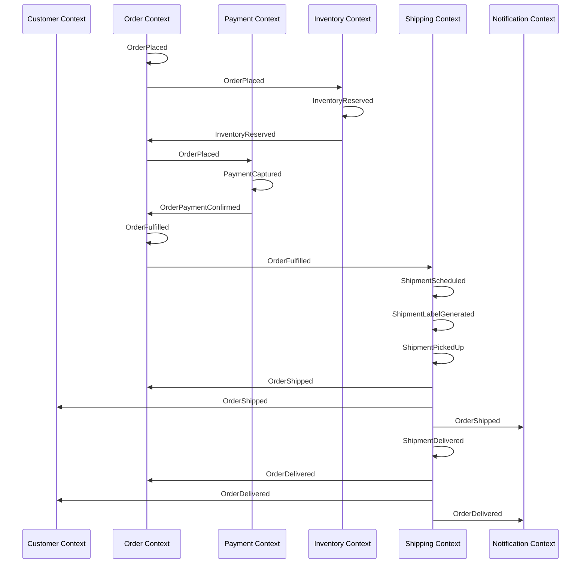
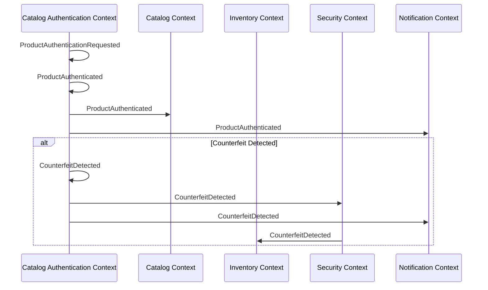
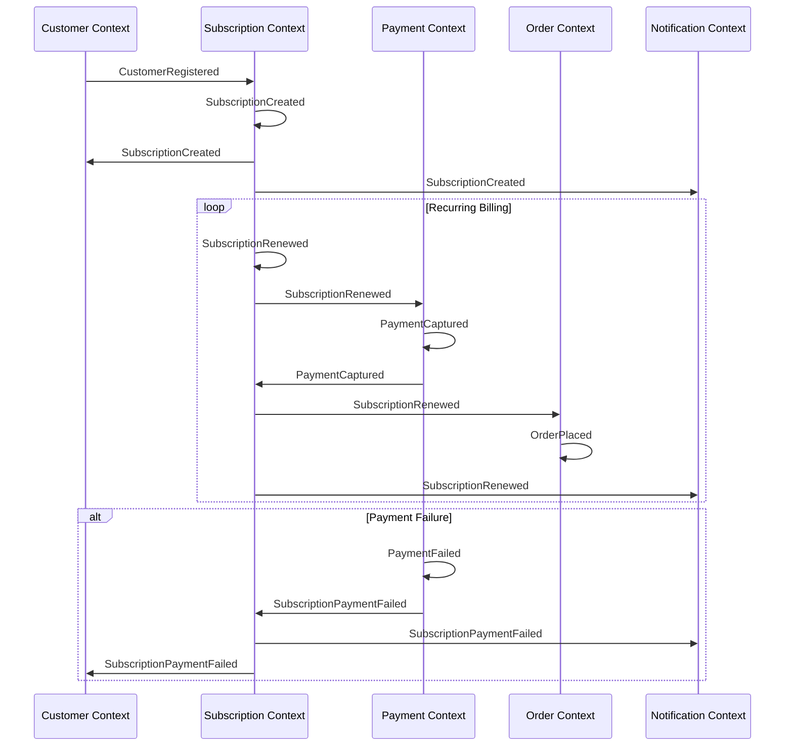
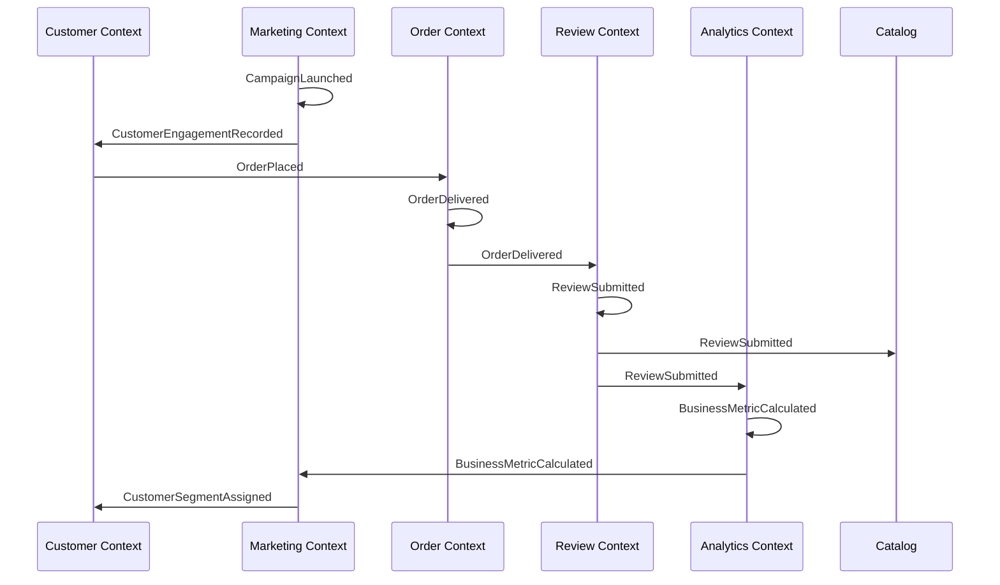
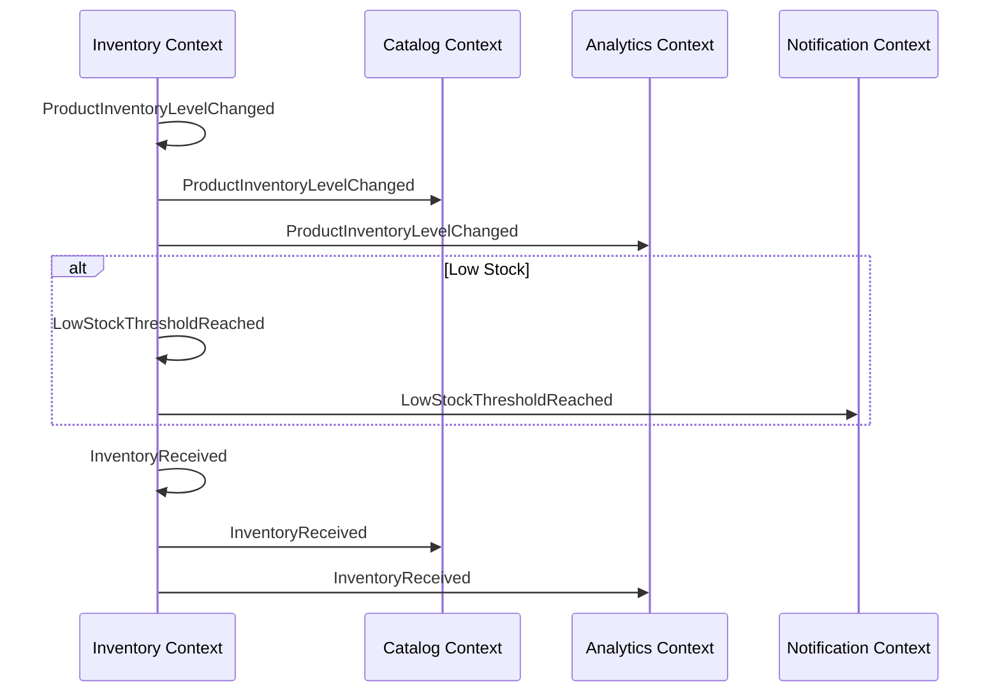

# Context→Event Flow Diagram

This diagram visualizes the flow of key domain events across bounded contexts in the Elias Food Imports system, showing how events trigger actions and subsequent events in different contexts.

## Order Processing Flow

## Product Authentication Flow

## Subscription Management Flow

## Customer Engagement Flow

## Inventory Management Flow

This diagram illustrates the key event flows across bounded contexts in the Elias Food Imports system. It shows how events originate in one context and trigger actions and subsequent events in other contexts, creating a chain of business processes that implement the system's requirements.
