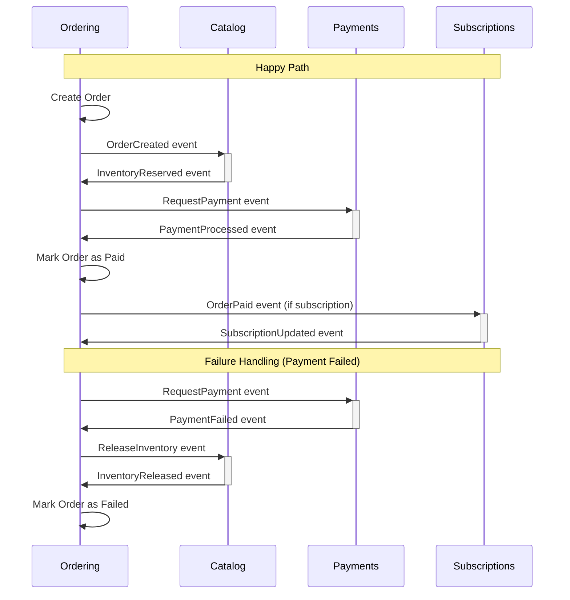

# Distributed Transaction Strategy

## Overview

This document outlines the strategy for handling distributed transactions across bounded contexts in the Elias Food Imports (EFI) domain model. In a domain-driven design architecture with multiple bounded contexts, ensuring data consistency while maintaining the autonomy of each context is a key challenge.

## Problem Statement

When operations span multiple bounded contexts, traditional ACID transactions are not feasible because:

1. Bounded contexts may have different persistence mechanisms
2. Transactions would create tight coupling between contexts
3. Long-running transactions decrease system availability

For example, when processing an order, the following bounded contexts are involved:
- **Ordering**: Creates and manages the order
- **Catalog**: Updates inventory
- **Payments**: Processes payment
- **Subscriptions**: Updates subscription status (if applicable)

## Proposed Strategy: Saga Pattern

For EFI, we recommend implementing the **Saga Pattern** rather than Two-Phase Commit (2PC) for the following reasons:

### Saga Pattern Benefits

1. **Loose Coupling**: Maintains bounded context independence
2. **Scalability**: Each context can scale independently
3. **Resilience**: System can continue functioning even if some components fail
4. **Eventual Consistency**: Provides a practical consistency model for distributed systems

### Implementation Approach

We will implement **Choreography-based Sagas** using domain events:

1. **Domain Events**: Each bounded context publishes events when significant state changes occur
2. **Event Handlers**: Each context subscribes to relevant events from other contexts
3. **Compensating Actions**: For each action, define a corresponding compensating action to roll back if necessary

## Example Saga: Order Processing



## Consistency Boundaries

We define the following consistency boundaries:

| Context | Local Consistency Requirements |
|---------|--------------------------------|
| Ordering | Orders must have valid items and customer information |
| Catalog | Inventory must not go below zero |
| Payments | Payment amount must match order total |
| Subscriptions | Subscription must reference valid customer and items |

## Implementation Details

### 1. Domain Event Infrastructure

Enhance the existing `DomainEvents` class to include:
- Event publishing across bounded contexts
- Retry mechanisms for failed event handling
- Monitoring and observability

```typescript
// Example implementation
class DomainEventBus {
  private eventHandlers: Map<string, Function[]> = new Map();
  
  registerHandler(eventType: string, handler: Function): void {
    // Register event handler
  }
  
  publishEvent(event: DomainEvent): void {
    // Publish event to all registered handlers
    // Include retry logic and error handling
  }
}
```

### 2. Saga Coordinator (Optional)

For complex sagas, implement a coordinator service that:
- Tracks saga state
- Implements timeouts
- Handles compensating actions

### 3. Event Persistence

Store domain events in an event store to:
- Provide an audit trail
- Support replay capabilities
- Enable event sourcing if needed

## Testing Strategy

1. **Unit Tests**: Test each step in isolation
2. **Integration Tests**: Test interactions between two contexts
3. **Saga Tests**: Test complete saga flows including failure scenarios
4. **Chaos Tests**: Inject failures to verify compensating actions

## Monitoring and Observability

Implement the following to monitor saga execution:
- Distributed tracing with correlation IDs
- Event completion metrics
- Failed transaction alerts
- Saga execution timeline visualization

## Conclusion

The Saga Pattern provides the best balance of consistency and autonomy for EFI's distributed domain model. By using domain events for choreography, we maintain loose coupling while ensuring eventual consistency across bounded contexts.

## Next Steps

1. Enhance domain event infrastructure to support cross-context communication
2. Define compensating actions for each operation
3. Implement monitoring and alerting for saga execution
4. Document saga flows for key business processes

_Last Updated: 2025-05-30_
